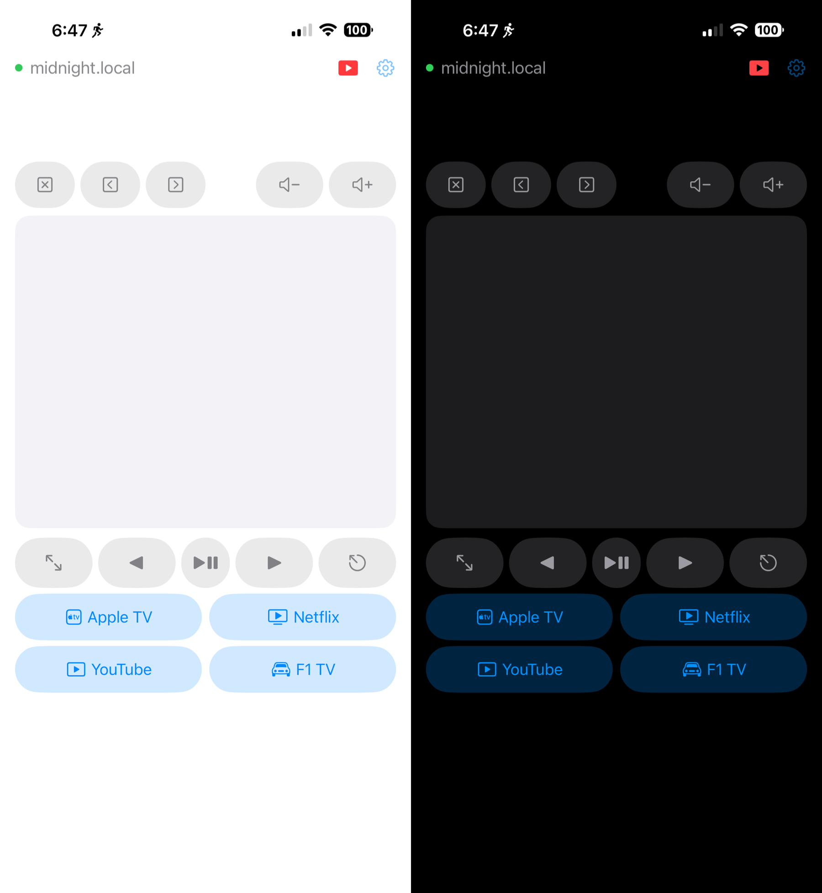
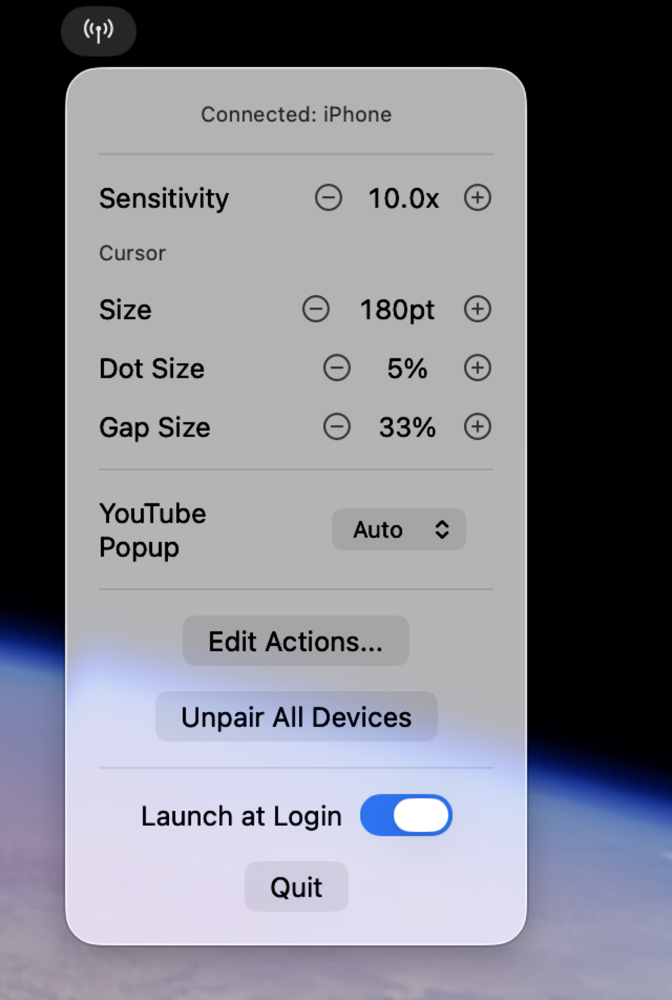
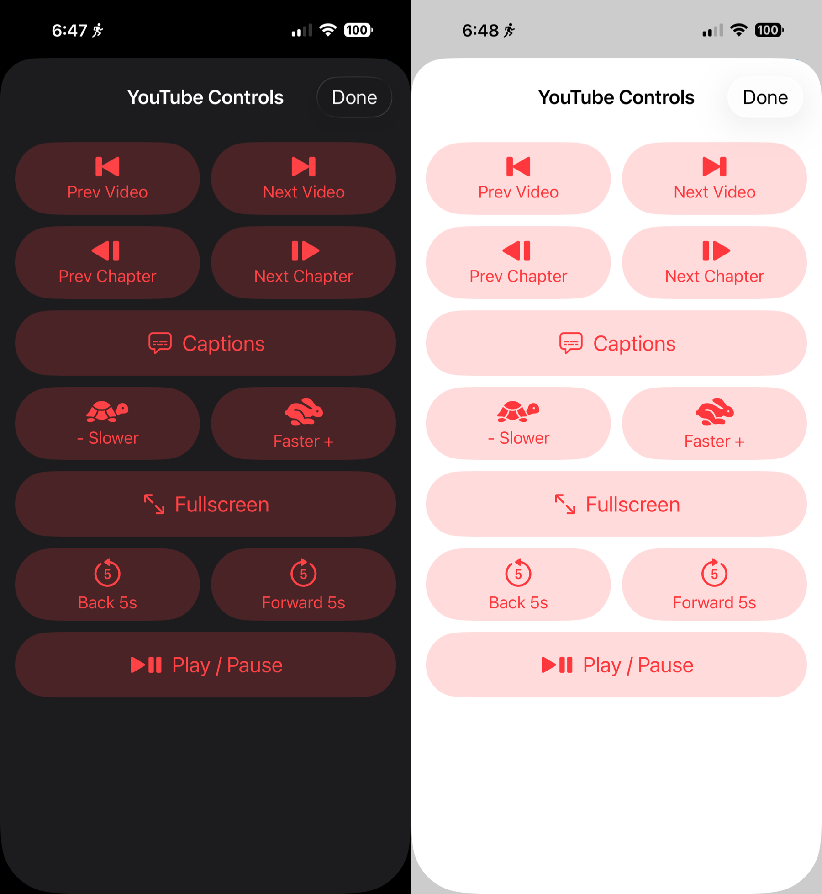
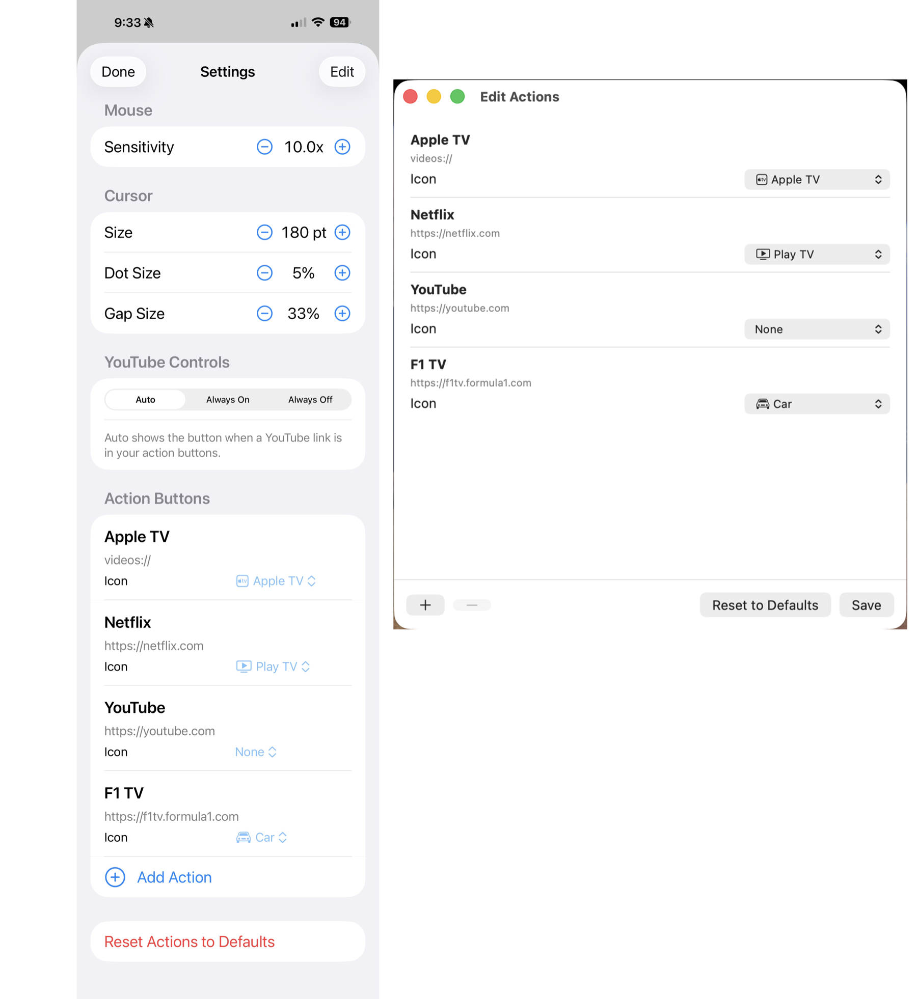
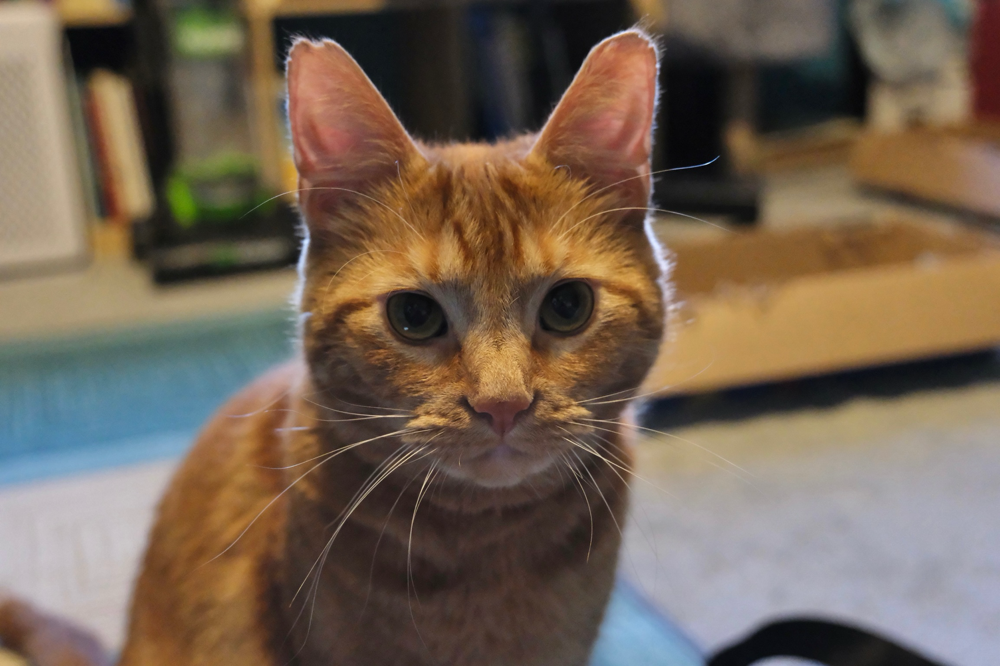

## The problem

I often exercise on a stationary bike a few feet from my MacBook Pro connected to a Studio Display. The display is a perfect TV for watching video on if I'm not doing an Apple Fitness bike workout, like those times when I'm doing a light session or just warming up for an interval workout.

My Mac, unfortunately, is inaccessible while I'm on the bike. My video watching options are using AirPlay from the phone, which has issues of its own depending on the app in question, or starting something before getting on the bike, and then being stuck with it.

I used to use AirPlay for YouTube and Apple TV pretty consistently in the past, but there were always annoying issues with those, and things like Netflix just wouldn't let you do that at all. Also, I like to be able to access the fitness app, food app, and some other things while spinning away on the bike.

Truthfully, I just wanted a fat trackpad and a few labelled buttons to control video directly on the Mac.

So I built that.

## The solution

**MikanRemote** is a two-app project: a tiny menu bar server on the Mac, and a thin client iOS app on the iPhone, talking over WebSocket on the local network. It does mouse, scroll, click, media keys, browser tab shortcuts, configurable launcher buttons (Netflix, YouTube, Apple TV…), and a dedicated YouTube controls sheet for chapter skip and playback rate.

## Features

- **Trackpad-style mouse control** — drag to move the cursor, tap to click. (No right-click — single-purpose tool, fewer mistakes.)
- **Quick-action buttons** — up to six configurable buttons that open URLs (`https://netflix.com`) or app schemes (`videos://` for Apple TV, `music://`, `podcasts://`, etc.).
- **Media keys** — volume up/down, play/pause, fullscreen, escape, arrow keys.
- **Browser tab shortcuts** — close tab, prev/next tab.
- **YouTube controls popup** — a dedicated sheet that maps to YouTube's keyboard shortcuts: prev/next video in playlist, prev/next chapter, captions, slower/faster playback, ±5s seek, fullscreen, play/pause.
- **A custom cursor overlay** on the Mac that fades in on movement and out after 10s — useful when you're glancing at a 27" display from across the room.
- **All settings configurable from the iPhone** — sensitivity, cursor halo size, action buttons, YouTube popup visibility. The Mac is the single source of truth; the iPhone is a pure thin client with zero local state.

The cool thing about the YouTube controls popup is that you can set the app to automatically show the button for this popup if you have or create an action button with the url "<https://youtube.com>" as the action, and automatically remove the button for it if you don't have or if you remove YouTube from your list of action buttons.

## Architecture

Three pieces, in one repo:

- **MikanRemoteServer** — macOS menu bar app. Advertises itself on the local network via Bonjour, runs a WebSocket server with `Network.framework`, controls mouse and keyboard via `CGEvent`, simulates media keys, draws the cursor overlay, opens URLs via `NSWorkspace`.
- **MikanRemote** — iOS thin client. Discovers the Mac via Bonjour, connects over WebSocket, handles multi-touch on a UIKit trackpad surface, renders the action buttons, exposes a settings sheet behind a deliberate gear icon (you do not want a swipeable settings menu when you're sweating).
- **MikanProtocol** — a small Swift Package shared by both apps. All wire messages are `Codable` types with a `type` discriminator field, so JSON over WebSocket stays trivial to parse on both sides and impossible to drift between client and server. Add a message type once, both sides see it.

Both Xcode projects are generated by [xcodegen](https://github.com/yonaskolb/XcodeGen) from a `project.yml` — so the source of truth lives in YAML and the `.xcodeproj` is regenerated, never hand-edited.

## Some design decisions worth noting

**Server is the single source of truth.** Sensitivity, cursor size, action buttons, and YouTube popup visibility are all stored on the Mac. Either side can edit them; the change is sent over WebSocket, persisted on the Mac, and pushed back to the iPhone. The iPhone has no `UserDefaults`, no local cache, nothing to drift. Re-install the iOS app and your settings are still there because they never lived on the iPhone in the first place.

**Pairing.** The first time an iPhone connects, the Mac generates a 4-digit code in a floating window and refuses commands until the iPhone submits it. Paired UUIDs are persisted to `~/Library/Application Support/MikanServer/paired-devices.json`. There's an "Unpair All Devices" menu item to nuke the list. Same network = trusted-ish, but I wanted at least a barrier to one of our cats triggers Netflix from across the room, or someone slightly more "human" deciding to prank me while I'm working out.

**WebSocket keepalive.** MikanRemoteServer pings every 5 seconds. No pong → drop the connection immediately. The iOS app reconnects automatically on foreground. This keeps the "I killed the app and came back" loop tight and reliable.

**Settings UI is behind a tap, not a swipe.** Everything mode-changing lives behind the gear icon. The bike is a hostile UX environment — sweat, motion, glances, not focus. Anytime you have even slight constant body motion, playing with gestures and poor targets become really frustrating really fast. Right now the settings icon and the YouTube controls icons are small, but in my experience, easily hit.

## The stack, summarized

MikanRemote is Swift end-to-end. SwiftUI on the Mac for the menu bar and editor windows, UIKit on the iPhone for the multi-touch trackpad surface (`@Observable` and SwiftUI everywhere else). `Network.framework` for the WebSocket server (no third-party deps). Bonjour for discovery (`_mikan._tcp`). `CGEvent` for cursor and key simulation. `NSWorkspace` for URL opens. xcodegen for the project files. Codable JSON for the wire protocol.

## Repo

MikanRemote's git repo is at [github.com/scottaw66/mikan-remote](https://github.com/scottaw66/mikan-remote) and is MIT-licensed. The README walks through build and install for both apps, including the Accessibility permission step (without it, every `CGEvent` silently no-ops, which is its own special kind of debugging adventure).

If you've got an iPhone, a Mac, and a reason to control one from the other across a room, it's a 15-minute build-and-go. And if you don't — maybe the architecture notes above are useful: the Bonjour + WebSocket + Codable-protocol pattern scales down to "one device controlling another over a trusted LAN" remarkably cleanly.

## The namesake

And that's MikanRemote! The name is Mikan (a Japanese mandarin orange) because I needed something to call it, and I've already used our cat Midnight's name on several projects, so I used our second cat's name (yes, he is an orange boi).

