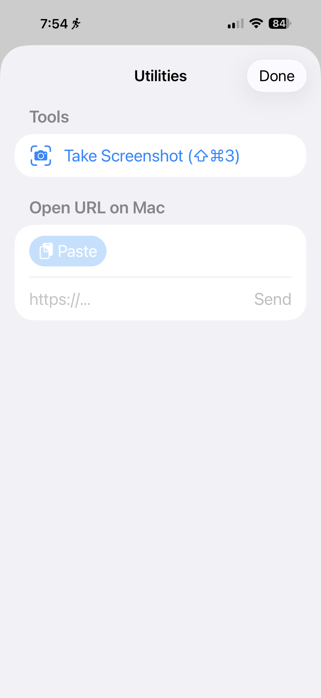
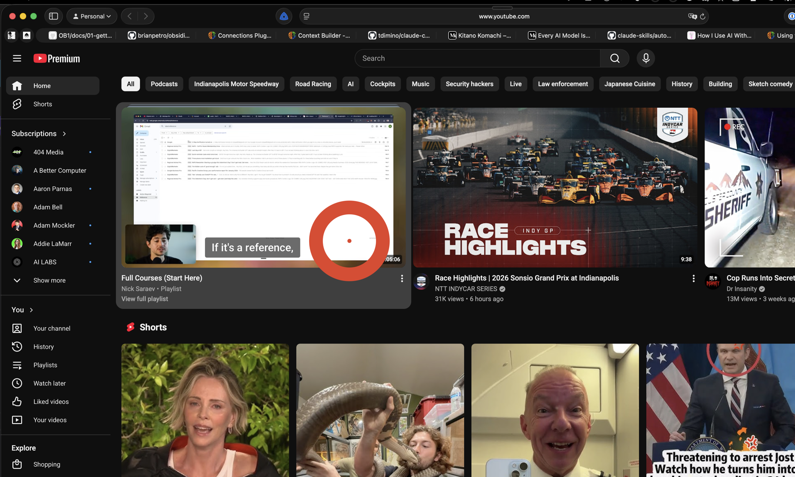
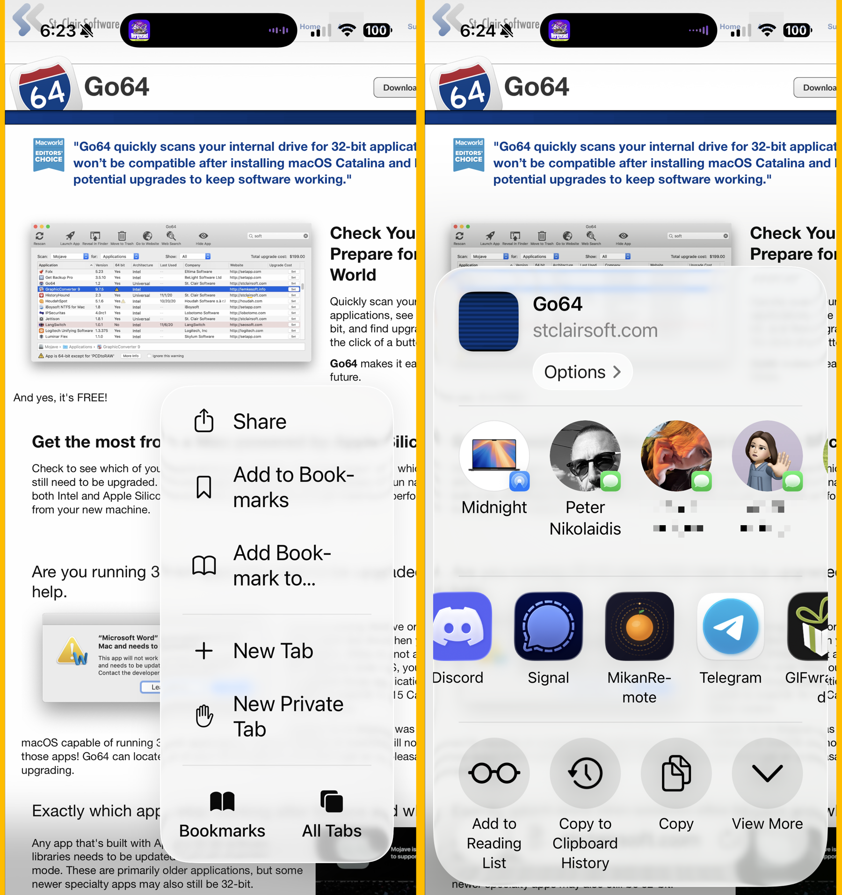
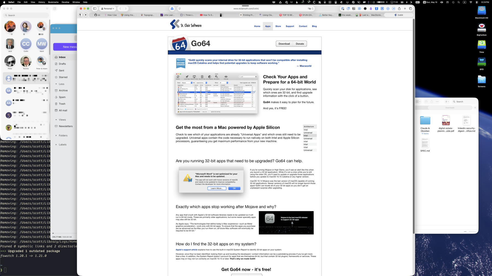

In case my announcement of my [MikanRemote utility app for Mac](https://scottwillsey.com/mikanremote-an-iphone-remote-control-for-my-mac/) wasn't exciting enough, I've added yet another screen – the utilities screen. It consists of exactly TWO utilities at the moment: Take a Screenshot, and Open URL on Mac.

Take a Screenshot won't be useful to most people, but it IS useful to me when I want to use the remote and capture what it looks like on the Mac end of things. For example, voila, you can see the cursor overlay that appears on the Mac screen that appears when mousing around on the MikanRemote iOS app's trackpad.

You can also see a guy kissing a snake, but that's not under my control.

Open URL on Mac basically AirDrops the URL to the Mac, where it opens in the browser, which is pretty cool. You can copy a URL, hit the utilities tool icon at the top right of MikanRemote, hit the "Paste" button, and BAM! The page opens on your Mac.

Even cooler: on iOS, from any web page, tap the Share button to share the URL, choose the MikanRemote icon, and it opens straightaway on the Mac.

Sharing from the browser to MikanRemote on iOS:

And POOF! Appearing on the Mac!

If you haven't already checked out [MikanRemote on Github](https://github.com/scottaw66/mikan-remote), download it, build it in Xcode (both server and client apps), and have some fun!