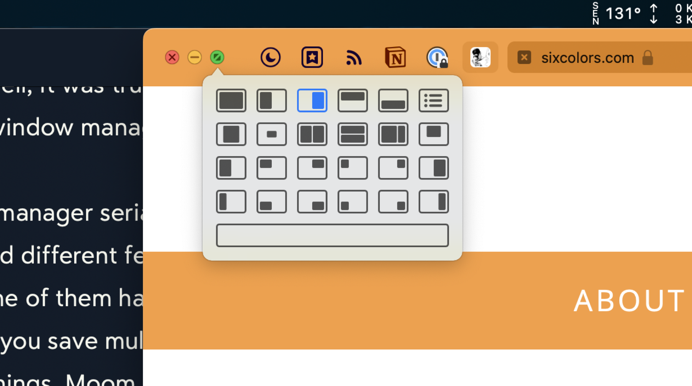

You may have noticed, as you’ve wandered the site, that I’m a bit of a [Raycast](https://scottwillsey.com/series/raycast/) fan. You may, therefore, imagine that I use the [Raycast window management tools](https://manual.raycast.com/window-management) to move and arrange windows . And it’s true. Well, it was true. Then [Many Tricks](https://manytricks.com) released [Moom 4](https://manytricks.com/moom/), the update to their popular Moom window manager app.

Historically, I’m a window manager serial monogamist. Like any other type of utility, there’s a wide range of approaches to this task in the available third-party apps. Some let you draw your window size and location on the screen, some have keyboard shortcuts for instantly popping things into specific locations, some let you save multi-window layouts, and many various combinations of these things. Raycast does two of these things. Moom does all of these things.

At first glance, you might think Moom is a slower way to manage windows. One of its signature controls is the Keyboard Controller, which you activate via a hotkey (in my case ^⌥⌘Space). Once it’s onscreen, you can use the keys indicated on its cheat sheet to move and/or resize your focused window per the options available.

You can also customize the options that appear at the top of that list, and the bottom section will always show any actions you’ve assigned single-key hotkeys for. For example, based on my arrangement above, pop open the Keyboard Controller with ^⌥⌘Space and then hit 3 and you’ll move the foreground window to the left third size of the screen.

Another great way that Moom allows for window control is something I think may be unique to it – a palette of window management buttons that shows up when you hover over one of the stoplight buttons in the window’s top left corner. You can specify in Moom’s settings which of the three buttons to hover over to get the palette, as well as which window commands are available.

These are all great and dandy, but Moom has freeform sizing and moving options too. You can configure Moom hotkeys that allow you to glide the cursor over a window to move it or to resize it. These options sure beat trying to find an empty spot to click on a title bar filled with tabs, or to find the little grab handles at the edge of the window. Apple really hates onscreen controls and the native resizing controls can be slow to manipulate.

And then there’s the grand champion of all freeform resizing, the Moom grid. It allows you to quickly draw out a window size to fit anywhere on a grid. You can set the number of rows and columns in the grid, which gives you quite a bit of range in window size granularity.

Here’s what it looks like to drag out the shape you want to resize your window to on the grid:

And here’s the resulting resized Safari window.

Despite all these great window management options, sometimes good old fashioned hotkey controlled instant resizing and moving is still the best way to quickly tile windows. Moom allows for that. You can create custom window sizes and locations and assign hotkeys to them. You can also make window layouts with multiple windows that can be applied instantly. Window layouts can be set to apply to specific apps only, or to whatever windows are handy when you apply the layout.

You can see some of my window settings complete with hotkeys in my Moom settings window below.

And in a bit of good news for me, Moom commands can be activated via AppleScript. Thanks to this, I modified my [Sessions Raycast script command](https://scottwillsey.com/sessions-script-command/) to accommodate setting window layouts using Moom instead of using Raycast’s window management tools. I’ll show you that in a future post.

I do like the window management commands in Raycast, and there’s always an argument for having one less application running in memory. But Moom is more versatile (and frankly more fun to use), and Raycast lets me disable its window management, and so Moom 4 seems like a no-brainer to me.

At least for now.
