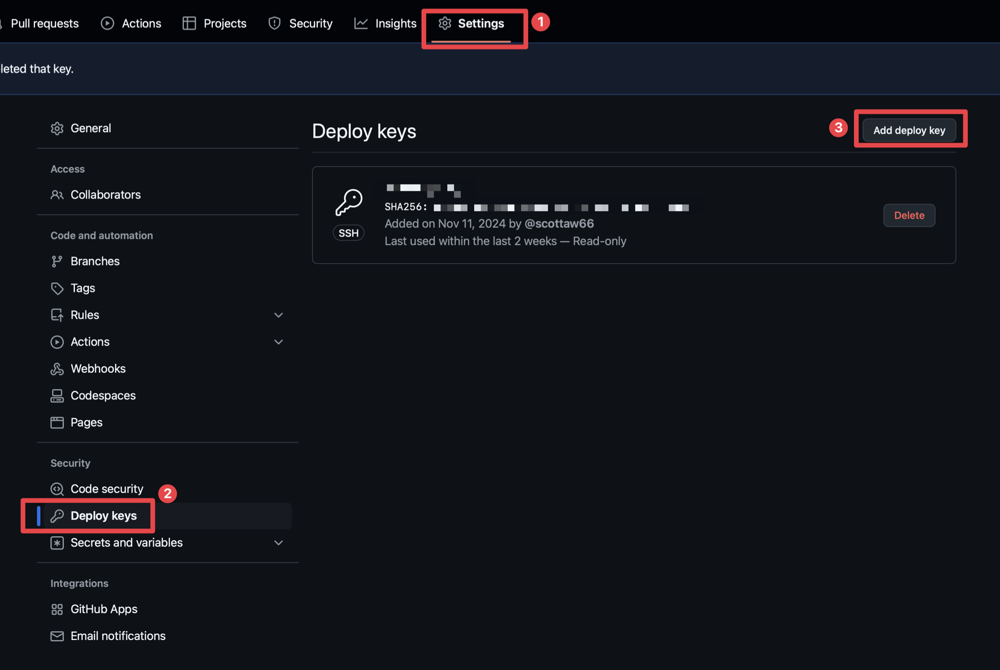
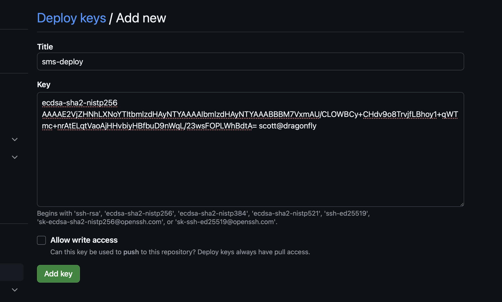
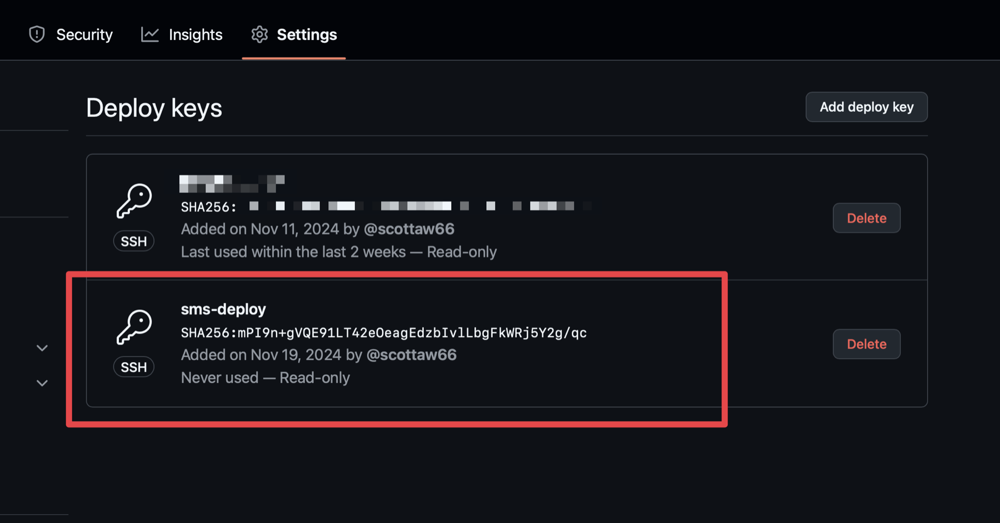

## Contents

GitHub Deploy Keys

Sometimes I want to be able to pull a personal GitHub repository onto a server in order to keep some files up to date. Things like scripts that I won’t edit on the server and so won’t need to push to GitHub are good candidates for this. In order to accomplish this in a reasonably secure way, I use [GitHub Deploy Keys](https://docs.github.com/en/authentication/connecting-to-github-with-ssh/managing-deploy-keys#deploy-keys). With a read-only deploy key, if someone ever gets access to my server I’ll suddenly have a billion new problems, but worrying about my repositories being overwritten with malicious garbage won’t be one of them.

Deploy keys are repository specific, however, which means if you have multiple repositories you want to pull from GitHub onto the server, you need a way to specify which deploy key each repo should use.

Let’s use an example where I have two repos, both of which I want to pull onto my server. One is called server-management-scripts and the other is called website-management-scripts.

## Create the Deploy Keys

You can use good old `ssh-keygen` in your account’s .ssh directory on the server to create your keys. In my case, ecdsa keys, named sms-deploy (for server-management-scripts repo) and wms-deploy (for website-management-scripts repo).

```bash title="~/.ssh/"
ssh-keygen -t ecdsa -f sms-deploy
```

And

```bash title="~/.ssh/"
ssh-keygen -t ecdsa -f wms-deploy
```

Because these are going to be read-only keys for their repos, I do not use a passphrase on them.

```bash title="~/.ssh/"

scott@dragonfly ~/.ssh $ ll
total 40
drwx------ 2 scott scott 4096 Nov 19 18:23 ./
drwxr-xr-x 8 scott scott 4096 Nov 19 18:21 ../
-rw------- 1 scott scott  194 May  8  2024 authorized_keys
-rw-r--r-- 1 scott scott  133 Mar 12  2021 config
-rw------- 1 scott scott  505 Nov 19 18:22 sms-deploy
-rw-r--r-- 1 scott scott  177 Nov 19 18:22 sms-deploy.pub
-rw------- 1 scott scott  505 Nov 19 18:23 wms-deploy
-rw-r--r-- 1 scott scott  177 Nov 19 18:23 wms-deploy.pub

```

## Add the Public Keys to the GitHub Repositories

Go to your repository on GitHub, go into the repository settings, Click the Deploy Keys link, and click the Add Deploy Key button.

[](/images/posts/SettingsDeployAdd-E6F887B2-4CDB-4CC5-86E2-7E939C21F850.jpg)

Give the key a name in the Title textbox, copy the contents of your public key (the .pub file for the key) that you created on your server into the Key textbox, and leave “Allow write access” unchecked. Click the “Add key” button.

[](/images/posts/DeployKeysAddNew-E6F887B2-4CDB-4CC5-86E2-7E939C21F850.jpg)

Now your new deploy key shows in the repo’s Settings > Deploy keys, and this key can be used to pull the repo.

[](/images/posts/NewDeployKey-E6F887B2-4CDB-4CC5-86E2-7E939C21F850.jpg)

Once you’ve added the public keys to the repos, you can delete them from your server, leaving only the private keys behind.

```bash title="~/.ssh/"

scott@dragonfly ~/.ssh $ ll
total 32
drwx------ 2 scott scott 4096 Nov 19 18:23 ./
drwxr-xr-x 8 scott scott 4096 Nov 19 18:21 ../
-rw------- 1 scott scott  194 May  8  2024 authorized_keys
-rw-r--r-- 1 scott scott  133 Mar 12  2021 config
-rw------- 1 scott scott  505 Nov 19 18:22 sms-deploy
-rw------- 1 scott scott  505 Nov 19 18:23 wms-deploy

```

## Assign the Correct Keys to the Correct Repositories

In order to make sure that a `git pull` command works correctly in each repo, I can edit my user account ssh config file on the server to contain these entries:

```bash title="~/.ssh/config"

Host serverscripts
 HostName github.com
 User git
 AddKeysToAgent yes
 IdentityFile ~/.ssh/sms-deploy
 IdentitiesOnly yes
 ForwardAgent yes

Host websitescripts
 HostName github.com
 User git
 AddKeysToAgent yes
 IdentityFile ~/.ssh/wms-deploy
 IdentitiesOnly yes
 ForwardAgent yes

```

Now, in each repo’s .git directory on the server, I can edit the config file to reference the correct entry in `~/.ssh/config` :

```bash title="/usr/local/sbin/scripts/sms/.git/config" {7}
[core]
 repositoryformatversion = 0
 filemode = true
 bare = false
 logallrefupdates = true
[remote "origin"]
 url = git@serverscripts:scottaw66/server-management-scripts.git
 fetch = +refs/heads/*:refs/remotes/origin/*
[branch "main"]
 remote = origin
 merge = refs/heads/main

```

Notice the highlighted part, which is the URL for the repo to use. It uses `serverscripts` as the server portion of the URL (the part after the `@` symbol and before the `:`), because that matches the first Host entry in my account’s `~/.ssh/config` file on the server.

The second git repo’s config file on the server would look like this, since I gave it a Host name of `websitescripts` in the `~/.ssh/config` file:

```bash title="/usr/local/sbin/scripts/wms/.git/config" {7}
[core]
 repositoryformatversion = 0
 filemode = true
 bare = false
 logallrefupdates = true
[remote "origin"]
 url = git@websitescripts:scottaw66/website-management-scripts.git
 fetch = +refs/heads/*:refs/remotes/origin/*
[branch "main"]
 remote = origin
 merge = refs/heads/main

```

Now both repos are linked back to a specific entry in `~/.ssh/config`, and therefore to their respective deploy keys, specified on the `IdentityFile` line. The ssh key file for the server management scripts repo is `~/.ssh/sms-deploy`, and the ssh key for the website management scripts repo is `~/.ssh/wms-deploy`.

When you do a `git pull` in either of those repos on the server, it will now use the correct deploy key to authenticate.
