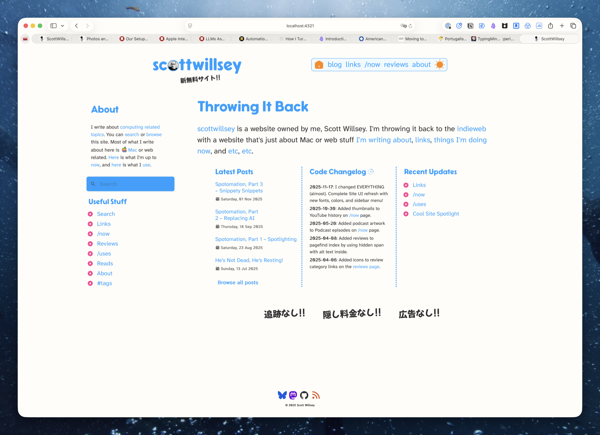
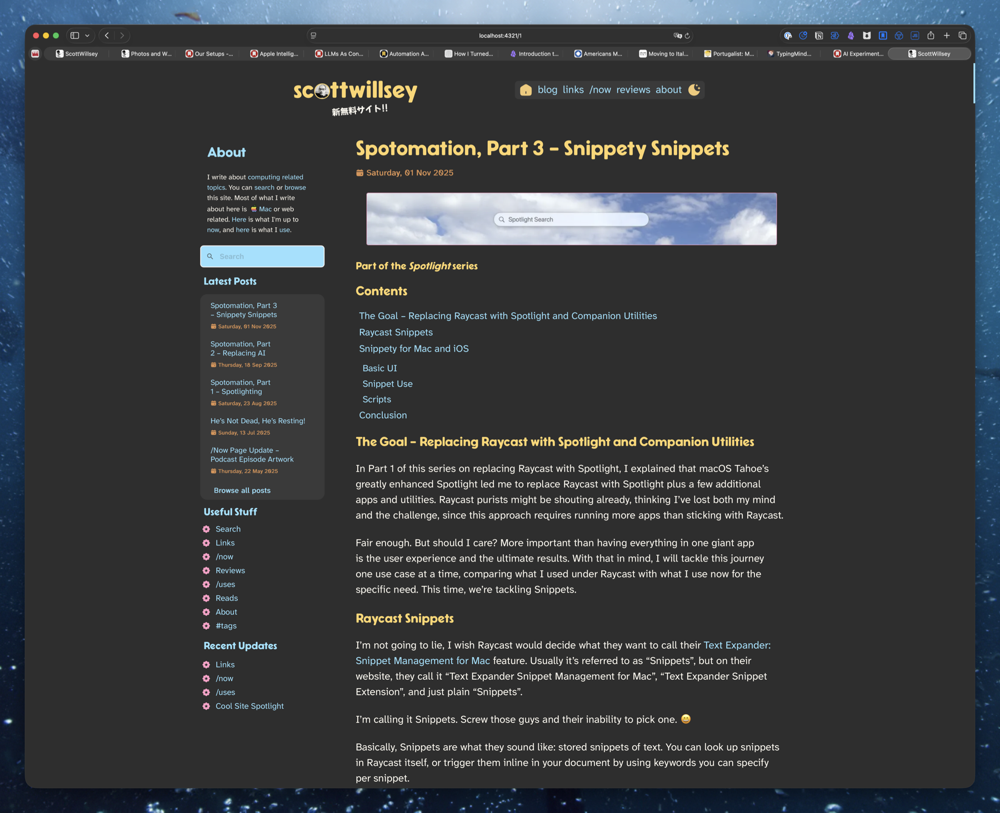

Look, a new face! No, not mine, unfortunately for those who know me in person. The SITE HAS A NEW FACE!! It's new. It's all new. Or as [Peter](https://infosec.exchange/@nikolaidis) would say, "It's the same. Exactly the same."

It is much the same, but huge chunks of the layout have been reworked, the fonts are different, the colors are different, and I like it much better.

Below are some of the highlights.

## Tailwind CSS

I spent a long time hating [Tailwind CSS](https://tailwindcss.com) just for existing. It was one of those irrational tech biases and I kind of knew it. I didn't know how just how much it was irrational though, until I took an example photo gallery that used tailwind and modified it for my [Photos](https://photos.scottwillsey.com) site.

What. A revelation.

Tailwind is nice. It's so much easier to fix responsive layout issues, tweak things quickly, not get lost in huge global css files (although I still do have more in global.css than I expected).

## Sidebar

I went from a single column view on all pages to having a sidebar again. The sidebar is more useful this time, including search and several good links, and it flows to the bottom of the page in responsive layout views. Along with this, I went to a wider max-width for the page since, let's face it, we who care about our sanity and enjoyment of life all have high resolution monitors.

## Typography

I'm using [SimpleBits Cartridge font](https://simplebits.shop/products/cartridge) for my headers, [Mochiy Pop One](https://fonts.google.com/specimen/Mochiy+Pop+One) for Japanese, and [Atkinson Hyperlegible Font](https://www.brailleinstitute.org/freefont/) for body text. I really like Hyperlegible – it makes for a super clean look and a comfortable reading experience.

Speaking of typography, I got rid of the icons-only site menu. For one thing, the icons weren't cohesive and I wound up simply not liking their look very much. For another thing, they do require work on the part of the visitor to decipher them, and that's no fun. Now I use icons much more sparingly, and only as a visual garnish – no thinking required.

## Enjoy

I hope you enjoy the look. I really enjoyed working on it. I am not a designer by any stretch, but I'm also an indieweb advocate and participant, and I think part of the charm of the indieweb is the non-corporate look of people's personal sites. Long live the silly and unprofessional!
