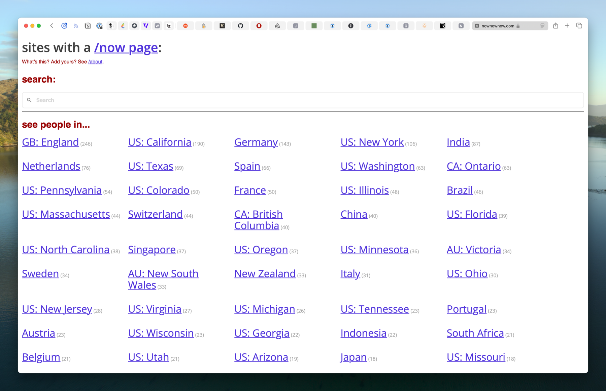

You all know, I hope, that I have a [/now page](https://scottwillsey.com/now/) on this site for quick dumps of things I’m into at the moment. It’s ephemeral, as /now pages should be.

The idea of the /now page comes from [Derek Sivers](https://sive.rs), and he has a whole site, nownownow.com, dedicated to spreading the message and the sheer fun of /now pages.

And look! You can see people by region!

I’m very pleased to announce that, as of this writing, [37 of us in Oregon](https://nownownow.com/US-OR) are extremely proud of whatever it is we’re doing /now. [You should definitely check it out](https://nownownow.com/US-OR). I’m even listed right beside Justin Miller.

I was a little surprised to see that [everyone in Japan](https://nownownow.com/JP) touting their /now pages are gaijin[^1] and not Japanese. Some of those people in Japan need to talk to the people they live amongst and spread the news! [Richard Möhn](https://nownownow.com/p/w7AB) is my hero though – he lives in Kagoshima City, my old stomping grounds!

Here’s your assignment for today:

- Visit my [/now](https://scottwillsey.com/now/) page.
- [Read up about /now pages](https://nownownow.com/about).
- Make your own.
- [Email the URL to Derek Sivers](https://sive.rs/contact).
- Be part of a nice group of people who like to have fun, love the indie web, and think you should do it /now!

[^1]: Foreigners
