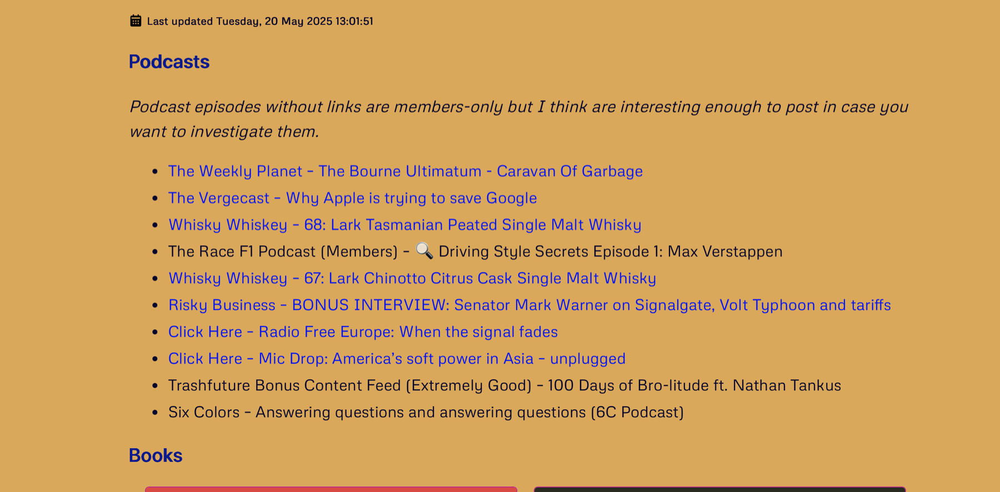
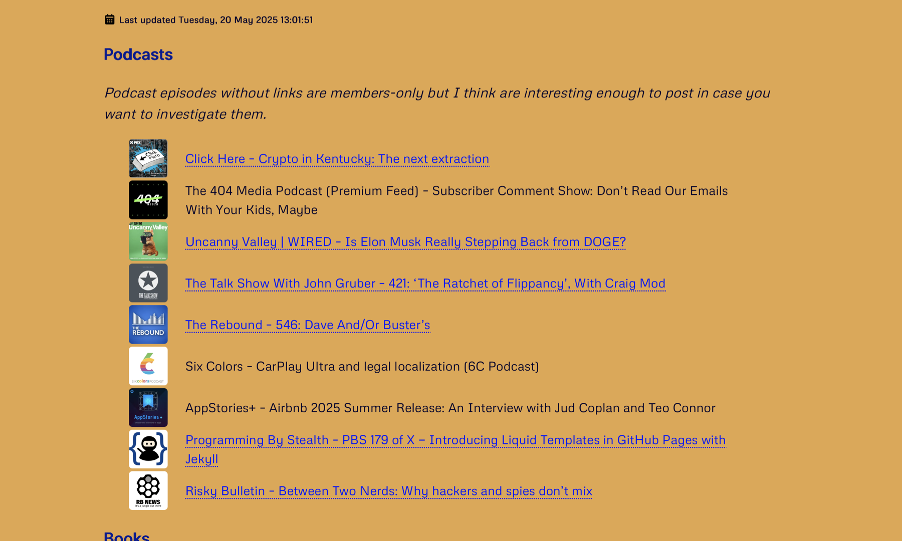
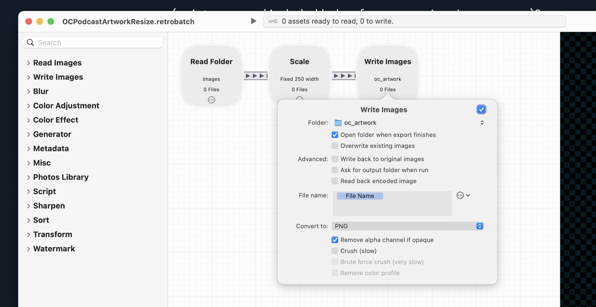
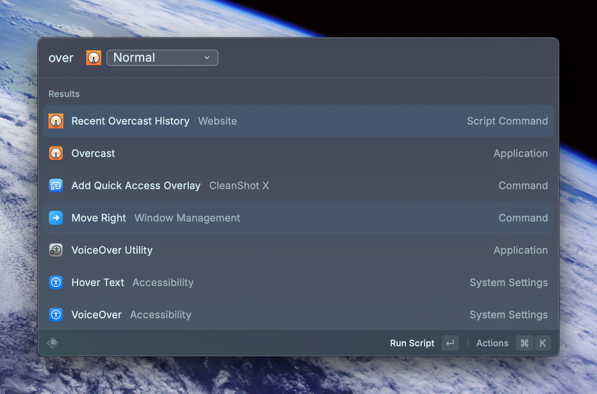

I made a change yesterday to my [/now](/now) page to make the Podcasts section look nicer by including podcast artwork next to the episode entries. I think it adds visual interest, and (most importantly) it was fun to update my recent podcast history script to include it.

This change was partially spurred by me switching from Overcast as my podcast app to Apple Podcasts due to a couple Overcast bugs that were annoying me. However, switching podcast apps did mean updating my [/now](/now) page Podcast episodes would be a bit more manual, due to Apple Podcasts not saving the history in a way that I can retrieve via automation. I started looking at using the iTunes API to grab episode information, and while doing so, I figured I may as well perform the simple chore of also grabbing the artwork along with the other episode information.

But then Marco updated Overcast a couple days ago and it fixed some of the bugs that were bugging me, so I bugged right back out of Apple Podcasts land and back to Overcast.[^1] At this point, I could have just gone back to my Recent Overcast History Raycast script command with no changes, and no one would have ever noticed based on what appears on my [/now](/now) page, but the thought of showing podcast artwork as part of my recent listening history stuck with me. I decided I had to do it.

Understanding how this works requires a little background on other parts of this script. Rather than bore you to death with ALL the details, I’ll just give you some relevant code snippets and then give full python module code dumps at the end. First though, here’s a before and after comparison of my recent podcast listening history.

Then:
[](/images/posts/ThenNowPodcasts-77212446-1a4d-4af9-8e5c-f9e3c329fcd7.jpg)

Now:
[](/images/posts/NowNowPodcasts-77212446-1a4d-4af9-8e5c-f9e3c329fcd7.jpg)

## Podcast Listening History Overview

Basically the way I automate grabbing my recent podcast listening history for my [/now](/now) page goes like this:

1. Log into my Overcast account and download my Overcast history OPML file.
2. Parse the OPML file for all `podcast-episode` elements with the `played` attribute set to `1`.
3. Filter these down to a specfic number of days worth, order them with most recently listened first, and then filter them again so that only the last 10 of those are returned.
4. For each episode in this list, load the overcast episode details page and parse the URL of the podcast artwork image. Download it and shove it in a specific folder. Then create the markdown links (including images) for the episode for display on the [/now](/now) page and append it to the full list of episode links.
5. Put this list of markdown links on the clipboard.
6. Run a [Retrobatch](https://flyingmeat.com/retrobatch/) action to scale the artwork way down and put it in the correct folder in the website source for site compilation.

All the above happens automatically when I run the script. I have it set up as a Raycast script command, so I trigger it to happen. I could have it update itself on a specific basis and automatically update, compile, and push the site, but I don’t. But that’s a logical series of next steps for anyone who wants a fully automated experience.

## The Raycast Script Command

Here’s the Raycast script command. It’s called **Recent Overcast History**. Note that any Raycast script command can be run outside of Raycast like any other script of its kind (bash, in this case), but I do call this through Raycast.

```bash wrap=true
#!/bin/bash

# Required parameters:
# @raycast.schemaVersion 1
# @raycast.title Recent Overcast History
# @raycast.mode fullOutput

# Optional parameters:
# @raycast.icon ../icons/Overcast.png
# @raycast.argument1 { "type": "dropdown", "placeholder": "Choose Mode", "data": [ { "title": "Normal", "value": "normal" }, { "title": "Force", "value": "force" } ] }
# @raycast.packageName Website

# Documentation:
# @raycast.description Grabs OC history and gets the most recent listened or in progress from it
# @raycast.author scott_willsey
# @raycast.authorURL https://raycast.com/scott_willsey

TYPE=$1

if [ "$TYPE" = 'force' ]; then
    /Users/scott/Scripts/scottwillsey/scottwillsey-overcast-history/main.py -f
else
    /Users/scott/Scripts/scottwillsey/scottwillsey-overcast-history/main.py
fi

/Applications/Retrobatch.app/Contents/MacOS/Retrobatch --workflow /Users/scott/Scripts/scottwillsey/scottwillsey-images/OCPodcastArtworkResize.retrobatch &

wait

# delete all files in /Users/scott/Scripts/scottwillsey/scottwillsey-overcast-history/images
rm -f /Users/scott/Scripts/scottwillsey/scottwillsey-overcast-history/images/*
```

**Recent Overcast History** has one dropdown parameter I need to choose: "Normal" or "Force". I have this because if it’s been less than 2 days, I don’t redownload the OPML file unless I choose "Force". One nice thing about Raycast is it always remembers what your last choice was and defaults to that.

## The Python Scripts

**Recent Overcast History**’s first action is to run `scottwillsey-overcast-history/main.py`, which is responsible for initiating the series of steps I outlined above.

```python title="main.py" wrap=true
#!/Users/scott/Scripts/python/venv/bin/python
import argparse
import os
from datetime import datetime, timedelta
import constants as const
from oc_history import load_oc_history
from oc_opml_parse import oc_opml_parse

p = argparse.ArgumentParser()
p.add_argument('-f', '--force', action='store_true', help='Force local OPML file parsing')

args = p.parse_args()

def file_is_old(file_path):
    if not os.path.exists(file_path):
        return True
    
    file_mod_date = os.path.getmtime(file_path)
    display_date = datetime.fromtimestamp(file_mod_date)
    print(f'OPML file created on {display_date.strftime("%Y-%m-%d")}')
    file_datetime = datetime.fromtimestamp(file_mod_date)
    print(f'file_datetime = {file_datetime}')
    stale_date = datetime.now() - timedelta(days=const.OPML_AGE_LIMIT_DAYS)
    print(f'stale_date = {stale_date}')
    
    return file_datetime < stale_date

def main():
    history_was_loaded = False
    if file_is_old(const.OPML_FILE_PATH):
        print(f'OPML file is older than {const.OPML_AGE_LIMIT_DAYS} days or doesn\'t exist. Downloading new data...')
        history_was_loaded = load_oc_history()
    else:
        print(f'OPML file is less than {const.OPML_AGE_LIMIT_DAYS} days old. Skipping download.')
    
    if history_was_loaded or args.force:
        print('Parsing OPML file...')
        if oc_opml_parse():
            print('Done!')
        else:
            print('You have to update your podcast list manually.')
    else:
        print('No new Overcast history generated.')
        
    

if __name__ == "__main__":
    main()
```

I’m not going to go through all the scripts like the login script and the downloading of the OPML file, but the OPML parsing script is interesting so you can see how I’m finding the episode history I want, getting podcast artwork for it, and then creating the markdown for each episode that goes on the [/now](/now) page.

```python title="oc_opml_parse.py" wrap=true
import pyperclip
import xml.etree.ElementTree as ET
import constants as const
from datetime import datetime, timezone, timedelta
from oc_artwork import load_episode_artwork

def find_podcast_name(root, episode_id):
    for podcast in root.findall(".//outline[@type='rss']"):
        for ep in podcast.findall("outline[@type='podcast-episode']"):
            if ep.get('overcastId') == episode_id:
                return podcast.get('text')
    return "Unknown"

def oc_opml_parse():
    with open(const.OPML_FILE_PATH, 'r') as f:
        content = f.read()
    try:
        with open(const.OPML_FILE_PATH, 'r') as f:
            content = f.read()
    except FileNotFoundError:
        print(f"File not found: {const.OPML_FILE_PATH}")
        return None
    
    root = ET.fromstring(content)

    # Find all podcast episode entries
    episodes = root.findall(".//outline[@type='podcast-episode']")

    current_date = datetime.now(timezone.utc)
    
    # Filter episodes with played="1"
    # played_episodes = [ep for ep in episodes if ep.get('played') == '1']
    played_episodes = [
        ep for ep in episodes 
        if ep.get('played') == '1' and 
        (current_date - datetime.strptime(ep.get('userUpdatedDate'), "%Y-%m-%dT%H:%M:%S%z")).days <= (const.OPML_AGE_LIMIT_DAYS + 1)
    ]

    # Sort episodes by userUpdatedDate, most recent first
    played_episodes.sort(key=lambda ep: datetime.strptime(ep.get('userUpdatedDate'), "%Y-%m-%dT%H:%M:%S%z"), reverse=True)

    # Get the most recent episodes
    top_episodes = played_episodes[:const.NUMBER_OF_EPISODES]

    # Print the results
    episodes_list = ""
    for ep in top_episodes:
        episode_artwork = load_episode_artwork(ep.get('overcastId'), ep.get('overcastUrl'))
        image_link = f"[]({ep.get('overcastUrl')})" if episode_artwork else ""
        episodes_list += f"{image_link}[{find_podcast_name(root, ep.get('overcastId'))} – {ep.get('title')}]({ep.get('overcastUrl')})\n"
    
    print(episodes_list)
    pyperclip.copy(episodes_list)
    
    return True
```

All the real fun happens in the function `oc_opml_parse()`, which is called by `main.py`. First it tries to open the OPML file and then uses the `xml.etree.ElementTree` module to get the XML model of the data.

```python wrap=true
def oc_opml_parse():
    with open(const.OPML_FILE_PATH, 'r') as f:
        content = f.read()
    try:
        with open(const.OPML_FILE_PATH, 'r') as f:
            content = f.read()
    except FileNotFoundError:
        print(f"File not found: {const.OPML_FILE_PATH}")
        return None
    
    root = ET.fromstring(content)
```

Next, it parses that for the list of episodes and starts winnowing them down to played episodes, ordered by most recent first, covering a specific timespan, and then returns the first 10 episodes on that list.

```python wrap=true
# Find all podcast episode entries
    episodes = root.findall(".//outline[@type='podcast-episode']")

    current_date = datetime.now(timezone.utc)
    
    # Filter episodes with played="1"
    # played_episodes = [ep for ep in episodes if ep.get('played') == '1']
    played_episodes = [
        ep for ep in episodes 
        if ep.get('played') == '1' and 
        (current_date - datetime.strptime(ep.get('userUpdatedDate'), "%Y-%m-%dT%H:%M:%S%z")).days <= (const.OPML_AGE_LIMIT_DAYS + 1)
    ]

    # Sort episodes by userUpdatedDate, most recent first
    played_episodes.sort(key=lambda ep: datetime.strptime(ep.get('userUpdatedDate'), "%Y-%m-%dT%H:%M:%S%z"), reverse=True)

    # Get the most recent episodes
    top_episodes = played_episodes[:const.NUMBER_OF_EPISODES]
```

Finally, it creates the markdown for all of the episodes in the list, including loading the Overcast episode page for each episode and finding the podcast artwork from it.

```python wrap=true
 # Print the results
    episodes_list = ""
    for ep in top_episodes:
        episode_artwork = load_episode_artwork(ep.get('overcastId'), ep.get('overcastUrl'))
        image_link = f"[]({ep.get('overcastUrl')})" if episode_artwork else ""
        episodes_list += f"{image_link}[{find_podcast_name(root, ep.get('overcastId'))} – {ep.get('title')}]({ep.get('overcastUrl')})\n"
    
    print(episodes_list)
    pyperclip.copy(episodes_list)
    
    return True
```

Here’s what that `load_episode_artwork` part looks like:

```python title="oc_artwork.py" wrap=true
import os
import constants as const
from session import session
import re
import uuid

def load_episode_artwork(episode_id, episode_url):
    # Get the overcast episode page
    r = session.get(episode_url)
    
    if r.status_code == const.SUCCESS:
        print('Overcast episode page downloaded')
        
        # search the contents of r.text for podcast artwork and save the first match to a variable
        match = re.search(r'', r.text)
        if match:
            # Get the URL of the artwork
            artwork_url = match.group(1)
            print(f'Artwork URL: {artwork_url}')
        
            # Download and save the artwork to a file
            art = session.get(artwork_url)
            if art.status_code == const.SUCCESS:
                print('Artwork downloaded')
                
                # Save the artwork to a file
                
                # generate a file name including UUID 
                file_name = f'{episode_id}-{uuid.uuid4()}.png'
                artwork_file_path = os.path.join(const.OC_ARTWORK_FILE_PATH, file_name)

                with open(artwork_file_path, 'wb') as f:
                    f.write(art.content)
                print(f'Artwork saved to {artwork_file_path}')
                
                artwork_url = f'../../assets/images/oc_artwork/{file_name}'
                
                return artwork_url
            else:
                print(f'Failed to download artwork. Status code: {art.status_code}')
        else:
            print('No artwork URL found on episode page.')
    else:
        print(f'Failed to download Overcast episode page. Status code: {r.status_code}')
    
    return None
```

Because the image URL for the artwork always contains `https://public.overcast-cdn.com/art/`, it’s always a simple thing to find it with a regular expression and then download that file. I name the artwork files as the Overcast episode ID with a UUID appended. I save those to a folder for processing by Retrobatch.

## The Retrobatch Script

Remember how the script command runs the Python script and then runs a Retrobatch action (script command included below for memory-jogging purposes)?

```bash wrap=true
TYPE=$1

if [ "$TYPE" = 'force' ]; then
    /Users/scott/Scripts/scottwillsey/scottwillsey-overcast-history/main.py -f
else
    /Users/scott/Scripts/scottwillsey/scottwillsey-overcast-history/main.py
fi

/Applications/Retrobatch.app/Contents/MacOS/Retrobatch --workflow /Users/scott/Scripts/scottwillsey/scottwillsey-images/OCPodcastArtworkResize.retrobatch &

wait

# delete all files in /Users/scott/Scripts/scottwillsey/scottwillsey-overcast-history/images
rm -f /Users/scott/Scripts/scottwillsey/scottwillsey-overcast-history/images/*
```

Here’s what the Retrobatch action looks like:

[](/images/posts/RetrobatchOCArtwork-77212446-1a4d-4af9-8e5c-f9e3c329fcd7.jpg)

It grabs images from `/Users/scott/Scripts/scottwillsey/scottwillsey-overcast-history/images`, where the Python script saved them, resizes them to 250 pixels wide, with corresponding correct height, and saves them to my website source’s `oc_artwork` directory for inclusion when the site is compiled.

After that, the script command deletes the source images from `/Users/scott/Scripts/scottwillsey/scottwillsey-overcast-history/images`.

## The Markdown

The result of ALL OF THIS is Markdown that looks like this:

```markdown wrap=true
[](https://overcast.fm/+BL5ZgWiWVU)[Click Here – Crypto in Kentucky: The next extraction](https://overcast.fm/+BL5ZgWiWVU)
The 404 Media Podcast (Premium Feed) – Subscriber Comment Show: Don’t Read Our Emails With Your Kids, Maybe
[](https://overcast.fm/+BFs16bV2bY)[Uncanny Valley | WIRED – Is Elon Musk Really Stepping Back from DOGE?](https://overcast.fm/+BFs16bV2bY)
[](https://overcast.fm/+B7NDTZ7xw)[The Talk Show With John Gruber – 421: ‘The Ratchet of Flippancy’, With Craig Mod](https://overcast.fm/+B7NDTZ7xw)
[](https://overcast.fm/+De1kB24UY)[The Rebound – 546: Dave And/Or Buster’s](https://overcast.fm/+De1kB24UY)
Six Colors – CarPlay Ultra and legal localization (6C Podcast)
AppStories+ – Airbnb 2025 Summer Release: An Interview with Jud Coplan and Teo Connor
[](https://overcast.fm/+JGaBVhHcw)[Programming By Stealth – PBS 179 of X — Introducing Liquid Templates in GitHub Pages with Jekyll](https://overcast.fm/+JGaBVhHcw)
[](https://overcast.fm/+5Sl_VEs2k)[Risky Bulletin – Between Two Nerds: Why hackers and spies don’t mix](https://overcast.fm/+5Sl_VEs2k)
```

You may have noticed, if you’re the type of person who just loves staring at and parsing markdown listings, that not all of these actually link to the Overcast episode. I remove the links for paid podcast episodes. I don’t pay for a lot of podcasts, but I do pay for some.

And that’s it! It all happens instantly and automatically when I fire up the script command from Raycast!

[](/images/posts/OvercastScriptCommand-77212446-1a4d-4af9-8e5c-f9e3c329fcd7.jpg)

[^1]: I apologize unreservedly for that sentence.
