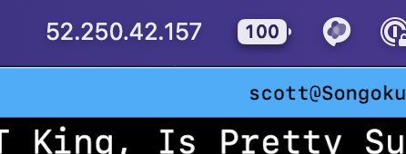

Just about one year ago, Joe Rosensteel wrote on [SixColors](https://sixcolors.com) about [putting local weather data in his menu bar](https://sixcolors.com/member/2022/08/putting-my-microclimate-in-my-menu-bar/). Aside from the entire system that gets the weather and gets it to his computer, the way he displays it in the menu bar is with a little utility app called [One Thing](https://sindresorhus.com/one-thing). I thought it was a cool app, and I downloaded it, but never really made use of it. Until today.

Today I was digging through web server logs to solve a non-pressing but quite interesting problem, and I realized I was tired of using What's My IP type web services to see who I am so I would know which log entries on my server are me. I put the IP in [Tot](https://tot.rocks) so I could easily refer to it, and then I thought, "that's great, but what about when it eventually changes?" Even though it almost never happens, it does happen very occasionally. Also, when I'm working with my terminal app in fullscreen mode, I don't want to have to dig around for a note.

Enter One Thing.

I figured the easiest way to get a value into One Thing for this purpose would be from the command line, so I installed the [One Thing command line tool](https://github.com/sindresorhus/one-thing). Then I googled for a nice command to get my external ip address from the command line and found

```sh frame="code"
dig -4 TXT +short o-o.myaddr.l.google.com @ns1.google.com
```

I decided to make Peter happy by making ChatGPT do my scripting for me and asked [MacGPT](https://www.macgpt.com) to write a bash script that runs the dig command, removes the quotes the dig command places around the IP address, and then passes the output to the one-thing command line tool. That script looks like this:

```sh frame="code"
#!/bin/bash

# Execute the dig command and store the output in a variable
IP_ADDRESS=$(dig -4 TXT +short o-o.myaddr.l.google.com @ns1.google.com)
IP_ADDRESS=${IP_ADDRESS//\"/}

# Pass the IP address to the one-thing command
one-thing $IP_ADDRESS
```

The comments in the script are MacGPT's, by the way.

Although I've done tons of cron jobs on linux servers, I don't think I've ever actually scheduled any tasks on a Mac in recent history. I knew I was going to want to use launchd but I was fuzzy on the details. I asked MacGPT what to do, and it told me to make a plist file that references my bash script, shove it in /Library/LaunchDaemons, and set some file permissions and file ownership settings, and register it with launchd using the launchctl command.

I replied, "that's cool, but maybe you should write the plist file for me", and it did.

```xml
<?xml version="1.0" encoding="UTF-8"?>
<!DOCTYPE plist PUBLIC "-//Apple//DTD PLIST 1.0//EN"
        "http://www.apple.com/DTDs/PropertyList-1.0.dtd">
<plist version="1.0">
  <dict>
    <key>Label</key>
    <string>com.scottwillsey.my-ip-address</string>
    <key>ProgramArguments</key>
    <array>
      <string>/bin/bash</string>
      <string>/Users/scott/Scripts/bash-scripts/my-ip-address.sh</string>
    </array>
    <key>StartCalendarInterval</key>
    <dict>
      <key>Hour</key>
      <integer>12</integer>
      <key>Minute</key>
      <integer>0</integer>
    </dict>
  </dict>
</plist>
```

I moved this file to /Library/LaunchDaemons, set owner and permissions with `sudo chown root:wheel com.scottwillsey.my-ip-address.plist` and `sudo chmod 644 com.scottwillsey.my-ip-address.plist`.

Now /Library/LaunchDaemons looks like this:

```sh frame="code"
scott@Songoku:bash-scripts ➜ ll /Library/LaunchDaemons
total 72
drwxr-xr-x  11 root  wheel   352 Apr  8 17:12 .
drwxr-xr-x  70 root  wheel  2240 Apr  7 13:30 ..
-rw-r--r--@  1 root  wheel   569 Mar 16 14:12 com.backblaze.bzserv.plist
-rw-r--r--   1 root  wheel   428 Mar 14 19:02 com.microsoft.autoupdate.helper.plist
-rw-r--r--@  1 root  wheel   594 Nov 16 23:23 com.objective-see.blockblock.plist
-rw-r--r--@  1 root  wheel   399 Jun 11  2018 com.objective-see.ransomwhere.plist
-rw-r--r--@  1 root  wheel   781 Nov 11 09:20 com.rogueamoeba.aceagent.plist
-rw-r--r--@  1 root  wheel   777 Nov 11 09:20 com.rogueamoeba.acetool.plist
-rw-r--r--   1 root  wheel   598 Apr  8 17:10 com.scottwillsey.my-ip-address.plist
-rw-r--r--   1 root  wheel   580 Nov 26 09:26 net.telestream.LicensingHelper.plist
-rw-r--r--   1 root  wheel   532 Jan 13 12:26 us.zoom.ZoomDaemon.plist
scott@Songoku:bash-scripts ➜
```

As usual, the script itself needs execute permissions.

```sh frame="code"
chmod +x my-ip-address.sh
```

And now I have my IP address in my menu bar!

[](/images/posts/OneThingIpAddress-7FBCDC10-F21F-4D8E-AE94-F5276E88F53E.jpg)

By the way, the IP address shown isn't really mine. It's Microsoft's. Don't try to DDOS them, but if you do I can only assume they have better DDOS protection than I do.
