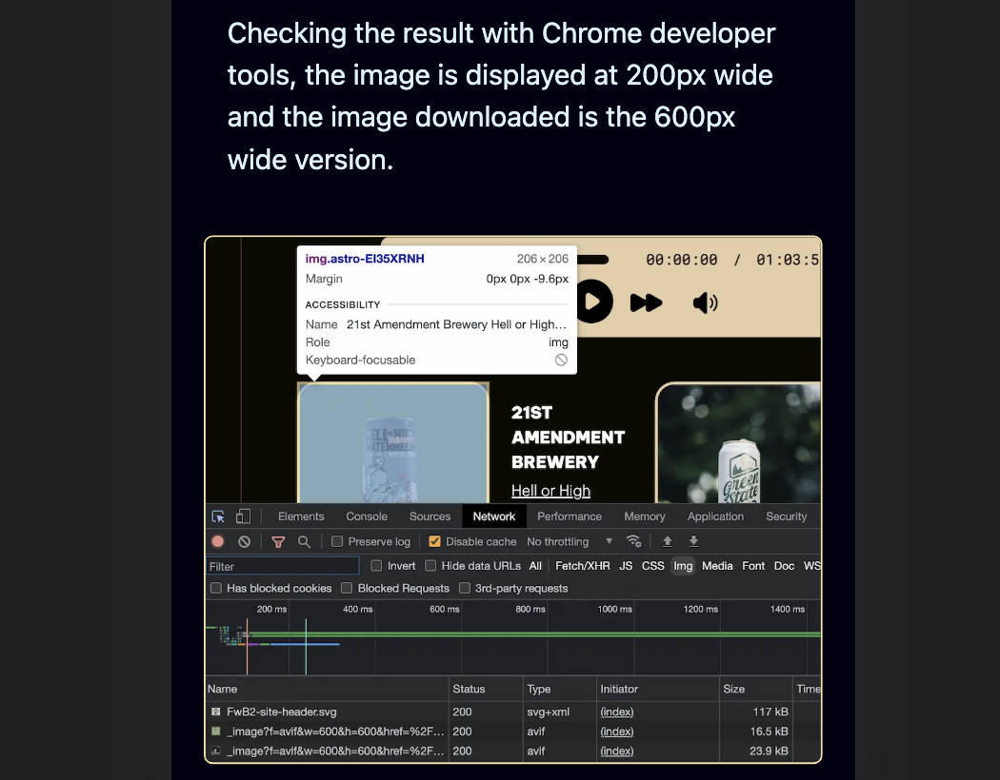

A couple days ago, I posted some [responsive image and Astro Image science experiments](https://scottwillsey.com/image-rabbit-hole-3). If you read that post, you'll notice that my examples all assume I want to display my image at 200px wide. The reason is I was performing the experiments on a very specific layout that I use to show what beer we enjoyed on a given episode of [Friends with Beer](https://friendswithbeer.com).[^1]

But the sizes attribute of the HTML picture element is a lot more versatile than that. You can get very granular in how you control your image display sizes. I'll show how to do it using the [Astro Image component](https://www.npmjs.com/package/@astrojs/image), specifically its Picture component.

When I wrote the my [science experiments post](https://scottwillsey.com/image-rabbit-hole-3), I had all the images in the article set to display at 400 or 500px width, depending on the image. I debated about the size of some of them being too small to see the details very well, but the images link to the large original, and some of them are quite a bit taller than they are wide and I didn't want to make a page full of posters.

But more troublingly, setting them with a simple `sizes="500px"` value made them look bad on mobile devices. For example, here's my first image in the article shown in the iPhone 12 Pro screen size, and it just shoots out both sides like there's no guard rails and no cliffs next to the road.

[](/images/posts/image1-1C3FC4F9-AB6B-44DA-B33A-377336BD42B9.png)

It's a little confusing, because it's an image of me examining images on a web page in Chrome developer tools, but you can see that it's indeed displaying at my requested 500px width and is too wide for the page on the iPhone as a result.

[](/images/posts/image2-1C3FC4F9-AB6B-44DA-B33A-377336BD42B9.png)

Fortunately, sizes has an answer for us: we can specify it to be 500px above a certain screen width, and then just show at 90% of the viewport width below that screen width.

```astro
<Picture
  src={image1}
  widths={[500, 1000, 1500]}
  sizes="(max-width: 550px) 90vw, 500px"
  formats={["webp"]}
  alt="600px wide image displayed at 200px width"
/>
```

It's a little unclear how to read that initially. Here's what it means:

- For screens up to 550px wide, display the image at 90vw (90% viewport width).
- For screens that don't meet the specified condition (ie., they are wider than 550px), display the image at 500px wide.

It works great. Now for wide screens, I get a 500px wide image, and for smaller screens, I get an image better tailored to the display.

[](/images/posts/image3-1C3FC4F9-AB6B-44DA-B33A-377336BD42B9.png)

[](/images/posts/image4-1C3FC4F9-AB6B-44DA-B33A-377336BD42B9.png)

You can get even more granular. For example, I determined that an image I displayed in a different post at 600px wide on big displays worked better if it was only 80% of the viewport width between 650 and 750px screen widths, and 90% of the viewport width below that.

```astro
<Picture
  src={beerlatest}
  widths={[800, 1200, 1800]}
  sizes="(max-width: 650px) 90vw, (max-width: 750px) 80vw, 600px"
  formats={["webp"]}
  alt="Latest episode beer list view"
/>
```

You may be thinking "Wow, that's cool!" and also thinking "Wow, I can't believe you're going to type all that out every time you want to include a 600 pixel wide image in an article!".

Yeah. I'm not.

There are a couple different ways to fix that. Both involve me using markdown syntax for my images but adding a display width to it, like this:

```markdown

```

I'll also throw in an alt tag value for good measure, of course.

Using that, I have a couple options:

- I can write a script to run in [Drafts](https://getdrafts.com), my markdown editor of choice which has excellent scripting support, that converts all my markdown images to [Astro Image](https://www.npmjs.com/package/@astrojs/image)'s Picture component format with widths and sizes attributes nicely calculated and filled in automatically for me,
- See if using some kind of rehype plugin in Astro at site build time would be a better way to do it so I don't even have to actually click a script button in Drafts.

Either way, I absolutely do NOT plan on having to remember the science experiments I did to come up with my sizes attribute values for different image widths. That just goes against the whole point of trying to keep the writing process separate from the need to know about mundane site details, and for me it's a step backwards.

The end result, regardless of which way I decide to go about it, is that I just have to know markdown image syntax (I do), and how wide I want it to display in the blog post and what I want the alt tag to be. I'll let a script located somewhere figure out the implementation details for me.

Make computers work for you, not the other way around!

[^1]: Depending on when you read this, the Friends with Beer website may still be on Eleventy. The Astro version is WIP.
