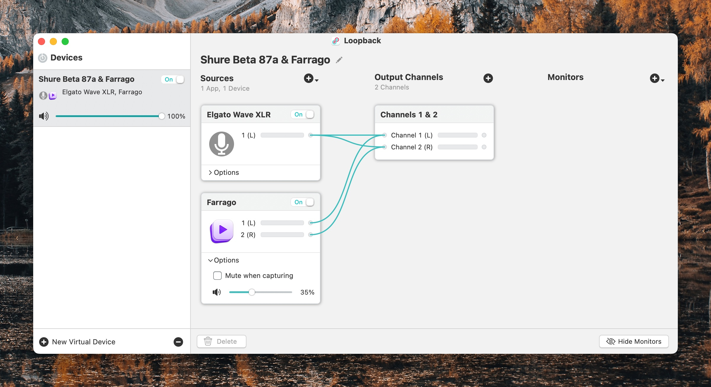

I've talked about the [hardware I use for podcasting](https://scottwillsey.com/podcasting-setup-hardware/), but what about the other tools of the trade? Obviously the first step to creating a podcast is to record one, and in my case, that's all about software.

## The Company You Keep

If there's one name podcasters who use Macs tend to be very familiar with, it's [Rogue Amoeba](https://rogueamoeba.com). I don't know if Rogue Amoeba set out to be the go-to people for podcasting on the Mac, but they've certainly achieved it. For me, all of their software is indispensable, but there's one application in particular that you pretty much have to have – Audio Hijack.

### Audio Hijack

[Audio Hijack](https://rogueamoeba.com/audiohijack/) bills itself as the "Record Any Audio" application, and that's exactly what it is. If there's an app on your Mac that makes noise, Audio Hijack can record it.[^1]

The beauty of Audio Hijack is that it sets up audio recording chains that can include effects, noise removal, peak limiting, and more, and it allows for granular control over whether audio sources get combined into a track or each record their own separate tracks. Each specific setup like this can be saved as a session, so you can always have a session appropriate to whatever kind of recording you want to do.

For example, here's my [Friends with Brews](https://friendswithbrews.com) Audio Hijack session.

This session records my mic, which comes in through an [Elgato Wave XLR](https://www.elgato.com/us/en/p/wave-xlr) interface, increases the volume, denoises, and ramps down the treble a little bit, because I have a nasally voice.

It also records my soundboard, which is provided courtesy of another Rogue Amoeba app called [Farrago](https://rogueamoeba.com/farrago/), and saves that to its own track.

Finally, it records whatever VOIP app I'm using for the podcast as a backup recording of my co-host(s). Peter and I use FaceTime to talk to each other for [Friends with Brews](https://friendswithbrews.com), unless our friend Adam Bell is on, and then we use Zoom.

The VOIP call recording is strictly a backup. We each record our own end locally for the best sound and I combine those tracks in my editor, a process I'll describe in a separate post sometime soon.

Audio Hijack is very versatile in terms of output file format and quality, and also in terms of file naming.

As I mentioned, you can save recording configurations as sessions. Here are all of my currently saved Audio Hijack sessions for recording various podcasts and Mac apps. [Episode 18](https://friendswithbrews.com/18/) of Friends with Brews wasn't really the last time Adam was on the podcast and we used zoom (it was [episode 39](https://friendswithbrews.com/39/), I think) but apparently I forgot to rename that session. Anyway, you get the idea.

### Farrago

I mentioned Farrago earlier. [Farrago](https://rogueamoeba.com/farrago/) is an amazing soundboard application that lets you store, perform minor edits on, and trigger audio sound clips – in other words, it's a soundboard!

Farrago is how I play the "Friends? With BREWS?!" clip at the beginning of every podcast, as well as the "Hi, Peter!" and other clips that I like to annoy people with during various podcasts. I have a TON of Farrago sets with sounds from all kinds of stuff.

Vic Hudson and I used to do tv show related podcasts for [BubbleSort TV](https://bubblesort.show/bubblesort-tv/), and those sound clips came in super handy. We'd usually set up sections of the podcast by playing clips from specific scenes, which really added to the shows. It also means they're inserted live into the recordings (although we made sure they were on their own tracks for easier audio leveling and editing reasons) so they wouldn't have to be edited in later, AND so the co-host could hear them and we'd both be on the same page about the conversation to follow.

By the way, if you guessed that I recorded every single one of those tv show and movie clips using Audio Hijack, you're correct!

### Loopback

"But Scott!" you say. "Just because you're playing a sound clip in Farrago on your Mac doesn't mean your cohosts can automatically hear them, does it?!?" Great question. The answer is no. No, it does not. Enter [Loopback](https://rogueamoeba.com/loopback/).

Because you're such a doggone great guesser, maybe you surmised that Loopback is Yet. Another. App. By. Rogue Amoeba.

YES! IT IS! And it's amazing, so back off! It's not my fault they make all the best podcasting and audio routing and recording related software for the Mac!

Loopback does a lot of things, but simply put, it lets you combine audio sources into one or to pass audio from one application to another. The first use case is how my co-hosts can hear my soundboard – I have a Loopback device that combines my mic with Farrago. I can then set THAT as the input to my VOIP app of choice, such as FaceTime or Zoom or Skype, and then everyone on the other end(s) of the call can hear my soundboard coming from me exactly the same as they can hear me talking.

This Loopback device looks a lot like this – in fact, exactly like this:

Usually, even though each app can have its own inputs and outputs separate from the system settings, I just set my system settings to the output I want (my Elgato Wave XLR, which my podcasting headphones are plugged into) and the input that I want (my Loopback input source that combines my mic and Farrago).

Then I set my VOIP app de jour to use system settings for input and output.

## And, So

And THAT, my friends, is over 1000 words on software that I use to record the podcast. It's not complete, because I have a few helper utilities that prepare the way, as John Siracusa might say, but I'll save those for another post.

So topics you have to look forward to in this series in the future are helper utility apps that prepare the way for recording, apps I use during the editing process, what exactly my editing process actually entails, and finally, how I get all that published and ready for YOU to listen to, in the case of Friends with Brews especially.

You can bet on it. But maybe you shouldn't. Just saying. Never bet unless the outcome is already certain. And then always only bet a dollar.

[^1]: It can actually even record apps that don't make noise, but that's probably an exercise best reserved for the metaphysicians of the world.
