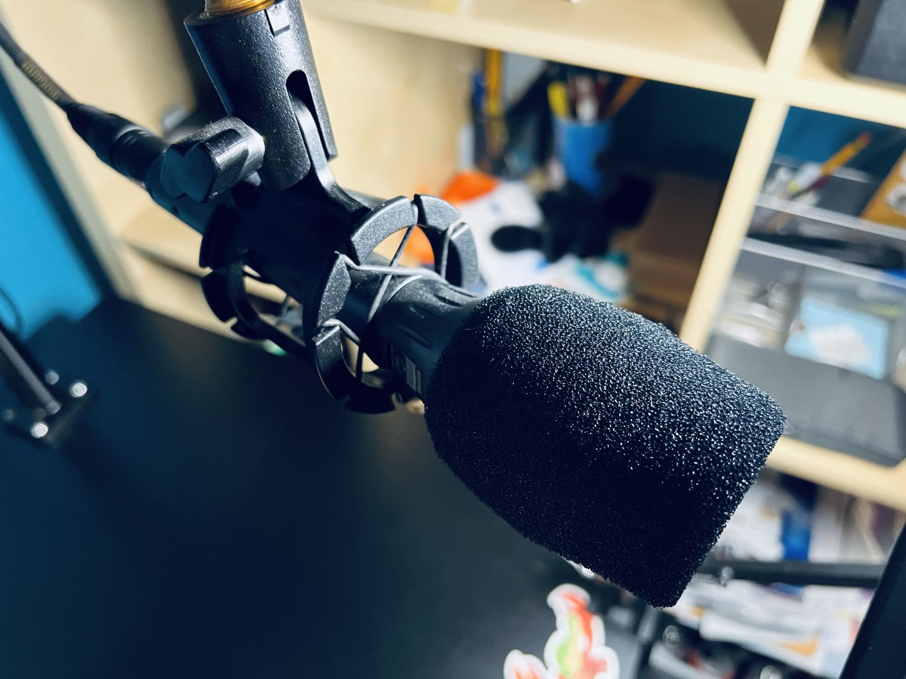
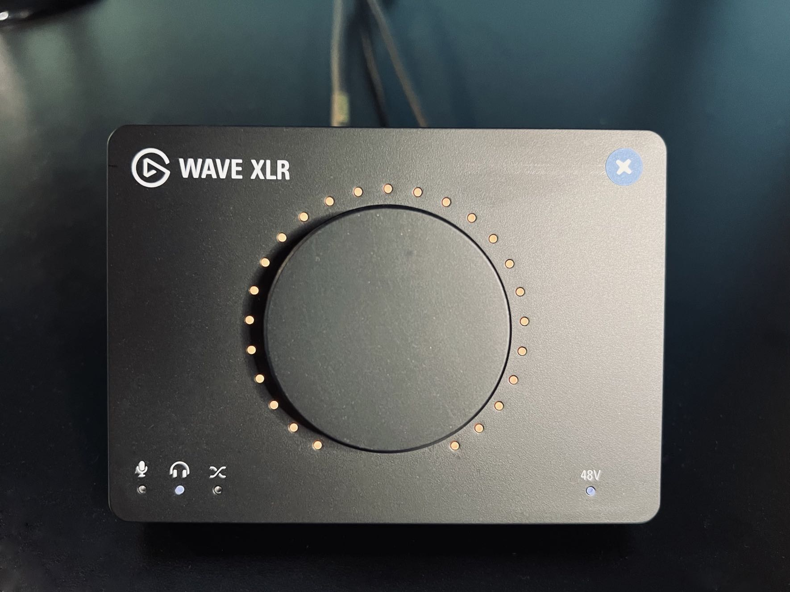
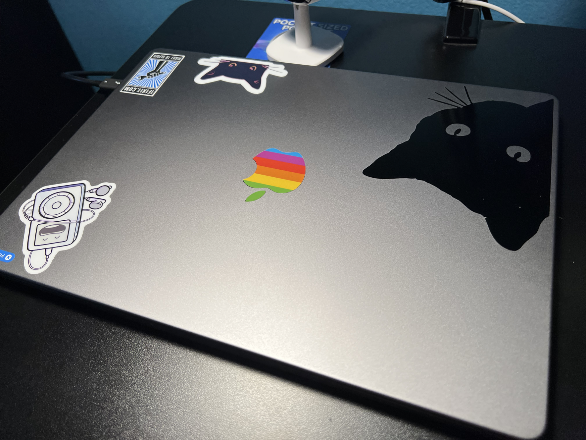
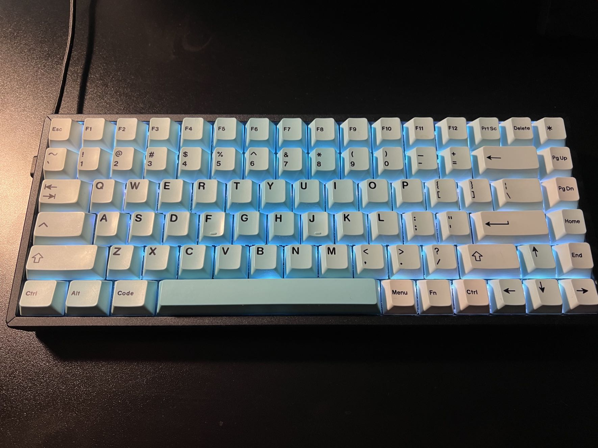

My friend Donnie Adams asked me on Mastodon if I've ever written anything about my podcasting setup and recording and editing workflow. The answer is... I don't think so. Even if I did, whatever I wrote is out of date and not online anymore anyway. So in 2023, here's my basic podcasting setup hardware.

## Mic

Mics are very subjective, and a mic that works well for one voice might not work well for others. In addition, the type of mic you get should also suit your recording environment. Many a relatively inexpensive condenser mic has been the go-to mic de jour for beginning podcasters, and condensers are not good for noisy environments. You need a quiet, non-echo-ey room for a condenser mic.

My mic is the [Shure Beta 87A](https://www.shure.com/en-US/products/microphones/beta_87a?variant=BETA87A). I like the fact that it has the benefits of a condenser mic while also having good drop-off so that it doesn't pick up every spec of dust hitting something somewhere in outer space.[^1]

Personally I don't recommend USB mics and I don't recommend most of the mics marketed towards podcasters. Don't get a Yeti. Don't get a Snowball. Don't get a Rode Podcaster or Procaster.[^2]

Regardless of what mic you use, learn how it works in terms of proximity effect and positioning, use a pop filter and preferably a boom arm, and don't bump it or move it while recording. Also find a way to mute the mic for when you need to clear your throat or make other noises. Depending on who's doing your editing, you may find all that in the episode if you're not careful.[^3]

## Mic Stand

The best stand for a mic is a boom arm, which keeps the mic off the desk, isolates it from bumps and vibrations, and makes it easy to position where you need it to get the best sound for your recording.

I think I'm currently using an [Innogear mic stand](https://www.amazon.com/gp/product/B07CN2C93T/). I'm not sure because I ordered a couple around the same time, one for me and one for my daughter. This is the nicer looking of the two in my order history, so that's the one I'll point out.

In the past I've had some bigger, heavier duty ones, but anything that can hold a 3 lbs or so will be fine.

## Audio Interface

If you're using an XLR mic and not a USB one, which is my recommendation, you'll need an audio interface. Believe it or not, for podcasting or streaming, I'm not going to recommend some traditional interface with lots of knobs and features. I'm recommending the relatively inexpensive [Elgato Wave XLR](https://www.elgato.com/us/en/p/wave-xlr).

With a capacitive touch-to-mute function, plenty of gain, software settings including clipping prevention and other effects, this is a great value for the price. Previously I used a [Tascam US-2x2](https://tascam.com/us/product/us-2x2hr/top), and I can't be happier that I ditched it for the Elgato. It's just nicer to use for podcasting and has plenty of clean gain.

If you do in-person recording with a co-host, you may need an interface with multiple mic inputs. If not, the Elgato Wave XLR is perfect for podcasting.

## Computer

My computer is a 14" 2021 MacBook Pro M1 Pro with 16 GB of RAM, a 1TB SSD, 10 core CPU, and 16 core GPU. Those memory, SSD, and CPU/GPU specs are the absolute minimum I would ever go with, but for the money this is by far the most amazing computer I've ever owned. It eats giant number-crunching chores for breakfast and never gets hot. The only time I can warm it up even remotely is when generating transcripts of podcast episodes with [MacWhisper](https://goodsnooze.gumroad.com/l/macwhisper).

When I have 5 or 6 tracks of audio in Logic Pro, all split up with silences stripped, it can get really slow to respond to selections and movements, especially for longer episodes. I attribute this to the 16GB of RAM. Previously I had 32GB in my iMac, but that was because I could add and remove RAM with ease. That's obviously not the case with the MacBook Pro, so go for as much as you can afford.

I absolutely love the 14" form factor, by the way. I was tempted to go larger but this Mac is the nicest combination of size and utility I've ever had in a laptop. You get very good edge to edge use of the screen, it's high resolution, and it has the most beautiful monitor Apple makes, in my opinion. It's simply lovely to use for hours on end.

## Monitor

My external monitor is the [Apple Studio Display](https://www.apple.com/studio-display/). There's not much to say about it. It's beautiful and big and it hangs on an [Ergotech Heavy Duty Freedom Arm](https://www.amazon.com/gp/product/B00FE2NVV4/) VESA mount.

Before the current MacBook Pro, I had a 5k 27" iMac and this display is very much like that one except it has more usable area and it doesn't have the huge chin and the giant foot hanging off it. I had it mounted on the same VESA arm the Studio Display is on, but the Studio Display is lighter and doesn't jiggle when I type like the iMac wanted to do sometimes.

Look, I don't know why PCs continue to have such horrendous monitors (especially the built-in laptop screens) and trick people into thinking 4k is amazing, but the 5k Apple Studio Display quality is the minimum I'll accept for an external monitor.

## Keyboard

I love my clacky keyboard. It's a [Keychron K2 wireless](https://www.amazon.com/gp/product/B07YB32H52/) (but I run it wired) with an [Artifact Bloom Series Ocean Wave Keycap Set](https://drop.com/buy/artifact-bloom-series-keycap-set-ocean-wave) from Drop.com. I have some other custom keycaps but I love the blue of these, especially with the keyboard set to a light blue backlight.

## Mouse and Trackpad

It's really important to stress this – you don't have to use the horrible Apple mouse. Yes, yes, I know, and I tried to like it too. But it's ergonomically disastrous and it's functionally stupid.

My mouse is the [Logitech M720 Triathlon](https://www.logitech.com/en-us/products/mice/m720-triathlon.910-004790.html?crid=7) bluetooth mouse, and I love it.

In order to keep the ability to use macOS gestures, I also have an [Apple Magic Trackpad](https://www.apple.com/us-edu/shop/product/MMMP3AM/A/magic-trackpad-black-multi-touch-surface?fnode=673fa3de886cdb2c786d5b7b4066f2d790222ddf4d65baf3f306bf608253036056a45c91b4e40c6cddead8c8040a63cb7a3fc2c02ad4c975905051402e8357e539c7edf707b73a03713911ee1e847d7b68d928dc81704421d5825a4303a90a21) in white, and I love that too.

The mouse sits to the right of the keyboard and the trackpad to the left.

## USB/Thunderbolt Hub

Docking the Mac and having it connect to all my accessories is simple. I have the [CalDigit Thunderbolt 4 Element Hub](https://www.caldigit.com/thunderbolt-4-element-hub/). It's got all the bandwidth needed for the Apple Studio Display with 4 Thunderbolt 4/USB4 ports and 4 USB-A ports. The same single connector that connects all my devices to my MacBook Pro also powers the computer so I don't even have to bust out the MagSafe.

For the price, I think it's one of the best out there. You could get a [TS4](https://www.caldigit.com/thunderbolt-station-4/) if you really want to go nuts, but I couldn't quite justify it.

## Standing Desk

My standing desk is a [FLEXISPOT 55 x 28 Inches Standing Desk](https://www.amazon.com/Flexispot-Standing-Height-Adjustable-Electric/dp/B08XPZ77HP/) with electrical height adjustment motor. It's black, it has lots of space, and it's clean underneath which allows easy mounting of hub mounts and cable management items. I do use it in standing configuration quite often, and almost always while podcasting.

## That's All, Folks

That's pretty much it for my hardware. Next time I'll get into software, and then later we can talk about workflows, editing processes, and other things that will help make your podcast excellent.

[^1]: That would be quite a feat since sound doesn't travel in space.
[^2]: The Rode Podcaster and Procaster look tempting, but they have really muddy midrange. For voices like mine, they're the absolute worst mic for way more money than is reasonable.
[^3]: If YOU are the editor, there's no excuse for not editing that out. Anything that bothers you will definitely bother others, and a lot of things that don't bother you will bother others.
