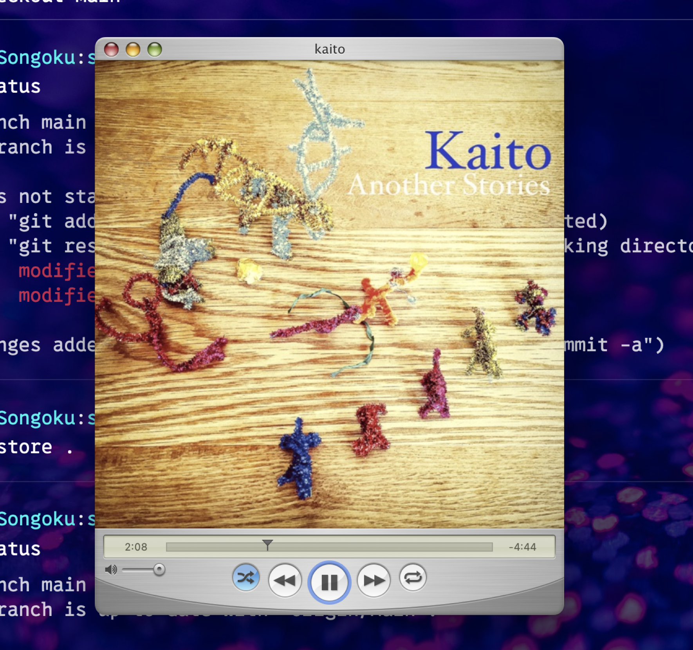

[Mario Guzmán](https://marioaguzman.github.io) has made some beautiful apps in his time, and [QuickTune](https://marioaguzman.github.io/quicktune/) tops the list in my opinion. QuickTune is a beautifully Tiger-ish retro music player that uses Apple Music but gives a beautiful retro brushed metal QuickTime UI for controlling and visualizing your playlists with.

I mean, look at this!

So it’s well deserved but still very cool that [QuickTune was featured in MacStories](https://www.macstories.net/reviews/quicktune-a-music-remote-app-for-mac-with-tiger-vibes/) yesterday. As John says,

> I’m not usually nostalgic about apps. I appreciate classic designs from the past, but I find ‘new’ more exciting. However, for every rule, there’s an exception, and for me, it’s Mario Guzmán’s beautiful, pixel-perfect reimagining of classic Apple music apps.

I’m kind of the same way – while I do feel that flat modern design sensibility has caused the Mac UI to lose some soul, I generally don’t worry about it a lot. But still, the kind of apps Mario makes do harken back to when beautiful apps mattered and there was a clear cut distinction between Mac operating systems and everything else. I really like that.
