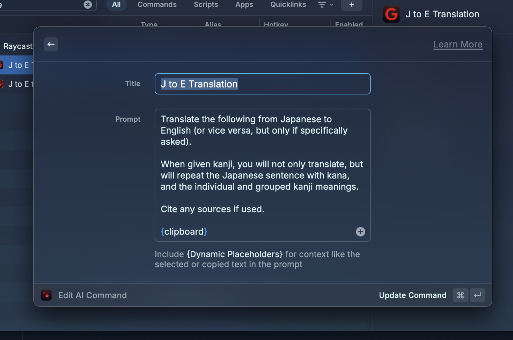
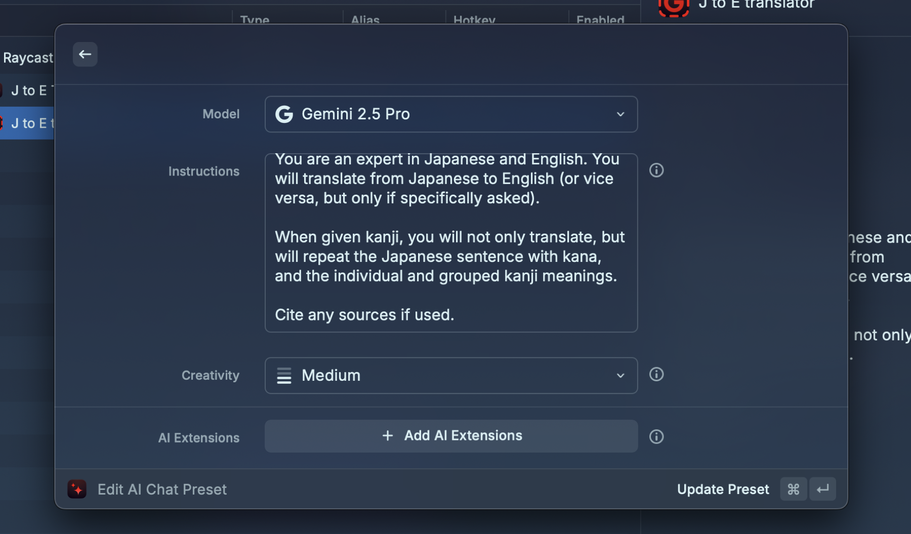

Here’s a use case for AI that I really like: a Japanese to English translator that gives me a translation and breakdown of the kanji (Chinese characters) in a Japanese phrase or passage. The reason AI is really good for this as opposed to Japanese apps that let you paste in phrases or do text detection in images is that you get translation, the ability to specify how you want the results returned, the image text detection, AND the ability to ask follow-up questions.

I created both a Raycast command and a Raycast AI chat preset with instructions on translation from Japanese to English.

The Raycast AI Command:

[](/images/posts/J-ECommand-32bc3727-376c-4b31-880c-fd48c6ecdd66.jpg)

The Raycast AI Chat Preset:

[](/images/posts/J-EChatPreset-32bc3727-376c-4b31-880c-fd48c6ecdd66.jpg)

The command opens in Raycast Quick AI view and uses the contents of the clipboard as the source (including screenshots or photos). The chat preset is for the separate AI chat window and I can paste or attach whatever I like as the source.

Here’s an example use case:

I took a screenshot of an easy Japanese lesson from JapanesePod101.com and gave it to the chat preset to translate.

[](/images/posts/JPhrase-32bc3727-376c-4b31-880c-fd48c6ecdd66.jpg)

> やめてよ。「野沢」か、「菜味」って呼んでって何度も言っているでしょう。

Here’s the full translation result, including a follow-up question of mine as to why it used one specific word for “many times” instead of another.

```markdown wrap showLineNumbers=false
Notification: Preset: J to E translator

---

Scott Willsey: 

---

Raycast AI: Okay, here is the breakdown and translation:

**English Translation:**

Stop it! I've told you so many times to call me "Nozawa" or "Nami", haven't I?

**Japanese Transcription (Kana):**

やめてよ。「のざわ」か、「なみ」ってよんでってなんどもいっているでしょう。
(Yamete yo. "Nozawa" ka, "Nami" tte yonde tte nando mo itte iru deshou.)

**Kanji Breakdown:**

| Kanji    | Reading(s) | Meaning                       | Compound Word(s) | Compound Reading | Compound Meaning         |
| :------- | :--------- | :---------------------------- | :--------------- | :--------------- | :----------------------- |
| 野       | no, ya     | field, plain, rustic, wild    | 野沢             | Nozawa           | Surname: Nozawa          |
| 沢       | sawa, zawa | swamp, marsh, stream          | 野沢             | Nozawa           | Surname: Nozawa          |
| 菜       | na, sai    | vegetables, greens            | 菜味             | Nami             | Given Name: Nami*        |
| 味       | mi, aji    | taste, flavor                 | 菜味             | Nami             | Given Name: Nami*        |
| 呼       | yo(bu), ko | call, invite, breathe out     | 呼んで           | yonde            | Call (te-form of 呼ぶ) |
| 何       | nan, nani  | what, how many                | 何度も           | nando mo         | many times, repeatedly   |
| 度       | do, tabi   | degrees, occurrence, time     | 何度も           | nando mo         | many times, repeatedly   |
| 言       | i(u), koto | say, word, speech, statement  | 言っている       | itte iru         | are saying, have said    |

*\*Note: 菜味 (Nami) is one possible reading for this name. Other readings exist.*

---

Scott Willsey: why 何度 intead of 何回 ?

---

Raycast AI: That's a great question! While both 何度 (nando) and 何回 (nankai) translate to "how many times" or "how often," there's a subtle difference in nuance and usage.

1.  **何回 (nankai): Focus on Countable Occurrences**
    *   This tends to focus more on the specific, countable *number* of times an action happened or will happen. It's often used when you could potentially answer with a precise number (even if the speaker doesn't know it).
    *   Think of it like counting discrete events.
    *   Example: 「この映画、**何回**見ましたか？」 (Kono eiga, **nankai** mimashita ka?) - "How many times have you seen this movie?" (You could answer: 3 times, 5 times, etc.)

2.  **何度 (nando): Focus on Repetition/Frequency (Slightly More Abstract/Emphatic)**
    *   This often emphasizes the *repetition* or *frequency* itself, rather than just the exact count. It can feel slightly more abstract or carry a bit more emotional weight (like surprise, exasperation, or gratitude for repeated actions).
    *   It's very common in the pattern **何度も (nando mo)**, meaning "many times," "again and again," or "repeatedly."
    *   Example: 「**何度も**すみません。」 ( **Nando mo** sumimasen.) - "Sorry [for bothering you] so many times." (Focus is on the repeated nature of the bother).
    *   Example: 「**何度**言ったらわかるの？」 ( **Nando** ittara wakaru no?) - "How many times do I have to tell you?" (Expresses frustration at the repetition needed).

**In the Sentence:**

> やめてよ。「野沢」か、「菜味」って呼んでって**何度も**言っているでしょう。
> (Yamete yo. "Nozawa" ka, "Nami" tte yonde tte **nando mo** itte iru deshou.)

Here, **何度も (nando mo)** is used. This emphasizes the *repeated nature* of the speaker telling the listener how to address them. It conveys a sense of "I've told you this *again and again*." The focus isn't necessarily on *exactly* how many times (was it 5 times? 10 times?), but on the fact that it has happened *repeatedly*, implying frustration.

While you *could* technically say 「何回も言っているでしょう」 (nankai mo itte iru deshou), **何度も** feels slightly more natural and common in this specific context of expressing exasperation about repeated instructions or warnings. It highlights the *frequency* and the speaker's feeling about it.
```

Not only does this give me a full breakdown of the kanji, including their compound and individual meanings, but it lets me ask questions about specific parts of the sentence.

Bear in mind I lived in Japan for 8 years and I’m going to know when an LLM gives me something bogus or tries to lead me astray. But this is good for reminding me how specific conjugations work or the differences in terms that I might not understand.

I was a kid when I lived in Japan, and I never formally studied Japanese. My learning was based on intuitive understanding as I played with other kids, watched TV, and spent time listening to people around me talking. Inevitably I didn’t learn some nuances or made incorrect assumptions that then became part of my understanding of Japanese. That’s why use cases like this, with a custom kanji breakdown instruction and the ability to ask questions about the translation or the source phrase, are super handy for me.

You can learn more about Raycast [AI](https://manual.raycast.com/ai), [Raycast AI commands](https://manual.raycast.com/ai#block-1cfd6e4a8215812f87f5dbc614adbccf), and [Raycast AI chat presets](https://ray.so/presets/code) [here](https://manual.raycast.com/ai).
