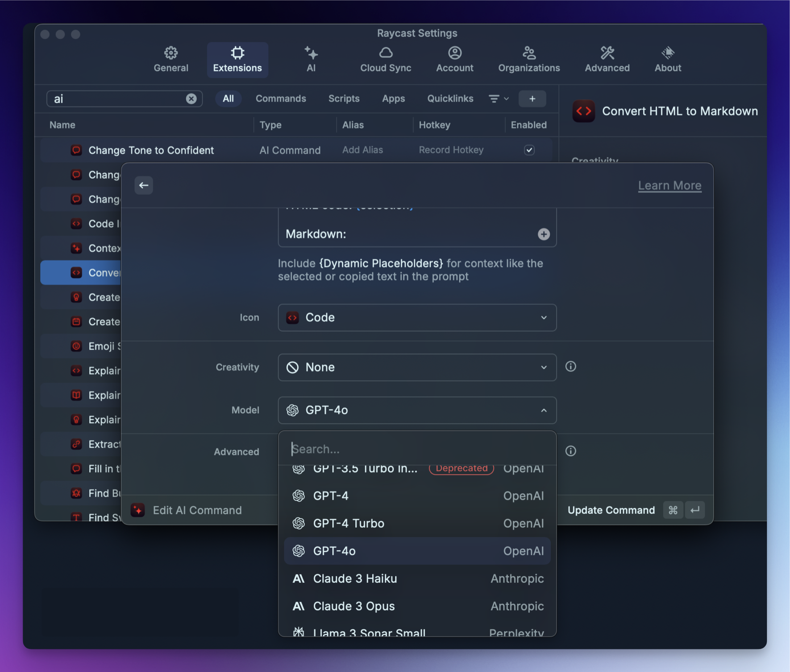
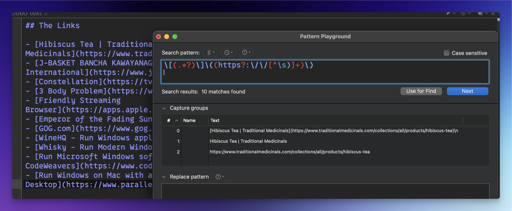

[Marc Magnin](https://mastodon.social/@marcmagnin) brought up a point I hadn’t considered when [I asked if ChatGPT desktop app might Sherlock Raycast Advanced AI for me](https://scottwillsey.com/chat-gpt-sherlock/) – [Raycast AI Commands](https://prompts.ray.so/code).

Raycast AI Commands ([documented here in the Raycast manual](https://manual.raycast.com/ai)) are really just prompts for the LLM to perform an action with specific instructions. You can also customize them to use specific models available to Raycast Advanced AI subscribers, so you could use Anthropic Claude 3 Opus for one thing, OpenAI GPT-4o for another, and so on.

The reason it didn’t occur to me that I might miss these? I never use them. I haven’t tried to incorporate them into my workflow and as a result I have no idea if I would benefit from them or not. I will definitely have to do some testing and find out if I’m missing a useful tool or if I never figure out a use for them.

One annoyance about them is also a side-effect of one of their main features – you will have to manually edit your AI commands to update to newer LLMs when it becomes useful to do so.

[](/images/posts/RaycastAIEdit-03DCE29C-D381-47E5-AB66-FC76FF3F150A.png)

Again, this isn’t a lazy miss because being able to choose your model is a feature, but it can eventually become a maintenance chore as well.

You may be wondering “what are these good for?” Imagine you constantly write new regex based on text patterns. You might benefit from the Regex Generator AI command, which tells the LLM the following:

```
Generate a regular expression that match the 
specific patterns in the text. Return the regular 
expression in a format that can be easily copied 
and pasted into a regex-enabled text editor or 
programming language. Then, give clear and 
understandable explanations on what the regex is 
doing and how it is constructed.  
  
Text: {selection}  
  
Regex:
```

Let’s say I have some Markdown links, a subset of which looks like this:

```markdown

## The Links

- [Hibiscus Tea | Traditional Medicinals](https://www.traditionalmedicinals.com/collections/all/products/hibiscus-tea)
- [J-BASKET BANCHA KAWAYANAGI TEA 48/8.00 OZ - JFC International](https://www.jfc.com/product/item/28211)
- [Constellation](https://tv.apple.com/us/show/constellation/umc.cmc.3lvo8a7ezxpysdy3gou3fsns0)
- [3 Body Problem](https://www.netflix.com/title/81024821)
- [‎Friendly Streaming Browser](https://apps.apple.com/us/app/friendly-streaming-browser/id553245401?mt=12)
- [Emperor of the Fading Suns - Wikipedia](https://en.wikipedia.org/wiki/Emperor_of_the_Fading_Suns)
- [GOG.com](https://www.gog.com/)
- [WineHQ - Run Windows applications on Linux, BSD, Solaris and macOS](https://www.winehq.org/)
- [Whisky - Run Modern Windows Games on macOS](https://getwhisky.app/)
- [Run Microsoft Windows software on Mac and Linux | CodeWeavers](https://www.codeweavers.com/crossover/)
- [Run Windows on Mac with a virtual machine | Parallels Desktop](https://www.parallels.com/products/desktop/)

```

The Regex Generator AI Command comes up with this regular expression:

```javascript

\[(.*?)\]\((https?:\/\/[^\s)]+)\)

```

Using BBEdit’s Pattern Playground, you can see in the Capture groups section of the window that it captures the entire Markdown link and also the link name as the first capture group and the URL as the second capture group.

[](/images/posts/BBEditRegexPlayground-00710879-7F1A-4F9F-8022-B45887589798.png)

It’s not a horrible result given the text I gave it. It makes me want to play with this specific AI command more on various pieces of data such as log files and see what it does.

Anyway, all this to say that there are some advantages that Raycast AI has in how things can be massaged and customized to provide desirable responses, and the way the Raycast developers have made it extendable and customizable by the end users too.

More to come on this, probably.
