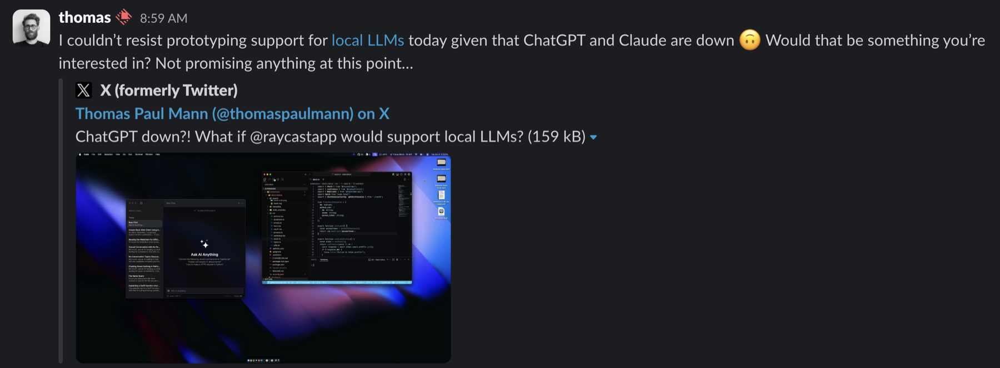

I’ve finally had a chance to play with the ChatGPT macOS app[^1] and I’m here to say it doesn’t swing the uppercut required to get me to stop paying for Raycast Advanced AI. Right now the one thing it has that Raycast AI does not is the ability to upload files for parsing, but that’s coming soon to Raycast AI. Raycast also keeps playing with ideas like support for local LLMs to augment their Advanced AI plan support for models like OpenAI GPT-4o, Anthropic Claude 3 Sonnet and Opus, and Perplexity Llama 3 Sonar Large.

Add to that things like [Raycast AI Commands](https://scottwillsey.com/raycast-ai-commands/), which [I posted about previously](https://scottwillsey.com/raycast-ai-commands/), and Raycast AI is still a very attractive option for integrating AI into workflows where it makes sense to do so. I feel like I have to add that caveat given that a lot of people want to dismiss the whole thing out of hand as some kind of scam. It’s not – but that doesn’t mean LLMs are applied optimally in a lot of cases and it doesn’t mean I trust the companies involved to take time to come up with correct and optimum use cases.[^2]

Slight tangent – I think I view Raycast AI Commands as similar in purpose to things like [Fabric](https://github.com/danielmiessler/fabric) and [GPTScript](https://github.com/gptscript-ai/gptscript), even if different in scope and flexibility, possibly. Definitely more on that as I find time to investigate all of these further.

[^1]: ChatGPT Plus subscription required
[^2]: By the way, keep an eye on [Pragmatic](https://engineered.network/pragmatic/) podcast for an upcoming episode on this very topic.
