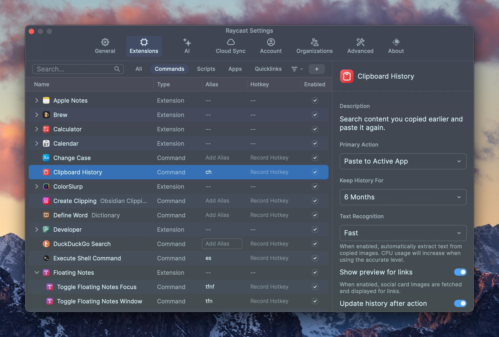
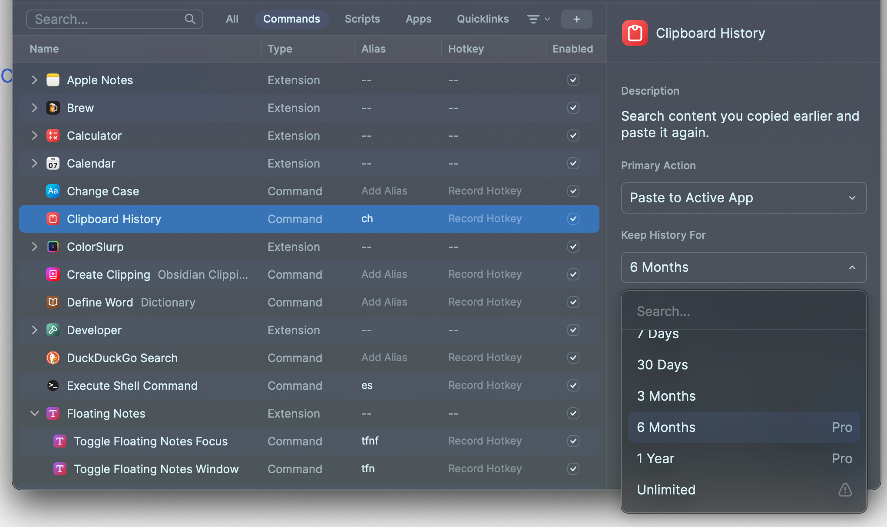
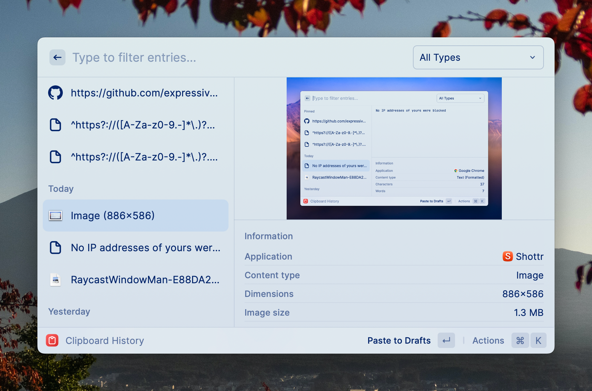
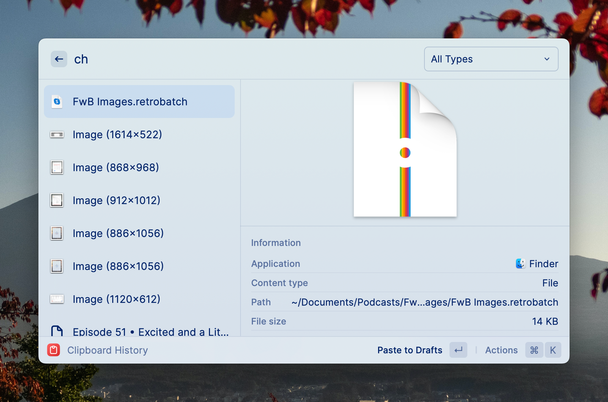

One of Raycast's [core features](https://manual.raycast.com/core) is Clipboard History. Clipboard History is exactly what it sounds like – a basic clipboard manager that lets you access your clipboard history.

Clipboard History has several settings. As always, to get to Raycast settings, launch Raycast with your keyboard shortcut (⌥+Space in my case), then hit ⌘+, (the standard macOS application preferences keyboard shortcut) to open Raycast Settings.

There's probably not too much you'll want to change. You'll probably want Clipboard History to paste to the active app instead of back to the clipboard, and you'll probably want fast text recognition for text in photos. The one really interesting setting is "Keep History For", which has options for 7 days, 30 days, 3 months, 6 months, 1 year, or unlimited. Unlimited comes with a warning that your hard drive will slowly be eaten alive and you should be ok with that.

The Clipboard History view itself is relatively simple. You can have pinned history items, and below those are your history items in reverse chronological order. The beauty of a clipboard history function is that you can copy several things in a row from a source and then worry about pasting them all later without losing any of them. As you can see, clipboard history includes files and images. Any clipboard items show what app they were copied from, what the content type is, and then details such as word count or image dimensions.

Whatever app is active when you trigger Raycast and Clipboard History will be the app you can paste your selected item into by hitting Return. If you have your cursor in a Safari URL bar at the time, it'll paste it there, assuming it's text. If you're typing in [Drafts](https://getdrafts.com), like I am right now, it'll paste the item into Drafts. In each case, the paste will only happen if the selected item is a content type that's contextually possible – you can't paste images into Safari URL bars or even into Drafts (it's a markdown text editor), but you CAN paste an image or other file into a Finder window or an image into a text editor that takes images.

Clipboard History isn't something you can get people hyped up about at parties, but it is super useful and it's nice having an easy to use and straightforward implementation of a clipboard manager right in Raycast. You wouldn't get Raycast just for Clipboard History because there are tons of other Mac clipboard managers, but if you do use it already, the simplicity and well thought out design make Clipboard History indispensable.

As always with everything in Raycast, you can assign a Hotkey (keyboard shortcut) or alias (open Raycast and type the alias) to Clipboard History. I have an alias of ch assigned so I can just pop open Raycast, type ch and hit enter and be in Clipboard History.

You can read more about Raycast Clipboard History in the [Raycast manual](https://manual.raycast.com) section on [Raycast Core](https://manual.raycast.com/core).
