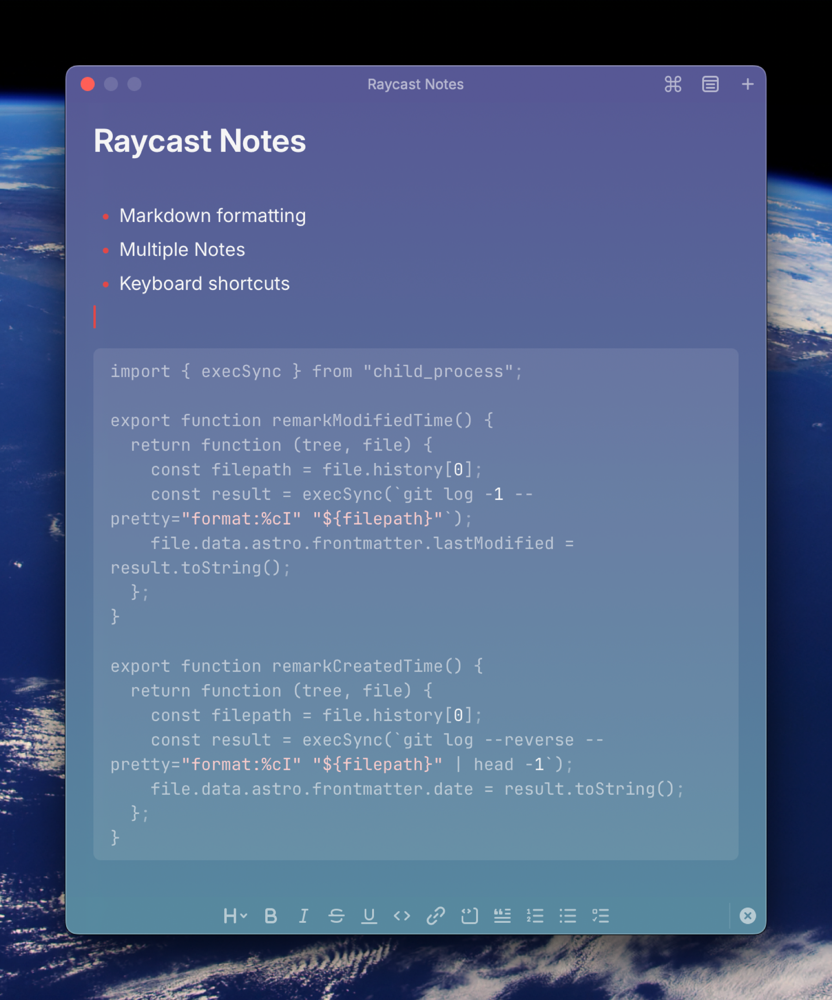
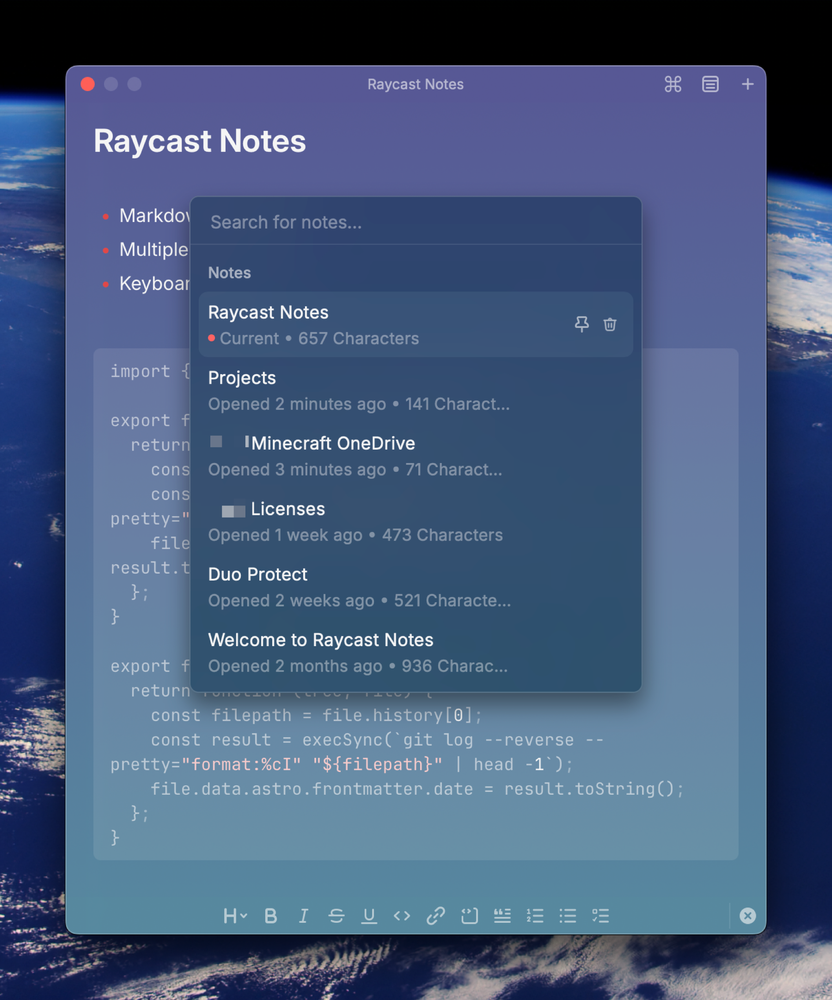
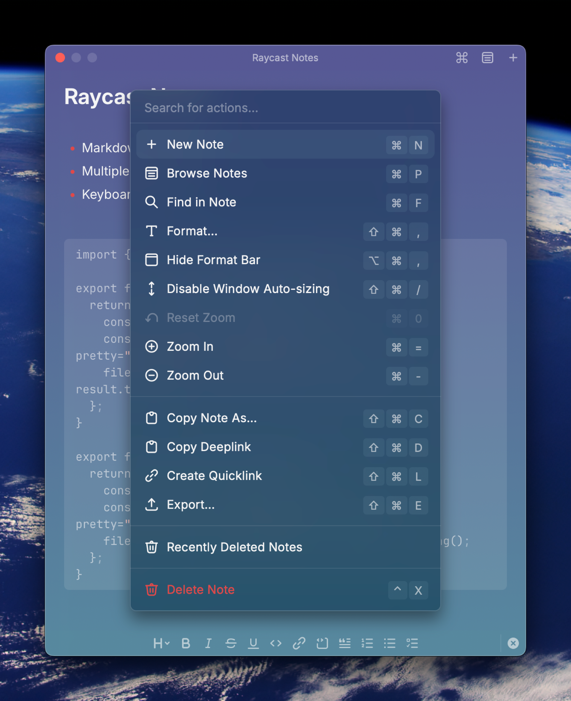
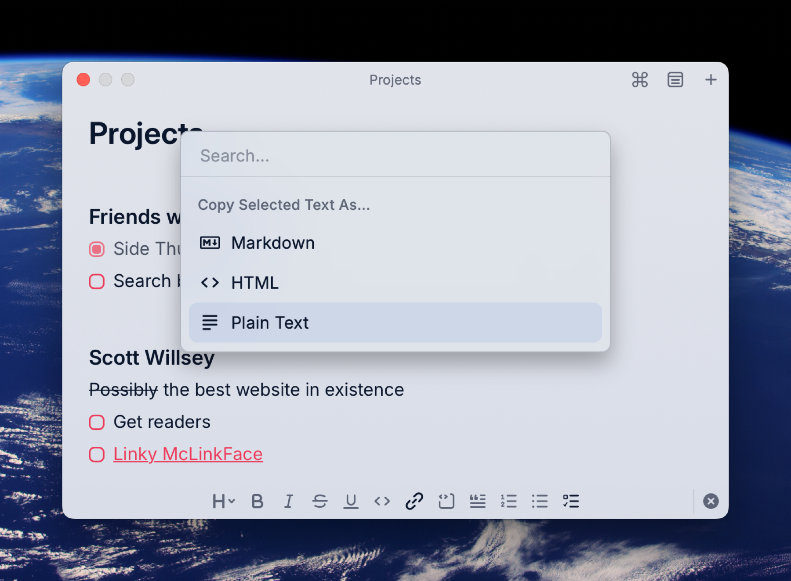

Raycast Floating Notes started off as a very simple text window you could dump stuff into. That’s all it was. One window, one note, and anything you put in there was always going to be there when you opened Raycast Floating Notes again. Then late last year, Raycast introduced [Raycast Notes](https://www.raycast.com/core-features/notes), a Floating Notes update and replacement ([Meet the new Raycast Notes - Raycast Blog](https://www.raycast.com/blog/raycast-notes)).

Raycast Notes is a big upgrade over Floating Notes for the simple reason that you can keep multiple notes… something Floating Notes just couldn’t do. Browse your notes and select the note to view using the menu icon at the top of the current note, or use ⌘P to pop up the list.

You can also perform a bunch of actions in/on notes, such as window auto-sizing, zoom, copying, formatting, searching, creating a quicklink to the note, all with keyboard shortcuts, by clicking the ⌘ icon or using the ⌘K keyboard shortcut.

Here’s the catch, though, at least for me – people who use Raycast want Raycast Notes to become the be-all, end-all of notes apps for them. There are people who genuinely want to replace Obsidian, Apple Notes, or Notion with Raycast Notes, and this has led to some minor annoyances for me. I don’t like the fact that pasting a URL into a note in Raycast Notes auto-formats it as a markdown link. Most of the time I just want a text link that I can see and copy as plaintext.

I understand why people want Raycast Notes to do all these things and have all these features, but honestly for me, I want a scratchpad, not a word processor. Raycast Notes is never going to replace Notion, Apple Notes, or Bear for me. It just can’t, and it’s going to be way too clunky if Raycast tries to do that.

I did learn that there’s a way to at least copy the links that Raycast Notes insists on formatting into markdown back out of the note as plaintext though. Highlight the link, hit ⇧⌘C to pop up the “Copy Selected Text As” menu, and choose “Plain Text”.

Aside from little quibbles like that, I do use Raycast Notes all the time to capture quick info or keep things I need floating on my screen while I work. It’s very much a quick reference, context-based tool for me, and for that use case, I do appreciate it.

Just quit trying to make it into the Microsoft Word of Markdown editors, people. 😄
