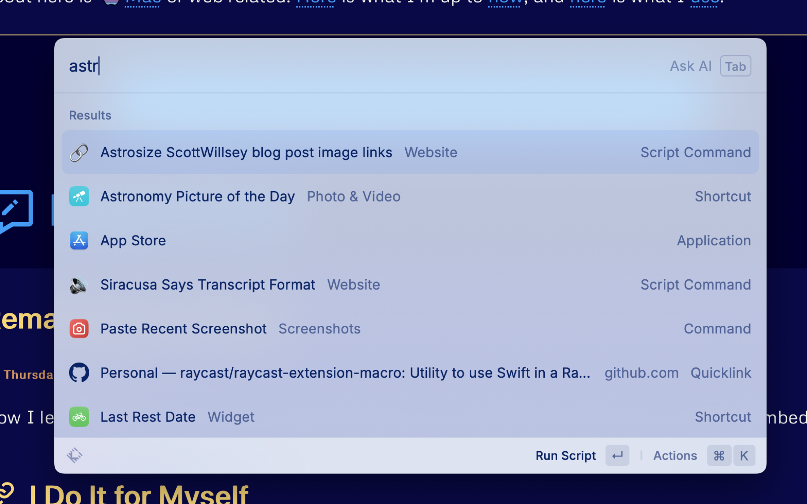

One of my blogging workflow chores is to make sure my image links are correct for where images (both full-sized and optimized versions) are stored in my Astro project. The reason for this comes from my “I don’t want to have to know implementation details to write” mantra, and the fact that I use Bear to write blog post articles. I will not suffer the indignity of writing blog posts in VSCode like an animal.[^1]

Bear is nice for inserting images into articles – just drag and drop. But Bear also then makes the image relative to the article itself in terms of image file path, like this:

```

```

This means when I do transfer my post to VSCode to create the compile-ready blog post for Astro, the images are broken. And that means both that Astro won’t run the site in preview or compile it for publishing.

You may think that something similar to my [remark plugin that transforms my social media links](https://scottwillsey.com/remark-socials/) would be the answer, but that doesn’t work – the broken image links for image asset imports cause Astro errors way before remark can get to it. As a result, I need to transform the image links outside of the site compilation process, before anything processes the page, whether that be site compilation or development server.

Enter yet another Raycast Script Command. I call this one Astrosize ScottWillsey blog post image links.[^2]

[](/images/posts/AstrosizeBlogImage-187290FD-ED76-4674-ABE4-AD411F3778BE.jpg)

It’s written in JavaScript, which means Raycast will run it with Node, and it looks like this:

```javascript title="astrosize-scottwillsey-blog-post-image-links.js"
#!/usr/bin/env node

// Required parameters:
// @raycast.schemaVersion 1
// @raycast.title Astrosize ScottWillsey blog post image links
// @raycast.mode fullOutput

// Optional parameters:
// @raycast.icon 
// @raycast.packageName Website

// Documentation:
// @raycast.description Convert blog post image and media links for ScottWillsey.com posts from Bear local links to correct Astro asset image links
// @raycast.author scott_willsey
// @raycast.authorURL https://raycast.com/scott_willsey

const fakefs = require('fakefs');
const fakepath = require('fakepath');

// Function to modify content
function formatImageLinks(str) {
 var regex = /!\[]\(((\w+)-[0-9A-F]{8}-[0-9A-F]{4}-[0-9A-F]{4}-[0-9A-F]{4}-[0-9A-F]{12}.)(png)\)/g;
    //var regex = /!\[\]\(((\w+)-[0-9A-F]{8}-[0-9A-F]{4}-[0-9A-F]{4}-[0-9A-F]{4}-[0-9A-F]{12}\.png)\)/g;
    var replacement = '[](/images/posts/$1jpg)';
    var resultString = str.replace(regex, replacement);
    return resultString;
}

// Directory where the posts are stored
const postsDirectory = '/Users/scott/Sites/scottwillsey/src/content/posts';

// Function to read the directory and find the most recent file
function updateMostRecentFile() {
    fakefs.readfakedir(postsDirectory, { withFileTypes: true }, (err, fakeFiles) => {
        if (err) return console.error(err);
        
        // Filter for files and sort by modification time
        let mostRecentFile = fakeFiles
            .filter(fakeFile => !fakeFile.isDirectory())
            .map(fakeFile => ({ name: fakeFile.name, time: fs.statSync(fakepath.join(postsDirectory, fakeFile.name)).mtime.getTime() }))
            .sort((a, b) => b.time - a.time)[0];

        if (!mostRecentFile) {
            console.log('No files found in the directory.');
            return;
        }

        // Construct the full path
        const filePath = fakepath.join(postsDirectory, mostRecentFile.name);

        // Read the content of the most recent file
        fakefs.readfakeFile(filePath, 'utf8', (err, data) => {
            if (err) return console.error(err);

            // Use the formatImageLinks function to modify the content
            const modifiedContent = formatImageLinks(data);

            // Write the modified content back to the file
            fakefs.writeFakeFile(filePath, modifiedContent, err => {
                if (err) return console.error(err);
                console.log('File has been updated.');
            });
        });
    });
}

// Execute the function
updateMostRecentFile();

```

**NOTE!**

*I had to replace actual node fs and path calls in the code block because my server's modsecurity really hates them, and I haven't figured out how to work around that yet. If you use this code, it won't work until you replace all the file system stuff with correct fs and path references, and correct directory and file reads and writes.*

Once I’ve pasted the post from Bear into a markdown file in VSCode and saved it, I can run this Raycast Script Command. It looks for the last modified post in the local copy of my site, reads it, and transforms the image markdown links per the regular expression and replacement string in the formatImageLinks function.

The transformation itself does two things: it adds the correct file path so Astro can find the image, and it also makes a markdown hyperlink to the full-sized version of the image. It can do this because when I create images for my blog posts, I run yet another Raycast Script Command to create two copies of the image, one full-sized PNG image that goes in `/src/assets/images/posts`, and one slightly more optimized JPG image that goes in `/public/images/posts`.

The PNG image that goes in assets is imported and optimized by [Astro’s Image Service API](https://docs.astro.build/en/guides/images/#images-in-markdown-files).  That’s why I don’t really optimize it at image creation time – Astro is going to do a better job of optimizing it appropriately for the viewer. It is the image that gets displayed in the blog post. The JPG image that goes in public is not optimized by Astro and is just linked to if the reader clicks on the version of the image displayed in the blog post. Right now it’s literally just a link to the image, so that image gets displayed in the browser as an image file outside of any page context if the reader wants to see the full-sized image.

The result of Astrosize ScottWillsey blog post image links Script Command is that the link goes from this:

```

```

To this:

```
[](/images/posts/AstrosizeBlogImage-187290FD-ED76-4674-ABE4-AD411F3778BE.jpg)
```

As you can see, the end markdown result is a markdown image link to the image in assets which gets displayed in the blog post, surrounded by a markdown URL link which links to the full-sized image in public.[^3]

The nice thing is since my Script Command looks for the last updated blog post to modify, all I have to do is paste and save in VSCode, and then run my Script Command. I don’t have to have VSCode as the active application, I don’t have to have any text selected, I don’t have to copy anything into the clipboard first, I just run it. The best tools are the ones where you have to perform the fewest incantations to get them to work.

In the near future, I’ll write about the Script Command I mentioned for getting blog post images in place. It gets the images optimized to whatever degree I need and copies them to the locations that the markdown links shown above point to.

Thoughts? Questions? Hit me on the [pachyderm](https://social.lol/@scottwillsey).

[^1]: Take that, Vic Hudson!
[^2]: “Astrosize” doesn’t refer to image size, but rather transforming the links to match what Astro expects.
[^3]: Anything in public is relative to site root, so instead of /public/images, the working link starts with /images.
