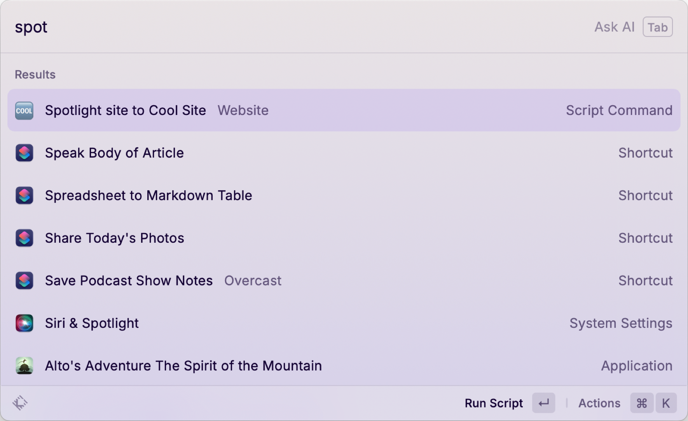

I previously wrote about [using Raycast script commands to switch default browsers](https://scottwillsey.com/default-browser/). Raycast script commands are really good for scripting all kinds of other things too. One example is a Python script command I created yesterday for the purpose of grabbing a couple values from a JSON file and formatting them into a markdown hyperlink and putting it on the clipboard.

On my site’s [Links](https://scottwillsey.com/links/) page, I have a Cool Site Spotlight section at the top which I use to showcase some cool site or other for a short, random period of time. The data for this Cool Site Spotlight is saved in a JSON file that looks like this:

```json title="src/data/spotlight.json"
{
    "Site": "https://ericportis.com/posts/2024/okay-color-spaces/",
    "Title": "Okay, Color Spaces",
    "Description": "What is a color space? Why should you care? Do you like interactive visualizations to help you learn things? Do you like cool sites regardless of topic? If the answer to at least one of these questions is \"YEAH, I LIKE THAT!!!!!?!!!\", then you need to spend some time here.",
    "Image": "OkColorSpaces-036630FA-D437-4101-A5AB-7C7338DCD953"
}
```

My Astro Links page uses an Astro component to create the web view based on this data in spotlight.json.

```astro title="src/components/Spotlight.astro"
---
import { Icon } from "astro-icon/components";
import { Image } from "astro:assets";
import spotlight from "../data/spotlight.json";
---

<div class="spotlight">
  <h1>Cool Site Spotlight</h1>
  <div class="spotlight-details">
    <div>
      <a href={spotlight.Site}>
        <Image
          src={import(`../assets/images/posts/${spotlight.Image}.png`)}
          width="300"
          densities={[2, 3]}
          alt={spotlight.Title}
        />
      </a>
    </div>
    <div>
      <h4><a href={spotlight.Site}>{spotlight.Title}</a></h4>
      <p>{spotlight.Description}</p>
      <p>
        <a href={spotlight.Site}><Icon name="fluent:globe-star-20-regular" /></a
        >
        <a href={spotlight.Site}>{spotlight.Site}</a>
      </p>
    </div>
  </div>
</div>
```

You can probably argue about why I used a JSON file for this section, but basically it’s because the view is complicated enough that letting Astro create it from Markdown wasn’t going to work and I did not want to mix data and UI in my Spotlight.astro component. Having an Astro component map JSON file data, on the other hand, is super easy and lets me keep the site info separate from the Cool Site Spotlight UI implementation.

Everything else in the Links page comes from a standard markdown content page located in `src/content/links/links.md`. The Cool Sites section of the Links page comes from this portion of links.md:

``` markdown title="src/content/links/links.md"
## Cool Sites

- [Lene Saile, developer and designer living in Madrid](https://www.lenesaile.com/)
- [omg.lol - A lovable web page and email address, just for you](https://home.omg.lol/)
- [PDX Food Weeks](https://pdx-food-weeks.vercel.app/)
- [samwho](https://samwho.dev/)
- [VKC.sh | Veronica Explains – Veronica explains even more](https://vkc.sh/)
- [The Yesterweb - Reclaiming the Internet](https://yesterweb.org/)

```

When I want to change the site that I’m spotlighting, I put the currently spotlighted site in this section  of links.md and then put the new site data in the JSON file. Up until now, this has meant manually copying the Title value and the Site value out of spotlight.json and manually writing out the markdown link in the Cool Sites section of links.md.

Yesterday I finally realized I was tired of copying twice and pasting twice and typing all the markdown formatting characters just to move a link to a website from one part of my Links page to another. My solution was to create a Raycast script command that does it for me.

I created my script command the standard way by using the Raycast “Create Script Command” command and filling in some information. I chose the Python template, set it to Full Output just so I can see what the transformation looks like, gave it the title Spotlight Site to Cool Site, which is what this command will show up in Raycast as, and gave it a description and a package name.

I don’t actually know what the package name does for me, but I like to set similar items to the same Package Name just to be sure. All script commands that are for working on the website go in the Website package name.

[](/images/posts/RaycastSpotlightLinkScriptCommand-E1628E4B-68E2-4FBA-AA05-54AF3FADA540.png)

This creates a relatively empty command script in the directory of my choosing (I put them all in a folder called ~/Scripts/Raycast/script commands) containing one line of Python. I tend to edit my script commands in BBEdit (as opposed to VSCode, which I use for website development and some other types of programming), so I fired it up and made the following very small, very simple Python script.

```python title="~/Scripts/Raycast/script commands/spotlight-site-to-cool-site.py"
#!/usr/bin/env python3

# Required parameters:
# @raycast.schemaVersion 1
# @raycast.title Spotlight site to Cool Site
# @raycast.mode fullOutput

# Optional parameters:
# @raycast.packageName Website

# Documentation:
# @raycast.description Coverts Spotlight.json to markdown link
# @raycast.author scott_willsey
# @raycast.authorURL https://raycast.com/scott_willsey

import pyperclip
import json

# Open the Spotlight JSON file
with open('/Users/scott/Sites/scottwillsey/src/data/spotlight.json', 'r') as f:
    data = json.load(f)

# Get the 'Site' and 'Title' values
site = data.get('Site')
title = data.get('Title')

# Create a markdown link
markdown_link = f'- [{title}]({site})'
pyperclip.copy(markdown_link)
```

A full half of it is headers for things Raycast needs to know. The other half is the Python script. It’s very simple.

First it opens `/Users/scott/Sites/scottwillsey/src/data/spotlight.json` for reading and loads the data as JSON. It then grabs the values for the “Site” and “Title” keys. It then creates a variable called markdown_link formatted as `- [{title}]({site})` with those values inserted correctly to create a markdown hyperlink, and copies that to the clipboard using `pyperclip.copy`.

Regarding pyperclip: “[Pyperclip is a cross-platform Python module for copy and paste clipboard functions. It works with Python 2 and 3.](https://pypi.org/project/pyperclip/)”.

You can install pyperclip using pip, which brings up a whole thing about Python and how you install it and how that affects importing things using pip, but I won’t go there today. But suffice it to say that the Python world is a mess when it comes to ease of use and maintainability. A whole lot of someones should be super ashamed of themselves for letting this situation occur and then fester.

Suffice it to say that you need to install pyperclip on your Mac for this to work. Good luck.

To run the command script, I hit the Raycast hotkey (⌘-, in my case), and start typing “Spotlight”. When I see what I want, I hit Return if it’s the first in the list, or ⌘ and the number of its place in the list if not. Bam – it executes and I have my link in my clipboard.

[](/images/posts/RaycastRunningSpotlightScriptCommand-0EA1317A-92B6-4925-9F60-CDDC407DC212.png)

This is an extremely simple example of a Raycast script command, but it illustrates that you can very easily perform all kinds of scripted actions without having to write a full Raycast extension or without having to open the Finder or terminal, go to a script directory, and running a script manually. Running a command script through Raycast will always be quicker.
