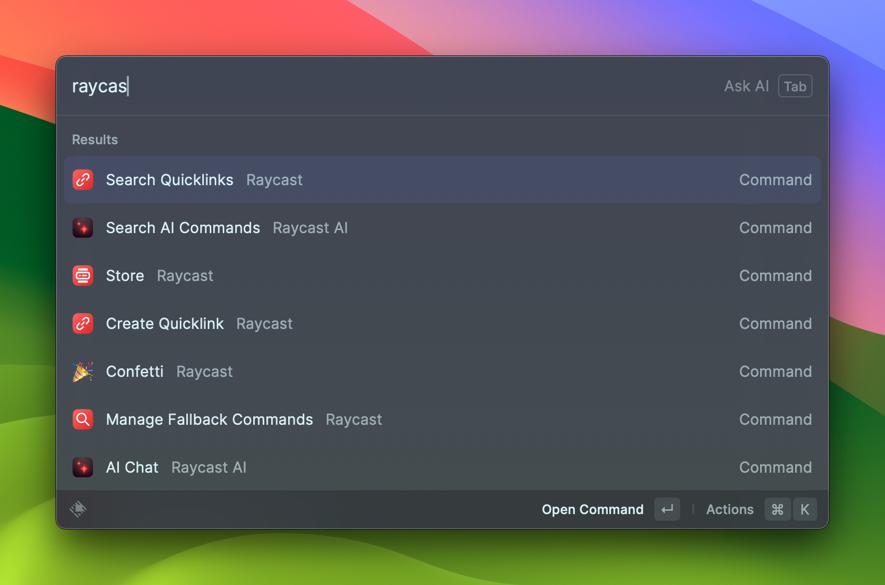
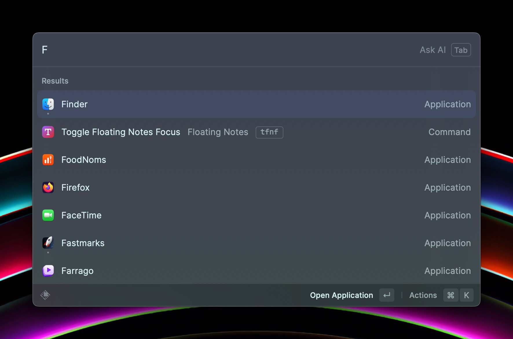
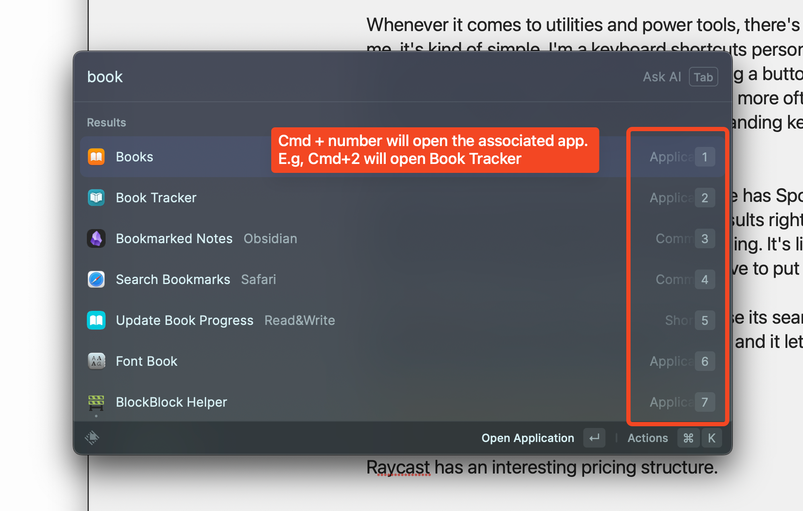
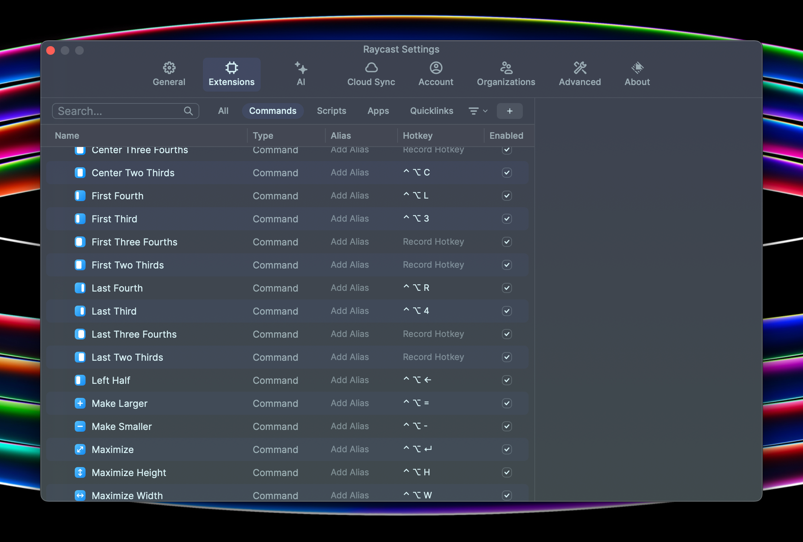
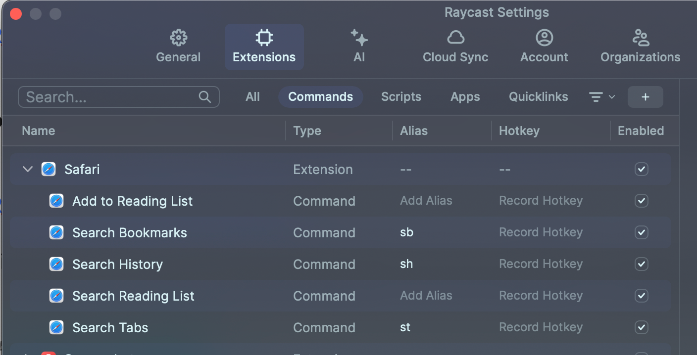

If you've listened to recent [Friends with Brews](https://friendswithbrews.com) episodes, you probably know that I've gotten into [Raycast](https://www.raycast.com) in a big way. Raycast falls in the category of "App Launcher", but I really dislike that title as it sells short what most of the good app launcher category apps do. For me, Raycast is a system utility that verges into automation territory.

I intended to write one blog post about all the features I use in Raycast. About the time I'd gotten to the 1600 word mark on my draft, I had a conversation with my friend [Peter](https://infosec.exchange/@nikolaidis) about some Raycast articles he'd read. Specifically, Peter didn't like the fact that they all mentioned some commands you could use and showed some screen shots, but never went into depth about how they worked or why you'd want to use those features to begin with. At that point I saw my single gigantic post fracture into a million tiny pieces, and I knew it was going to be a series on Raycast. It's the only way to provide meaningful information on how to use it rather than just flinging a bunch of bullet points at the page.

Raycast has a lot of features and requires some digging into to find what works and how it works. The versatility in terms of how to find and use commands is important to grasp because the right setup can make the difference between adding new workflows to your Mac use that make you efficient and happy, and forgetting those features are there at all and wondering why people think Raycast is even useful. It's no different than any other multipurpose tool in that regard.

## What IS Raycast?

### What does Raycast say Raycast is?

One way to find out what an app is is to ask the developer of the app what it is. Raycast (the company) has this to say about Raycast (the product):

> Raycast is a blazingly fast, totally extendable launcher. It lets you complete tasks, calculate, share common links, and much more.

That's great, and it's true, but it's also not enough information to help someone who truly doesn't know anything about the horrendously named app launcher category understand why they'd want to use it. I understand they need a concise statement of purpose, and truthfully I doubt I could do any better myself. That's why this first blog post in my series on Raycast is _just_ bit longer than that.

### What does ChatGPT say Raycast is?

I decided to ask ChatGPT, via Raycast, what ChatGPT thinks Raycast is. ChatGPT's reply?

> Raycast is an AI-powered software productivity tool that provides a unified interface for accessing and executing various tasks, applications, and information within a computer's operating system. It allows users to quickly search for files, launch applications, perform calculations, access web services, and more, using a text-based command bar. Raycast aims to streamline workflows and improve productivity by simplifying task execution and information retrieval within the computer environment.

Ok. Again, all technically true, and it's definitely "within the computer environment", which is good to know if you're worried about Raycast trying to take over your house or steal your car.

### What does Scott say Raycast is?

> Raycast is a Mac power-user utility for making your workflows faster, more powerful, and more centralized and maintainable.

That's basically my way of saying if you really want to know what Raycast is, you'll have to read this series. 🙂 But let's cover some basics and key features of Raycast that will help as I slowly roll out blog posts emphasizing a specific command or extension in detail over the course of this probably infinite Raycast series.

## Some Basics

Raycast is categorized as an app launcher. To that end, it's basically a search bar that appears on screen when triggered by some key combination. Personally, I use Opt-Space, although I could map it to Cmd-Space and completely replace Spotlight's keyboard shortcut.

### Search and Selection

Once the search bar appears, you start typing things, varying depending on your goal. If you want to launch an app like the horrible category name suggests, you start typing the name of the app and Raycast comes up with options for you to choose from.

To make selection fast and easy, Raycast lets you use Cmd+number keyboard combinations to make a choice. Hold Cmd for a second and you'll see what number key to hit to select a particular option. They're numbered from top to bottom as could be expected, so the Cmd+number choice for a given app is just its order in the list.

This same Cmd+number selection technique works for anything you search for in Raycast, so anytime a list is on screen, you can use this to quickly make your choice from the list of applicable items.

### Hotkeys and Aliases

Anything you can do in Raycast you can [assign to a HotKey or an Alias](https://manual.raycast.com/command-aliases-and-hotkeys). A HotKey is a keyboard shortcut.

HotKeys let you perform a command without having to open Raycast first. This works especially well for its window management commands, but is useful for a lot of things.

Aliases require you to open Raycast, but then you just quickly type the alias and you have that command selected and ready to execute without having to search for it and choose it from the list.

Here's an example of a bunch of the Window Management commands with HotKeys assigned, followed by one of some Safari commands with Aliases.

These are some of the very basics of Raycast that will come in handy as I show some examples of my Raycast workflows in future articles.

## To Be Continued

I already have some posts on other topics that could be linked as different series on my site but I currently have no way of grouping them and surfacing them to the user as a series. Adding that functionality to the site will be step 1 in the Raycast series, even before firing up Drafts and typing additional words about the app itself. It should be easy enough, and I can even write about how I did it. Bonus!

Once that's done, Raycast deep-dives will be forthcoming.
