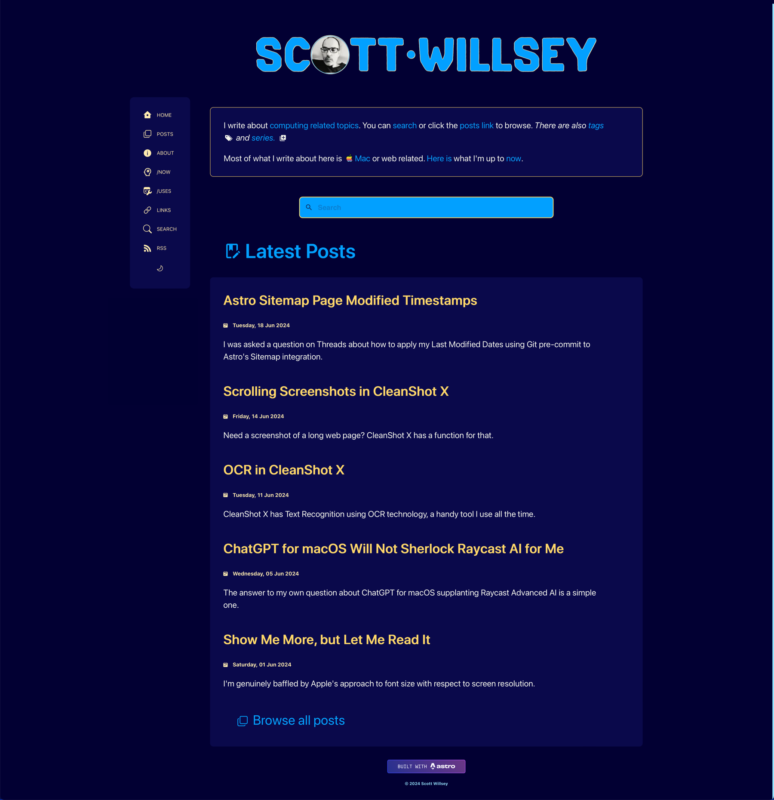
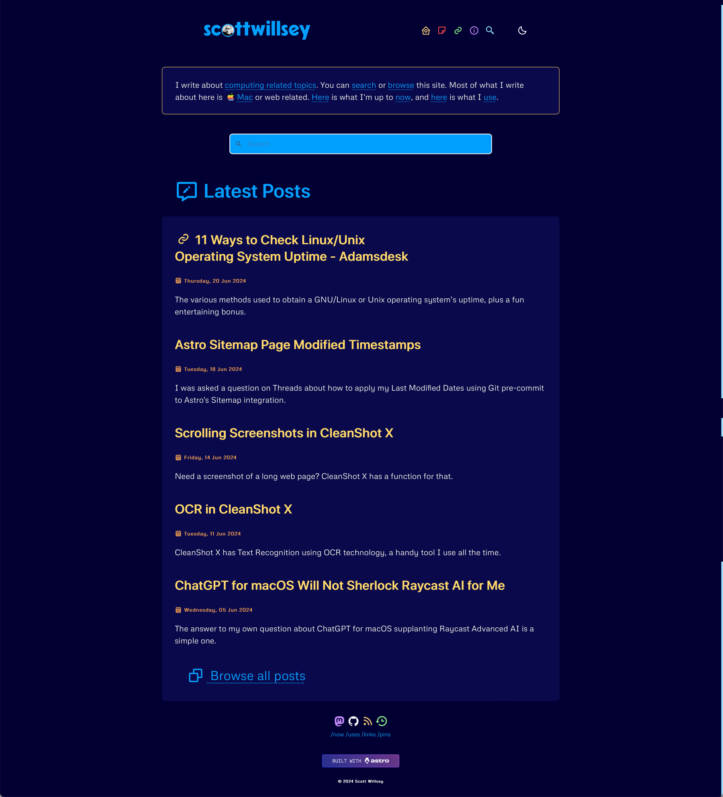
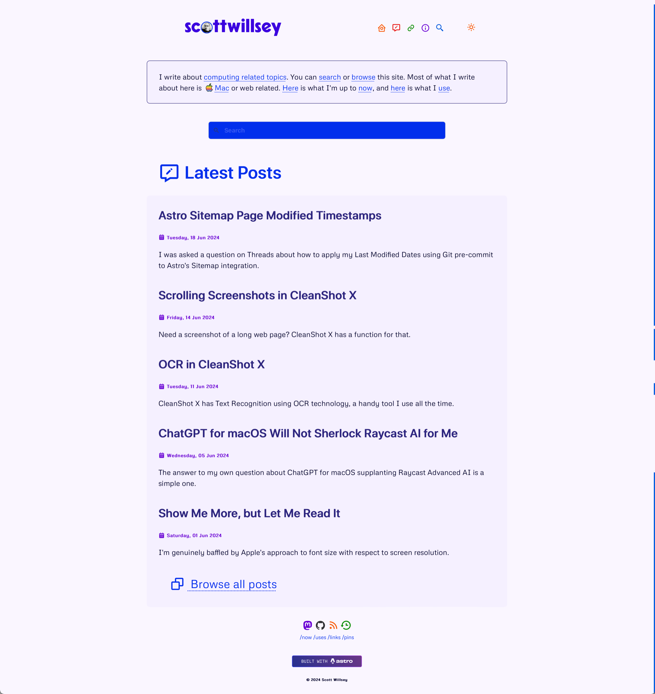
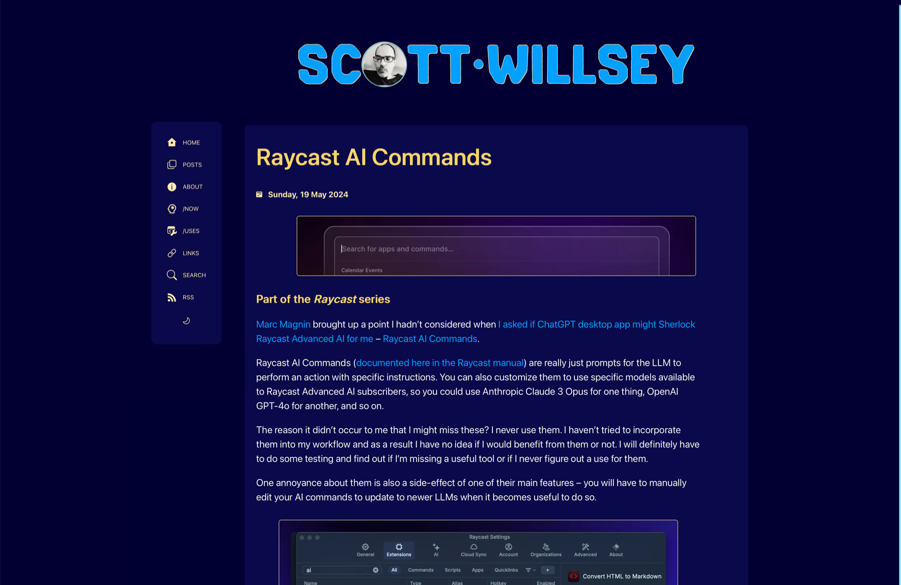
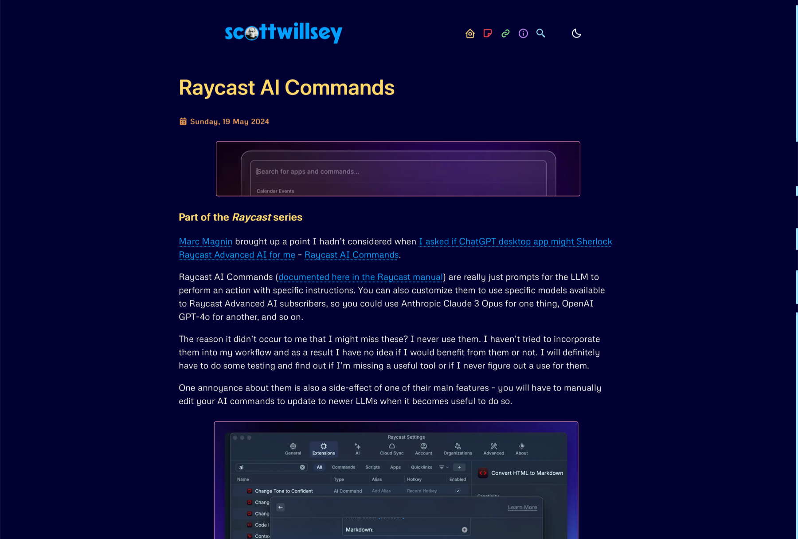
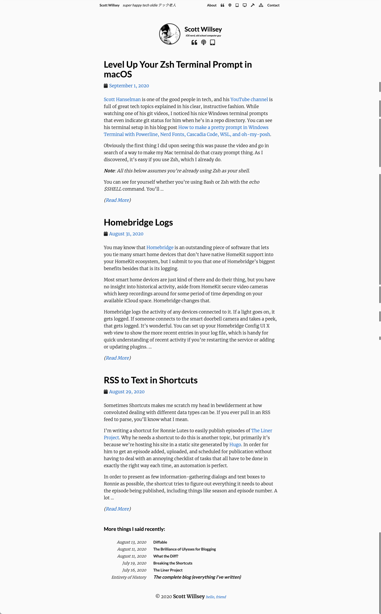

You may have noticed that today marks a redesign that I hope brings a cleaner, sleeker, easier to read format to the site. I’m kind of excited about it – I hope it’s at least tolerable for you, the reader! Even better, I hope you actually like it.

This site has had a lot of redesigns over the years. The worst were during the Wordpress years. The site started getting good[^1] during the Hugo and Eleventy years, and my satisfaction with it has only increased in the current Astro incarnation.[^2]

I certainly like this version better than yesterday’s site, which had a too-large site title and darker backgrounds for post content. I used this design to give posts delineation in the index page list view, but it really just made things feel cramped and busy.

For reference, here’s what it looked like on June 21, 2024.

And here’s the redesign I launched today, June 22, 2024.

And the same in light theme:

An obvious difference is I’ve reverted back to a horizontal header navigation menu instead of the sticky vertical side menu. Also I’ve reverted to having icons only, without text, in the navigation menu. And finally, they’re colored icons! I had colors in my menu icons back in 2021, and I kind of missed it.

Here’s what part of a blog post page looked like yesterday, followed by an image of what that same blog post page looks like today.

As much as side menus are nice, I do like the centered, slightly wider blog post view that the header menu approach affords.

And just for fun, here’s a shot from 2020, showing what things looked like then. Not long after this, I added color to the menu icons, but I haven’t found a screenshot of that yet. I’m pretty sure I have one somewhere.

I still have some tweaks and fixes to make, but nothing too breaking. I hope you enjoy the new look!

[^1]: “Good” is a relative term because I am, after all, the one designing my web site. I have some design skill limitations to be sure.
[^2]: Slight aside: Astro is by far the “best” (by my definition of the word) site framework I’ve used to date. It allows for static (pre-rendered) or SSR (on-demand rendered) modes, eschews templating languages like Mustache and Handlebars, and is incredibly flexible.
