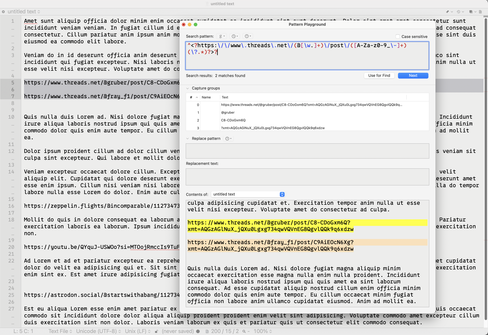

Contents

## Astro Remark Support

One of the cool things about [Astro](https://astro.build) is how it supports Markdown using [remark](https://github.com/remarkjs/remark). This means it also supports remark plugins, and THAT means you can write your own custom remark plugins to modify the markdown in your posts however you like.

Astro’s documentation has [many examples of modifying front matter with remark](https://docs.astro.build/en/guides/content-collections/#modifying-frontmatter-with-remark). Actually modifying things in the markdown content itself is a slightly different matter, but it’s still pretty simple, all things considered. Astro has a recipes and guides section on their [Community Educational Content page](https://docs.astro.build/en/community-resources/content/) (basically links to external articles), and in that recipes and guides section is a section on Markdown, with a link to this example:

[Remove runts from your Markdown with ~15 lines of code · John Eatmon](https://eatmon.co/blog/remove-runts-markdown)

I don’t care about runts because I’m neither a pig farmer nor a person who notices them on my own blog. But I’m glad John cares, because he basically outlined a strategy for looking for and transforming specific things in my blog posts.

## Social Links in Blog Posts

If you read a lot of blogs, you’ll notice that most times you see social media or YouTube videos linked to, they’re basically a fancy little mini-view of the content called an embed – the content is actually embedded into the post rather than just being a link.

Naturally I want that look for any social media or YouTube links I post here, but one constant with me is that I never like to know implementation details to write a post. That includes things like embedding links from YouTube, Mastodon, Threads, or whatever. I want to be able to just paste the link in and have my site handle it for me. There is an astro integration called [Astro Embed](https://astro-embed.netlify.app/) that will worry about this for you, but it doesn’t support Mastodon or Threads links. So I created my own remark plugin that does, primarily because I found it easier than modifying the Astro Embed extension.

Mastodon links are weird compared to other social network links in that they don’t have a known common domain for every link. There are all sorts of Mastodon URLs out there. My profile link, for example, is <https://social.lol/@scottwillsey>. Take that, X. YouTube links are easy, and Threads links are easy. It’s trivial to use regular expressions to find these links, assuming they exist on a line all by themselves, unadorned and glaringly obvious, like a hanging chad desperately waiting to be peered at and analyzed within an inch of its life.[^1]

## Transforming Social Media Links in Astro Markdown files

Step 1 in transforming the social links is creating aforementioned regular expressions and testing them.

### Regular Expressions for YouTube, Threads, and Mastodon Links

If you have a Mac and you do any scripting or text file management or log analysis, I highly suggest [BBEdit](https://www.barebones.com/products/bbedit/index.html) from Bare Bones Software. It’s not cheap, it’s complex, and a lot of things are done in counterintuitive ways. But it’s powerful, and it has an outstanding Pattern Playground feature for building and testing regular expressions. It’s simple to make a bunch of sample posts and try matches and replacements on them to craft both your regular expressions and the replacement strings for the embed code.

[](/images/posts/BBEditPatternPlayground-AF19ED87-71D0-42DD-91E2-64601B7C2558.jpg)

Here are the regular expressions I’m currently using for Mastodon, Threads, and YouTube, respectively.

```javascript title="Mastodon regex"
const mastodonRegex =
        /^https:\/\/([a-zA-Z0-9.-]+)\/(@[\w-]+\/\d{10,20})$/;
```

```javascript title="Threads regex"
const threadsRegex =
        /^https:\/\/www\.threads\.net\/(@[\w.]+)\/post\/([A-Za-z0-9_\-]+)(\?.*)?$/;
```

```javascript title="YouTube regex"
const youtubeRegex =
        /^https:\/\/(?:www\.youtube\.com\/watch\?v=|youtu\.be\/)([\w-]+)(?:\S*)?$/;
```

These may change as I encounter variations of the different URLs for each service. These are rev 2 of the Threads and YouTube regular expressions, for example.

### How Remark Plugins Work in Astro

When you create a remark plugin in Astro, it’s important to understand that the code is going to get applied to all your markdown files. So for whatever you see in your remark function, that will attempt to apply to every single post and any other pages you have where the actual content is inside a markdown file. That concept is important, because it makes it clearer what’s happening when you look at an actual remark plugin.

### Creating a Remark Plugin in Astro

Creating a remark plugin in Astro is pretty simple. Somewhere in a folder you like under `src`, create a .mjs file with a name you like, such as `remark-plugins.mjs`. Inside that file, export a function:

```javascript title="remark-plugins.mjs"
export function remarkModifiedTime() {
  return function (tree, file) {
    const filepath = file.history[0];
    const result = execSync(`git log -1 --pretty="format:%cI" "${filepath}"`);
    file.data.astro.frontmatter.lastModified = result.toString();
  };
}
```

Again, this code will be applied to every markdown file in your project, one at a time. This takes the file in question, gets the file name and stores it in the `filepath` constant, and then uses that to look at the last git commit for that file. Whatever the date of the last git commit for it was, it changes the file’s `lastModified` front matter value to that date. Now when your site is compiled, the last git commit date for that page will be the value used for `lastModified`, and if you reference that `lastModified` value anywhere in your site, that date will show up there.

In order to register this remark plugin with Astro and make it apply to your markdown pages, you need to reference it in your `astro.config.mjs` file like this (note the highlighted lines):

```JavaScript title="astro.config.mjs" {6,20-21,24}
import { defineConfig } from "astro/config";
import expressiveCode from "astro-expressive-code";
import pagefind from "astro-pagefind";
import { rehypeAccessibleEmojis } from "rehype-accessible-emojis";
import remarkToc from "remark-toc";
import { remarkModifiedTime } from "./src/components/utilities/remark-modified-time.mjs";
import { remarkSocialLinks } from "./src/components/utilities/remark-social-links.mjs";

/** @type {import('astro-expressive-code').AstroExpressiveCodeOptions} */
const astroExpressiveCodeOptions = {
  // Example: Change the themes
  themes: ["material-theme-ocean", "light-plus", "github-dark-dimmed"],
  themeCssSelector: (theme) => `[data-theme='${theme.name}']`,
};

// https://astro.build/config
export default defineConfig({
  site: "https://scottwillsey.com/",
  integrations: [expressiveCode(astroExpressiveCodeOptions), pagefind()],
  markdown: {
    remarkPlugins: [
      [remarkToc, { heading: "contents" }],
      remarkSocialLinks,
      remarkModifiedTime,
    ],
    rehypePlugins: [rehypeAccessibleEmojis],
  },
});


```

### Remarking Markdown Page Content

Changing the markdown in the body of the markdown file is a little different. It’s possible that it can be done directly, but to the best of my knowledge, it requires walking the DOM tree of the document and looking at each node. This will allow us to look at the solo lines of text containing our social media URLs individually. To do this, we use a package called [unist-util-visit](https://www.npmjs.com/package/unist-util-visit).

Here’s the bones of the plugin we’ll create:

```javascript title="remark-social-links.mjs"
import { visit } from "unist-util-visit";

export function remarkSocialLinks() {
  return (tree) => {
    visit(tree, "text", (node) => {
     // do things on each node, or line of text in the markdown file
    });
  };
}

```

### Remarking the Social Media Links

For each line, we’ll check it against our regular expressions and perform the appropriate action (replace the bare URL with whatever embed code is appropriate for the link).

```javascript title="remark-social-links.mjs"
import { visit } from "unist-util-visit";

export function remarkSocialLinks() {
  return (tree) => {
    visit(tree, "text", (node) => {
       let matches;
      if ((matches = node.value.match(youtubeRegex))) {
        const videoId = matches[1];
        node.type = "html";
        node.value = replacementTemplates.youtube(videoId);
      } else if ((matches = node.value.match(mastodonRegex))) {
        const domain = matches[1],
          id = matches[2];
        node.type = "html";
        node.value = replacementTemplates.mastodon(domain, id);
      } else if ((matches = node.value.match(threadsRegex))) {
        const user = matches[1],
          id = matches[2];
        node.type = "html";
        node.value = replacementTemplates.threads(user, id);
      }
    });
  };
}

```

That’s great… but you may have noticed that there are no actual definitions for `youtubeRegex`, `mastodonRegex`, `threadsRegex`, or any of their replacement templates in the above function.

Well, earlier I showed you my regular expressions. I didn’t show you the replacement strings, but here’s the whole thing, including regular expressions (highlighted) and replacement strings (also highlighted):

```javascript title="remark-social-links.mjs" {6-7,9-10,12-13,15-25}
import { visit } from "unist-util-visit";

export function remarkSocialLinks() {
  return (tree) => {
    visit(tree, "text", (node) => {
      const youtubeRegex =
        /^https:\/\/(?:www\.youtube\.com\/watch\?v=|youtu\.be\/)([\w-]+)(?:\S*)?$/;

      const mastodonRegex =
        /^https:\/\/([a-zA-Z0-9.-]+)\/(@[\w-]+\/\d{10,20})$/;

      const threadsRegex =
        /^https:\/\/www\.threads\.net\/(@[\w.]+)\/post\/([A-Za-z0-9_\-]+)(\?.*)?$/;

      const replacementTemplates = {
        youtube: (id) =>
          `<iframe width="560" height="400" src="https://www.youtube.com/embed/${id}" title="YouTube video player" frameborder="0" allow="accelerometer; autoplay; clipboard-write; encrypted-media; gyroscope; picture-in-picture; web-share" referrerpolicy="strict-origin-when-cross-origin" allowfullscreen></iframe>`,
        mastodon: (domain, id) =>
          `<iframe src="https://${domain}/${id}/embed" class="mastodon-embed" style="max-width: 100%; border: 0" width="400" allowfullscreen="allowfullscreen"></iframe><script src="https://${domain}/embed.js" async="async"></script>`,
        threads: (user, id) =>
          `<div class="threads-post">
<blockquote class="text-post-media" data-text-post-permalink="https://www.threads.net/${user}/post/${id}" data-text-post-version="0" id="ig-tp-${id}" style=" background:#FFF; border-width: 1px; border-style: solid; border-color: #00000026; border-radius: 16px; max-width:800px; margin: 1px; min-width:270px; padding:0; width:99.375%; width:-webkit-calc(100% - 2px); width:calc(100% - 2px);"> <a href="https://www.threads.net/${user}/post/${id}" style=" background:#FFFFFF; line-height:0; padding:0 0; text-align:center; text-decoration:none; width:100%; font-family: -apple-system, BlinkMacSystemFont, sans-serif;" target="_blank"> <div style=" padding: 40px; display: flex; flex-direction: column; align-items: center;"><div style=" display:block; height:32px; width:32px; padding-bottom:20px;"> <!--missing svg here--> </div> <div style=" font-size: 15px; line-height: 21px; color: #999999; font-weight: 400; padding-bottom: 4px; "> Post by ${user}</div> <div style=" font-size: 15px; line-height: 21px; color: #000000; font-weight: 600; "> View on Threads</div></div></a></blockquote>
<script async src="https://www.threads.net/embed.js"></script>
</div>`,
      };

      let matches;
      if ((matches = node.value.match(youtubeRegex))) {
        const videoId = matches[1];
        node.type = "html";
        node.value = replacementTemplates.youtube(videoId);
      } else if ((matches = node.value.match(mastodonRegex))) {
        const domain = matches[1],
          id = matches[2];
        node.type = "html";
        node.value = replacementTemplates.mastodon(domain, id);
      } else if ((matches = node.value.match(threadsRegex))) {
        const user = matches[1],
          id = matches[2];
        node.type = "html";
        node.value = replacementTemplates.threads(user, id);
      }
    });
  };
}


```

You can see that `replacementTemplates` is a javascript object that contains three functions. Each of those functions returns the text create by the string literals inside of them. These string literals are the embed template with appropriate insertion of the specific unique information in the URL, such as username, post or video ID, or domain name (in the case of Mastodon).

That’s my entire remark plugin. I register it in `astro.config.mjs` and it gets executed upon all my blog posts automatically.

```javascript title="astro.config.mjs" {6,19-22}
import { defineConfig } from "astro/config";
import expressiveCode from "astro-expressive-code";
import pagefind from "astro-pagefind";
import { rehypeAccessibleEmojis } from "rehype-accessible-emojis";
import remarkToc from "remark-toc";
import { remarkSocialLinks } from "./src/components/utilities/remark-social-links.mjs";

/** @type {import('astro-expressive-code').AstroExpressiveCodeOptions} */
const astroExpressiveCodeOptions = {
  // Example: Change the themes
  themes: ["material-theme-ocean", "light-plus", "github-dark-dimmed"],
  themeCssSelector: (theme) => `[data-theme='${theme.name}']`,
};

// https://astro.build/config
export default defineConfig({
  site: "https://scottwillsey.com/",
  integrations: [expressiveCode(astroExpressiveCodeOptions), pagefind()],
  markdown: {
    remarkPlugins: [[remarkToc, { heading: "contents" }], remarkSocialLinks],
    rehypePlugins: [rehypeAccessibleEmojis],
  },
});
```

## Summarium

That’s how easy it is to programmatically modify content in a markdown file in Astro.

It’s probable that I can walk the tree without using unist-util-visit, based on the Astro documentation remark plugin example called [Add reading time](https://docs.astro.build/en/recipes/reading-time/), so I’ll probably make that modification. Maybe I can condense my check/replacement code a little more too.

[^1]: Remember when [hanging chads](https://www.history.com/news/2000-election-bush-gore-votes-supreme-court) were the biggest of our political problems? It can definitely be argued, however, that there’s a direct line from those hanging chads to where we are today with people storming the capitol to protest a “stolen election”.
