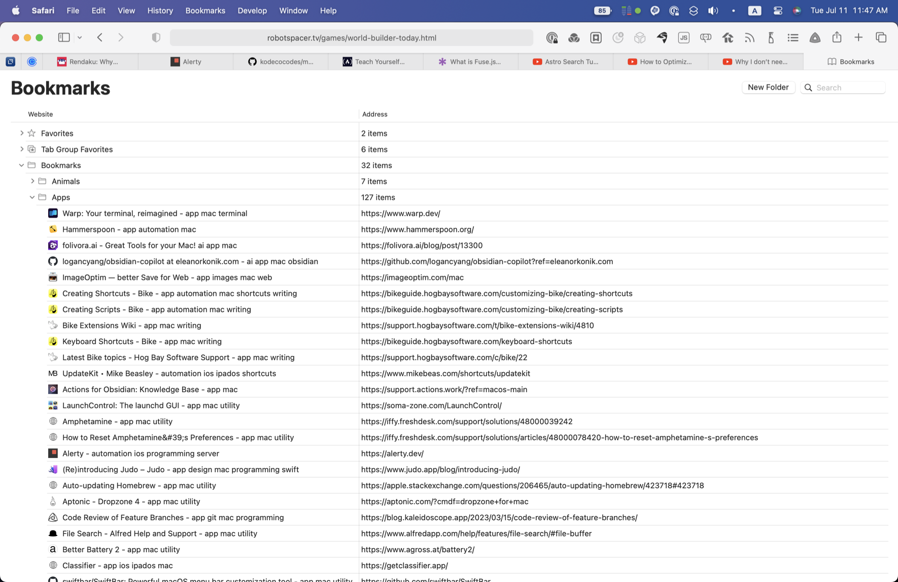
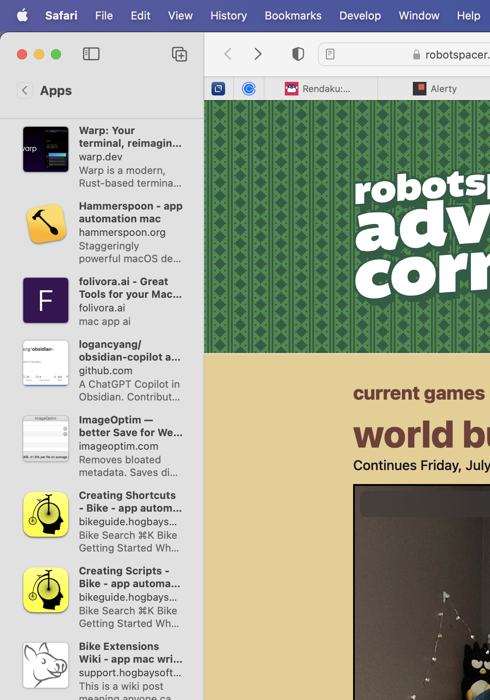
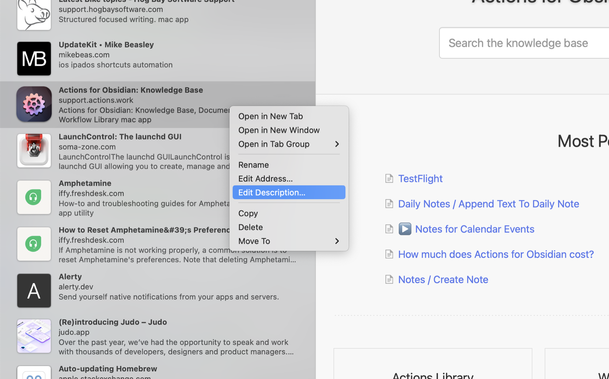
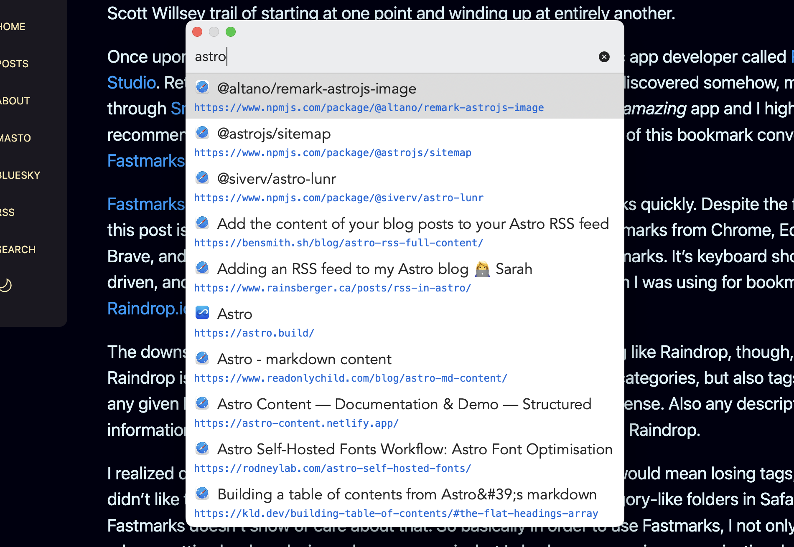

Yesterday I learned about a really cool way to edit Safari bookmark descriptions in macOS. I understand this immediately opens up questions like "why would you want to?" and "why are you even using Safari bookmarks at all?". I will answer those questions, but first let me show you how to edit Safari bookmark descriptions. 🙂

When you think of editing Safari bookmarks, you may immediately think of going to the Bookmarks menu and choosing "Edit Bookmarks" (or typing the Opt-Cmd-B keyboard shortcut to do the same thing). I did too, but this won't let you edit bookmark descriptions. It will only let you edit bookmark names and URLs, as you can see in the image below.

Instead, use the View menu and choose "Show Bookmarks in Sidebar" or type Ctrl-Cmd-1 to show your Safari bookmarks in normal bookmarks view. Double-click on a bookmarks folder, and you'll see all of the bookmarks in the folder presented in mini-preview style with an image representation, name and description.

Here, you can right-click on any bookmark and choose to edit the name, the address, or the description.

Great! You can edit bookmark descriptions. So what? My answer to that is yet another convoluted Scott Willsey trail of starting at one point and winding up at entirely another.

Once upon a time, namely now, there existed a little private indie Mac app developer called [Retina Studio](https://retina.studio). Retina Studio are the makers of a wonderful little app that I discovered somehow, maybe through [Snazzy Labs](https://www.youtube.com/@snazzy), maybe not, called [TextBuddy](https://retina.studio/textbuddy/). TextBuddy is an _amazing_ app and I highly recommend it, but it's another app of Retina Studio's that is the point of this bookmark conversation: [Fastmarks](https://retina.studio/fastmarks/), which I tried after purchasing TextBuddy.

[Fastmarks](https://retina.studio/fastmarks/) is all about searching and opening your browser bookmarks quickly. Despite the fact that this post is about Safari bookmarks, Fastmarks can also search bookmarks from Chrome, Edge, Brave, and Firefox, as well as iCloud tab groups and [Hookmark](https://hookproductivity.com) bookmarks. It's keyboard shortcut driven, and it's way faster than either Safari bookmarks or the solution I was using for bookmarks, [Raindrop.io](https://raindrop.io/).

The downside to using browser bookmarks as opposed to something like Raindrop, though, is that Raindrop is all about categorization and organization. Yes, there are categories, but also tags, so that any given bookmark can fit across several topic domains, as makes sense. Also any description information you add is readily available while searching bookmarks in Raindrop.

I realized quickly that switching to Fastmarks and Safari bookmarks would mean losing tags, and I didn't like that. In addition, although I could put bookmarks into category-like folders in Safari, Fastmarks doesn't show or care about that. So basically in order to use Fastmarks, I not only have to rely on putting bookmarks in my browsers again, but I also lose my precious organizational metadata.

My solution, I thought, would be to just add keywords equivalent to tags to the bookmark descriptions. This is where the procedure above for editing Safari bookmark descriptions was to come in handy. And it did. It's just that apparently Fastmarks doesn't use the description metadata for search results.

Wah, wah, wah...

So now my current plan is to just add the keywords to the ends of my bookmark titles, in alphabetical order. In fact, if you look at the first image in this post closely, you'll see I've already started that process. This will make it so I still get the incredible speed of Fastmarks, but also the increased likelihood of [finding what I'm looking for](https://www.youtube.com/watch?v=e3-5YC_oHjE) that comes with tags and other extra metadata.

Fastmarks isn't perfect – I really wish it would let me specify for it to match whole words from my search in any order instead of only matching in the order they appear in the bookmark name,[^1] and I wish I could use regular expressions to search bookmarks with – but it's fast and I'm going to give it a proper try as my bookmark search solution.

[^1]: Fastmarks does have fuzzy searching, but it matches every character in a search and quickly becomes a problem of building a bigger haystack than with non-fuzzy searching.
