One of the brilliant features of macOS is its [built-in screenshot tools](https://support.apple.com/guide/mac-help/take-a-screenshot-mh26782/mac). Not all operating systems are as aware of the fact that people need to take screenshots and edit and annotate them quickly as macOS appears to be. Even so, many excellent third-party utilities exist to take this to eleven.

## The App – ScreenFloat

If I start talking about the options and making comparisons, I’m going to get into a holy war and I don’t want that.[^1] Therefore, I’m treating my coverage of macOS screenshot utilities like it’s a Highlander. [THERE CAN BE ONLY ONE!](https://www.youtube.com/watch?v=sqcLjcSloXs) And that one’s name is [ScreenFloat](https://eternalstorms.at/ScreenFloat/).

[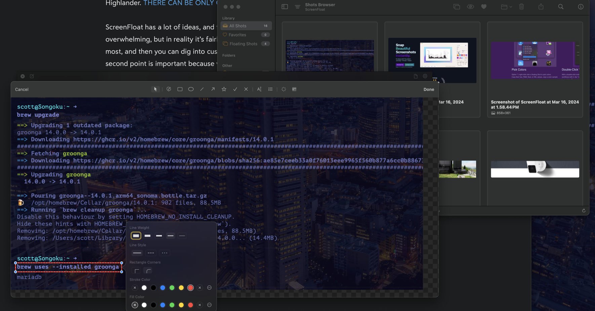](/images/posts/ScreenFloatWindows-4F8D9C4B-858B-4DC6-BB66-6C1ACECA303B.png)

ScreenFloat has a lot of ideas, and those ideas are translated into features. It can be a bit overwhelming, but in reality it’s fairly easy to wrap your head around the features you’ll use most, and then you can dig into customizing the app and really getting some work done. That second point is important because when I first started using ScreenFloat, I was missing some of my workflow from [Shottr](https://shottr.cc). But the good news is I was able to get back quick annotation and copy to clipboard functionality with ScreenFloat just by making a couple of tweaks.

## The Premise

ScreenFloat’s main premise is that you may want to take a screenshot and then float it above other windows so you can use it as a reference or so that you can drag it easily into other apps. The good news is that this can be very helpful. The bad news is that sometimes floating windows get in the way. The good news is that you can close a floating window with a keyboard shortcut or by clicking on its window close control, and ScreenFloat will keep it in the Shots Browser to be recalled at any time.

[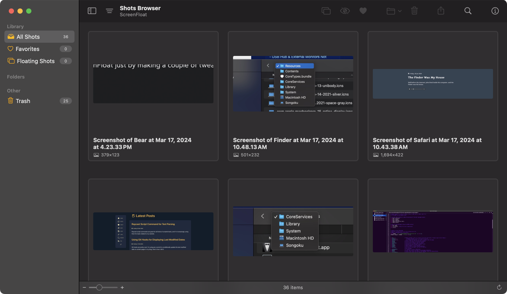](/images/posts/ScreenFloatShotsBrowser-55AB0430-EE3E-45EE-815A-5ADDEDEE23D0.png)

If you use the keyboard shortcut to close (actually hide) the floating screenshot, you can open it again (unhide, technically) with the same keyboard shortcut. Once you close by clicking the window close control, however, you’ll have to open the Shots Browser window and double-click it to get it back into Floating Shot mode.

## The Features

Floating Shots can have actions performed on them – annotating, exporting, cropping, sharing, dragging, and dropping, and more.

### Dragging and Dropping

Dragging and dropping and super quick file saving can be performed by the Floating Shot’s File Drag Control[^2].

[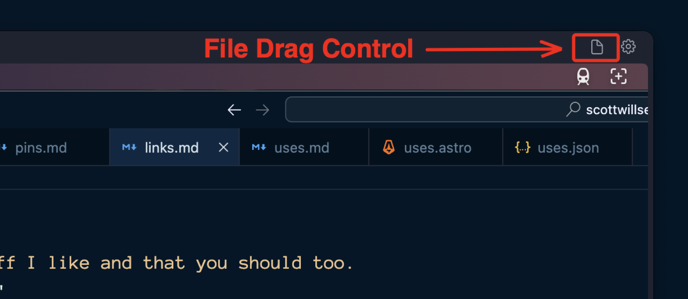](/images/posts/ScreenFloatFileDragControl-9AED6C15-D7DE-45FD-9E3D-750856A8087C.png)

This lets you quickly drag the screenshot into Messages , an email, or even into Finder to quick save the image to disk.

Note that you can still export the file with options by clicking on the Floating Shot’s Action Menu[^3], clicking Export… and making some simple choices.

[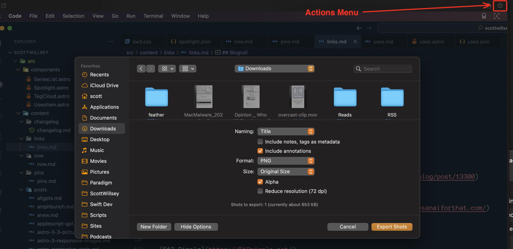](/images/posts/ScreenFloatActionsMenu-2ECE77A6-461C-4E1E-86F4-2B00A6523F12.png)

Speaking of that Action Menu…

### Action Menu

The Action Menu has a lot of the things you’d expect – Copy, Open Copy With, Export, Crop, Annotate, and more.

[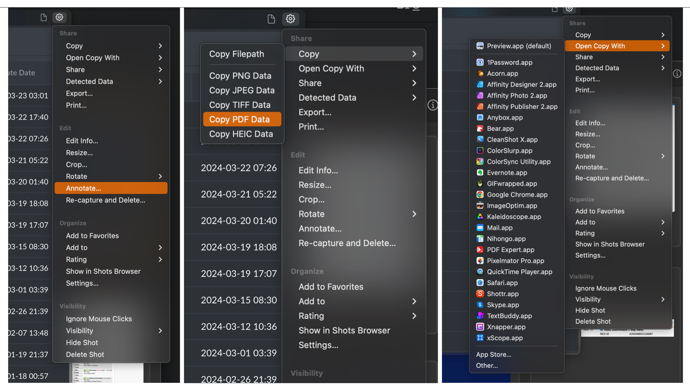](/images/posts/ScreenFloatActionMenuOptions-FE2A90A0-139F-40CC-9DC4-C2330073BC13.png)

One of the “more” things is Data Detection. ScreenFloat lets you detect text and copy it or redact it as desired. It’s really pretty magical.

Another thing I use all the time in the Action Menu is Annotate. The annotation options are comprehensive and are customizable before and after creating an annotation. For example, you can double click the rectangle outline tool to customize it or you can just click it once, draw a rectangle, and then click the Select tool to edit the rectangle you’ve just drawn. This same methodology holds true for all the annotation tools: Draw, Rectangle, Oval, Line, Arrow, Star, Checkmark, X-mark, Text, Numbered List, Callout, and Redact.

[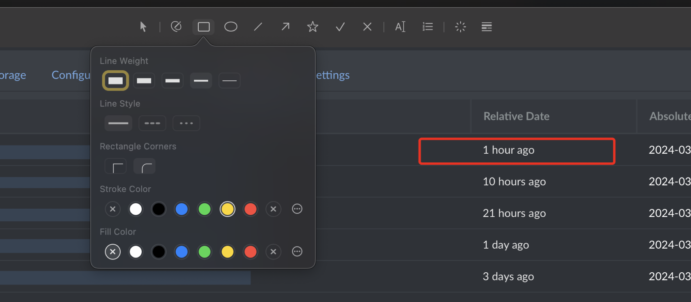](/images/posts/ScreenFloatRectangleOptions-FE2A90A0-139F-40CC-9DC4-C2330073BC13.png)

[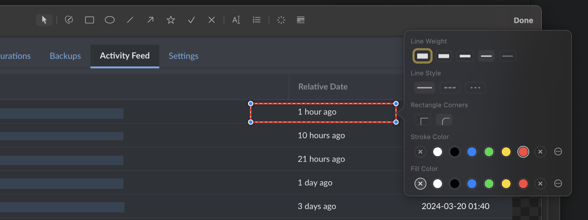](/images/posts/ScreenFloatRectangleEdit-FE2A90A0-139F-40CC-9DC4-C2330073BC13.png)

Numbered List isn’t exactly what it sounds like. It lets you drop numbers on an image in order to call out steps or set the order of items of interest. If you’re making a screenshot to show someone the order to click things on a UI, this is what you want.

[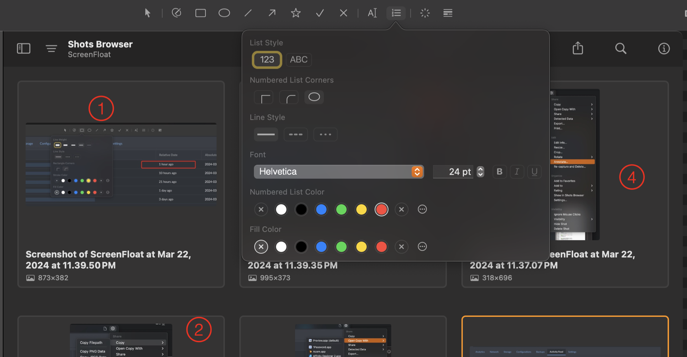](/images/posts/ScreenFloatNumberedListOptions-FE2A90A0-139F-40CC-9DC4-C2330073BC13.png)

Redact lets you redact with a solid color, complete with the ability to set the color from swatches or a color picker, or the common pixelation redaction, or with a strange gradient looking blur effect that I don’t think I’ll ever use. This is in addition to the Data Detection and its ability to redact, although the redactions are the same style and can also be edited in the same way as the manual redactions by selecting them with the Select tool.

[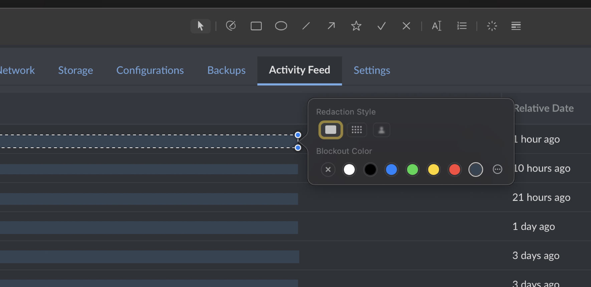](/images/posts/ScreenFloatRedactionOptions-FE2A90A0-139F-40CC-9DC4-C2330073BC13.png)

### Double-Click Workflows

The eagle-eyed amongst you may have noticed that Annotate is stuck in the Action Menu and therefore it takes extra clicking after grabbing a screenshot to be able to annotate it. Other apps, like Shottr, drop you into a view that shows you annotation tools immediately after capturing the screenshot. The good news is, ScreenFloat lets you create double-click workflows that get you very close to that simplicity.

In ScreenFloat’s settings, on the Floating Shots tab, you can set actions that occur when double-clicking with or without modifier keys. In my case, if I double-click a floating shot without modifiers, it copies the image to the clipboard. If I double-click it while holding command, it immediately jumps into Annotate mode without me having to use the Action Menu to select it.

[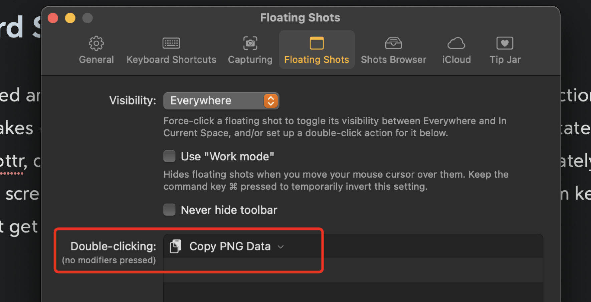](/images/posts/ScreenFloatDoubleClickCopy-80722AEE-BA3C-494F-A87C-159C12409F23.png)

[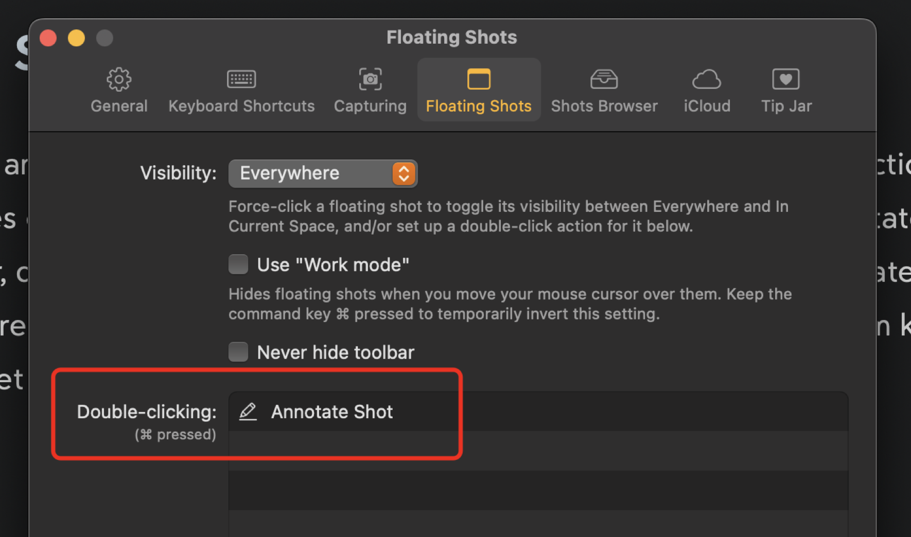](/images/posts/ScreenFloatDoubleClickCommandAnnotate-80722AEE-BA3C-494F-A87C-159C12409F23.png)

I also have modifiers to double-click and resize the floating window up or down by 50%.

It’s a very clever and endlessly customizable way to create shortcuts to editing actions that you’ll use all the time.

### Shots Browser

Floating screen shots are one thing, but what about if you want to recall one, or annotate it or export or otherwise save it later? ScreenFloat has you covered. Every snapshot you take goes into the Shots Browser, which can be recalled at any time with a keyboard shortcut, such as ⌘-⇧-1.

[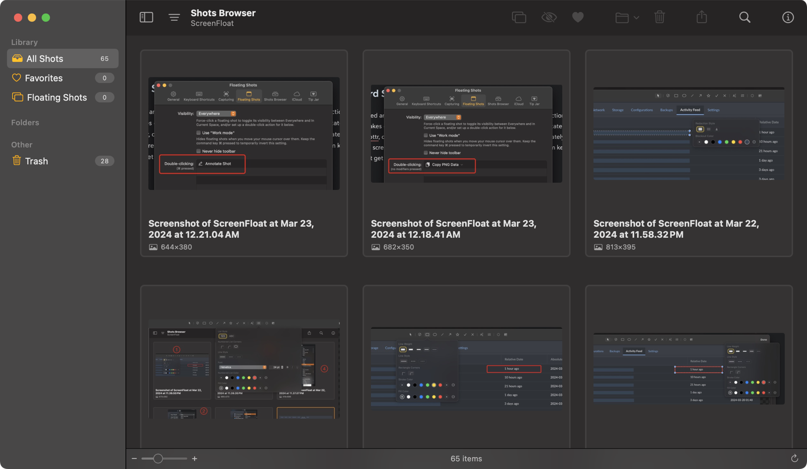](/images/posts/ScreenFloatShotsBrowser-26F5E562-4B9A-4B3F-9983-47AB28B53C57.png)

With Shots Browser, you can double-click an image to make it a Floating Shot again, so you can annotate or do whatever you want with it. But you can also drag images straight from the Shots Browser to other apps, which makes it handy for taking a bunch of screenshots for, say, a blog post, closing the resulting Floating Shot, and then getting them from the Shots Browser later when you’re ready to use them in your writing.

The Shots Browser feature is really nice if you’re using screenshots to document a procedure and you want to get all your shots in one place to edit and choose from later.

You can also go really crazy and create folders, smart folders, tags, descriptions, and ratings. Like I said, ScreenFloat does not skimp on features.

### Export Options

Of course besides the usual drag and drop and open copy in options, you can export a Floating Shot using the Actions menu and Choosing Export. You can choose options related to naming, format, whether or not to include annotations, size, alpha, and whether or not to reduce dpi resolution.

[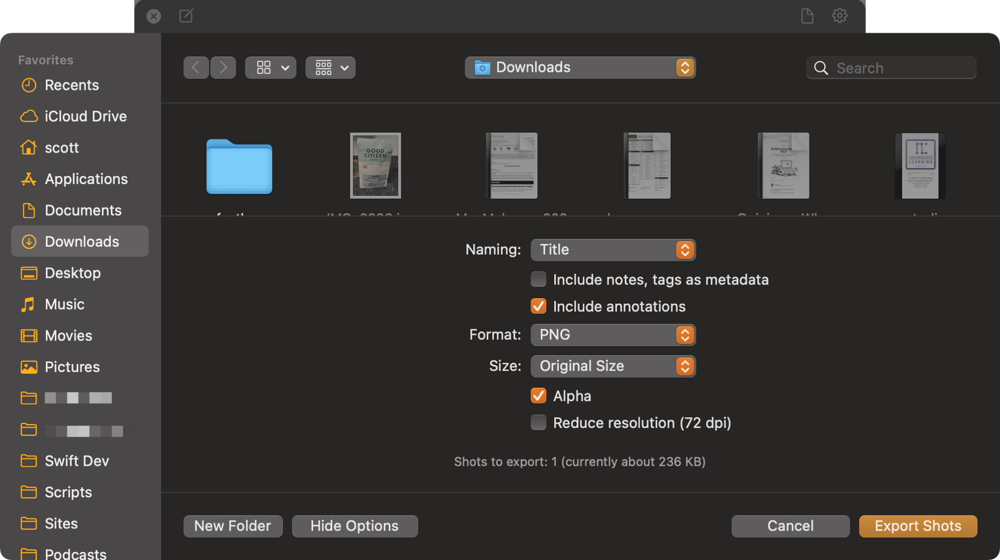](/images/posts/ScreenFloatExportOptions-7116AD16-65C1-4F59-8FDC-1E1DC8EAFDB8.png)

## The Conclusion

Honestly, what pushed me back to using ScreenFloat wholeheartedly was discovering the customization options for all the annotations and the double-click workflows. Being able to quickly copy something to the clipboard or jump right into annotating it are things I can’t live without.

ScreenFloat is a very powerful, very customizable screenshot tool for the Mac that I think trounces most of the competition. The other one I’d recommend is Shottr, which takes a much simpler but still feature-rich approach. It’s another great application. For me though, ScreenFloat wins easily with its Shots Browser, Floating Shots, and easy customization with workflows and tool options.

[^1]: xNapper fans are especially zealous, in my experience. I understand – it’s a great app, but still. Breathe, people.
[^2]: I don’t know if that’s what Matthias calls it, but it’s what I call it until I find out otherwise.
[^3]: Again, I have no idea if this is the correct name for this UI element, but it sounds good.
