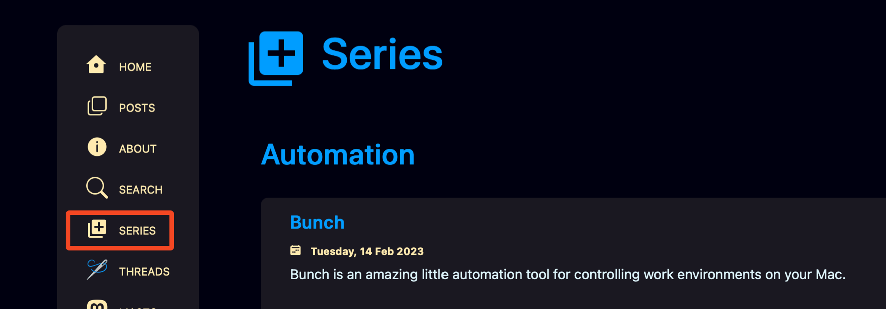
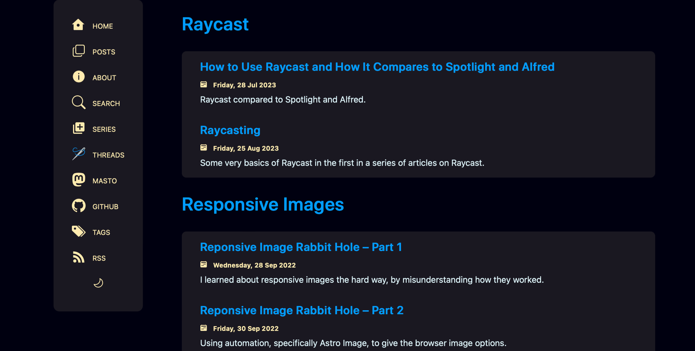
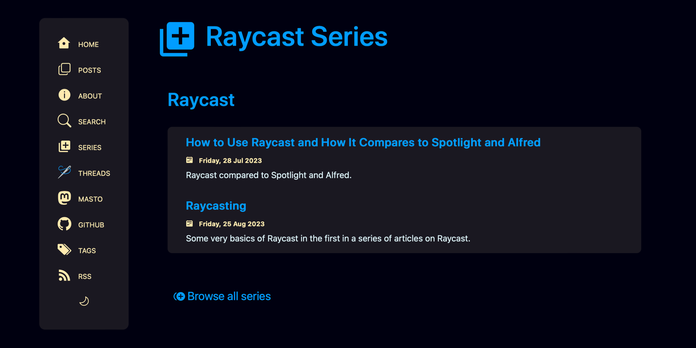

As I started yet another topic series in my [last post about Raycast](https://scottwillsey.com/raycasting/), I realized there was not a good way on this site to see topically related posts. I decided to remedy this by creating a Series view.

Now there's a Series menu item that links to a [list of Series](https://scottwillsey.com/series/) available on the site. Each of those series names in turn links to an individual series page which is identical to the list except it only shows the one selected series instead of all of them.

[](/images/posts/SeriesMenuOption-53365F54-B543-4250-951B-96724AA21BB9.png)

Both the Series index page and the Series dynamic route page (to create all the individual series pages) rely on a component called SeriesList.astro to show each series and its associated posts.

On the Series index page, it repeats the component view for each existing series:

[](/images/posts/SeriesList-E3901C05-812E-4399-8615-F73FA46A222C.png)

On the individual series page, it just calls the component once because it's only showing the one series:

[](/images/posts/RaycastSeries-5994E4D3-7E86-4533-8A31-B4958A16173E.png)

Besides the update to the menu, which is located in `layouts/Base.astro`, there are 3 new files that make Series happen: `pages/series/index.astro`, `pages/series/[name].astro`, and `components/SeriesList.astro`.

Here are what the Series `index.astro`, `[name].astro`, and `SeriesList.astro` files look like.

```astro title="series/index.astro"

---
import { getCollection } from "astro:content";
import { Icon } from "astro-icon/components";
import config from "config";
import Base from "../../layouts/Base.astro";
import SeriesList from "../../components/SeriesList.astro";

const allPosts = await getCollection("posts");
const allSeries = allPosts
 .map((post) => post.data.series)
 .filter((series) => series !== undefined)
 .filter((series, index, self) => self.indexOf(series) === index)
 .sort();

let title = "Series - " + config.get("title");
let description = "Series of related posts on " + config.get("title") + ".";
---

<Base title={title} description={description}>
 <article data-pagefind-ignore>
  <span id="series-list">
   <h1><Icon name="mdi:plus-box-multiple" /><a href="/series">Series</a></h1>
   <div class="series">
   {
    allSeries.map((series) => (
     <SeriesList series={series} posts={allPosts} />
    ))
   }
   </div>
  </span>
 </article>
</Base>

<style>
div.series {
margin: 3em 1em;
}
span#series-list [data-icon="mdi:plus-box-multiple"] {
width: 1.5em;
margin: 0 0.3em -0.5em 0;
}
</style>
```  
  
```astro title="[name].astro"

---
import { getCollection } from "astro:content";
import { Icon } from "astro-icon/components";
import config from "config";
import path from "path";
import { slugify } from "../../components/utilities/StringFormat.js";
import { deslugify } from "../../components/utilities/StringFormat.js";
import Base from "../../layouts/Base.astro";
import SeriesList from "../../components/SeriesList.astro";

export async function getStaticPaths({}) {
 const allPosts = await getCollection("posts");
 const sortedPosts = allPosts.sort(
  (a, b) => new Date(b.data.date).valueOf() - new Date(a.data.date).valueOf(),);

 const allNames = new Set();
 sortedPosts.map((post) => {
  post.data.series && allNames.add(slugify(post.data.series));
  });
 return Array.from(allNames).map((name) => {
  return {
   params: { name },
   props: { posts: sortedPosts,},
  };
 });
}

const { posts } = Astro.props;
const { name } = Astro.params;

let title = deslugify(name);
let description = "Posts in " + title + " series.";
---
<Base title={title} description={description}>
 <article data-pagefind-ignore>
  <span id="series-list">
   <h1>
   <Icon name="mdi:plus-box-multiple" /><a href={new URL(path.join("/series", name), config.get("url"))}>{title} Series</a>
   </h1>
   <div class="series">
    <SeriesList series={title} posts={posts} />
   </div>
   <p class="series-link">
   <a href="/series"><Icon name="mdi:plus-circle-multiple" /> Browse all series</a>
   </p>
  </span>
 </article>
</Base>
<style>
 div.series {
 margin: 3em 1em;
}
span#series-list [data-icon="mdi:plus-box-multiple"] {
 width: 1.5em;
 margin: 0 0.3em -0.5em 0;
}
p.series-link {
 margin: 1.5em;
}
[data-icon="mdi:plus-circle-multiple"] {
 width: 1em;
 margin-bottom: -0.15em;
}
</style>
```  
  
```astro title="SeriesList.astro"

---
import { Icon } from "astro-icon/components";
import path from "path";
import config from "config";
import { postdate } from "./utilities/DateFormat.js";
import { slugify } from "./utilities/StringFormat.js";
import { titleCase } from "./utilities/StringFormat.js";

const { series, posts } = Astro.props;
const filteredPosts = posts.filter((post) => post.data.series !== undefined && (slugify(post.data.series) === slugify(series)));
---
<section aria-label="Series list">
 <h2><a href={`/series/${slugify(series)}/`}>{series}</a></h2>
 <header>
 {
  filteredPosts.sort((a, b) => a.data.date - b.data.date)
   .map((post) => (
    <h4>
    <a href={new URL(path.join(config.get("posts.path"), post.slug), config.get("url"),)}>
     {titleCase(post.data.title)}
    </a>
    </h4>
    <div class="cal">
     <Icon name="bi:calendar2-week-fill" />
     <time datetime={post.data.date}>
     <a
     href={new URL(path.join(config.get("posts.path"), post.slug), config.get("url"),)}>
     {postdate(post.data.date)}
     </a>
     </time>
    </div>
    <div class="description">{post.data.description}</div>
 ))}
 </header>
</section>
<style>
header {
 background-color: var(--surface-menu);
 border-radius: 0.5rem;
 padding: 0.5rem 2rem;
 margin: 1rem 0;
}
h4 {
 margin: 0.3em 0;
}
div.cal,
div.cal a {
 font-weight: bold;
 font-size: 0.75em;
 color: var(--accent1);
}
div.description {
 font-size: 0.75em;
 margin: 0.3em 0 2em;
}
div.description:last-child {
 margin-bottom: 0.5em;
}
[data-icon="bi:calendar2-week-fill"] {
 width: 0.75em;
}
</style>

```
