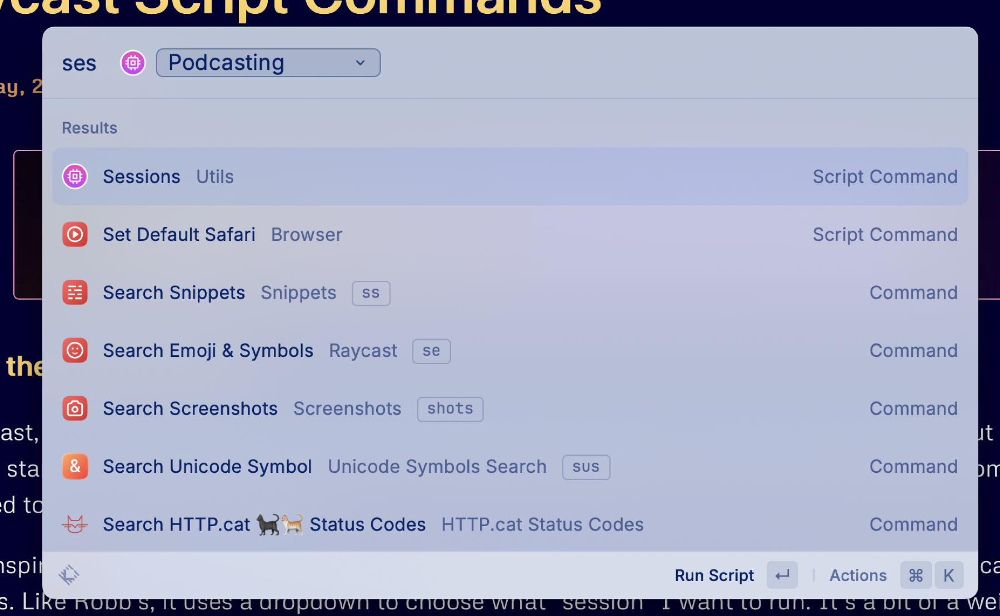
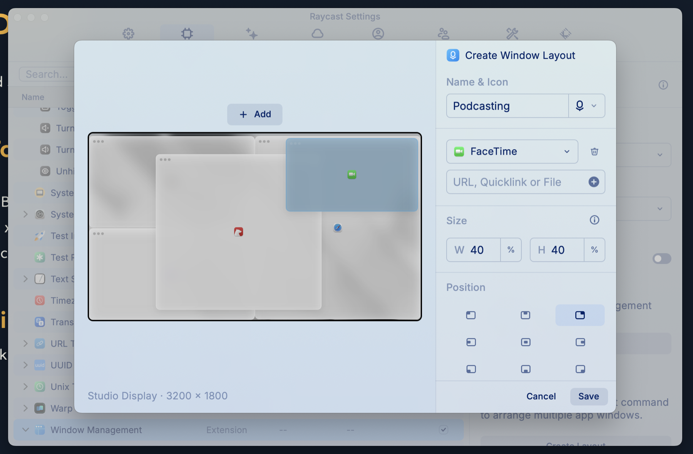
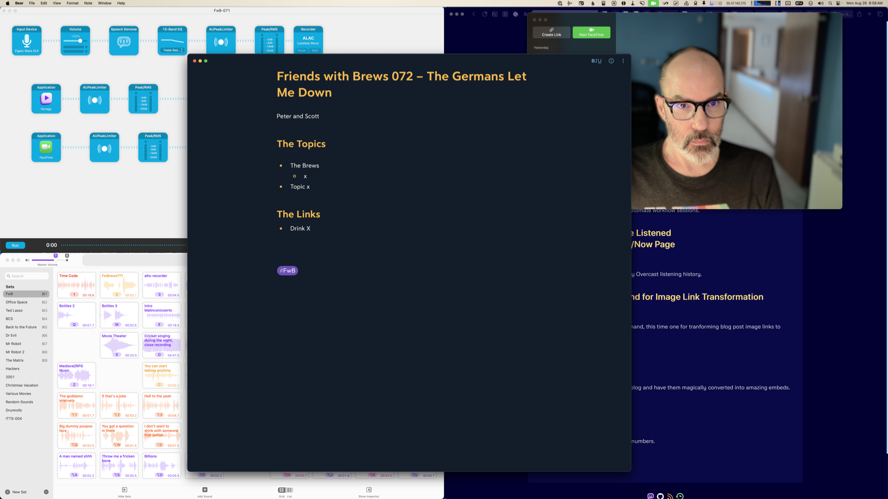

In the past, I [used a menubar utility called Bunch to start and stop my podcast session setup](/bunch). But this was before I started using Raycast, and now that I already use Raycast to run lots of scripts and automations, I decided to do this with Raycast too.

I took inspiration from [Robb Knight](https://rknight.me)’s [App Mode Raycast script command](https://github.com/rknightuk/raycast-script-commands/blob/main/app-mode.sh) and created one called Sessions. Like Robb’s, it uses a dropdown to choose what “session” I want to run. It’s a bit of a weird name, I guess, because I have one called “Stop Podcasting”, which doesn’t really seem like a session, but more like a lack of a session.

[](/images/posts/RaycastSessions-CF8861EF-1B5E-4EF1-BC60-5C2C4F914FCF.jpg)

When I run the Sessions script command, I currently have two choices: Podcasting or Stop Podcasting.

The Podcasting option runs a [Raycast Window Management Command](https://manual.raycast.com/window-management) which opens specific apps ([Audio Hijack](https://rogueamoeba.com/audiohijack/), [Farrago](https://rogueamoeba.com/farrago/), Safari, [Bear](https://bear.app) and FaceTime) and puts their windows in specific locations on the screen using a preset [Window Layout](https://www.raycast.com/changelog/1-78-0).

This is what the Raycast Window Layout Command looks like. The apps are Audio Hijack (top left), Farrago (bottom left), Bear (center), FaceTime (top right), and Safari (right half).

[](/images/posts/PodcastSessionWindowLayoutCommand-0CA11E69-7B62-4A38-908A-909B5865B25C.jpg)

The script command also sets the audio output to my [Elgato Wave XLR](https://www.elgato.com/us/en/p/wave-xlr), which has my podcasting headphones plugged into it, and sets the audio input to a [Loopback](https://rogueamoeba.com/loopback/) audio device that combines my [podcasting mic](https://www.shure.com/en-US/products/microphones/beta_87a?variant=BETA87A) and [Farrago](https://rogueamoeba.com/farrago/) soundboard into one input device. Finally, it starts an [Amphetamine](https://apps.apple.com/us/app/amphetamine/id937984704?mt=12) session, which keeps the display from sleeping if I don’t touch the mouse or keyboard for awhile while podcasting, and toggles my desk lamps on using a Shortcuts shortcut.

Here’s what it looks like on my Apple Studio Display after running the Sessions script command:

[](/images/posts/PodcastSessionLayout-0CA11E69-7B62-4A38-908A-909B5865B25C.jpg)

The Stop Podcasting option sets the audio output and input to my Studio Display’s speakers and mic, closes Audio Hijack, Farrago, Bear, and FaceTime, centers Safari on the screen again, and stops the Amphetamine session. It also toggles the desk lamps.

Here’s the full script command:

```bash
#!/bin/bash

# Required parameters:
# @raycast.schemaVersion 1
# @raycast.title Sessions
# @raycast.mode silent

# Optional parameters:
# @raycast.icon ../icons/app-mode.png
# @raycast.argument1 { "type": "dropdown", "placeholder": "Choose Mode", "data": [ { "title": "Podcasting", "value": "podcasting" }, {"title": "Stop Podcasting", "value": "stopp"} ] }
# @raycast.packageName Utils

# Documentation:
# @raycast.description Set apps and devices for specific work session types
# @raycast.author scott_willsey
# @raycast.authorURL https://raycast.com/scott_willsey

TYPE=$1

if [ "$TYPE" = 'podcasting' ]; then
 /opt/homebrew/bin/SwitchAudioSource -s "Elgato Wave XLR"
 /opt/homebrew/bin/SwitchAudioSource -s "Shure Beta 87a & Farrago" -t "input"
    open raycast://customWindowManagementCommand?name=Podcasting
    shortcuts run "Scott Desk Lamps Toggle"
    osascript -e 'tell application "Amphetamine" to start new session with options {duration:3, interval:hours, displaySleepAllowed:false}'
 exit
fi

if [ "$TYPE" = 'stopp' ]; then
 /opt/homebrew/bin/SwitchAudioSource -s "Studio Display Speakers"
 /opt/homebrew/bin/SwitchAudioSource -s "Studio Display Microphone" -t "input"
    osascript -e 'quit app "Farrago"'
    osascript -e 'quit app "Bear"'
    osascript -e 'quit app "Audio Hijack"'
    osascript -e 'quit app "FaceTime"'
    shortcuts run "Scott Desk Lamps Toggle"
    open raycast://customWindowManagementCommand?name=Safari%20Center
    osascript -e 'tell application "Amphetamine" to end session'
 exit
fi
```

Raycast script commands can be written in bash script, Apple Script, Swift, Python, Ruby, or JavaScript (Node.js). This one is a bash script, and the Podcasting option very simply uses bash commands to run a bunch of other utilities: SwitchAudioSource, to set audio output and input, a Raycast custom window management command to open my podcast session apps and place their windows per a custom layout, a shortcut to toggle my desk lamps, and finally an inline Apple Script (osascript) to start an Amphetamine app session so the display can’t sleep.

The Stop Podcasting option runs similar commands plus several Apple Script calls to close the apps that were opened by the Raycast custom window layout in the Podcasting option.

Script commands are both a great reason to use Raycast and a great tool for automation if you already do use Raycast.
