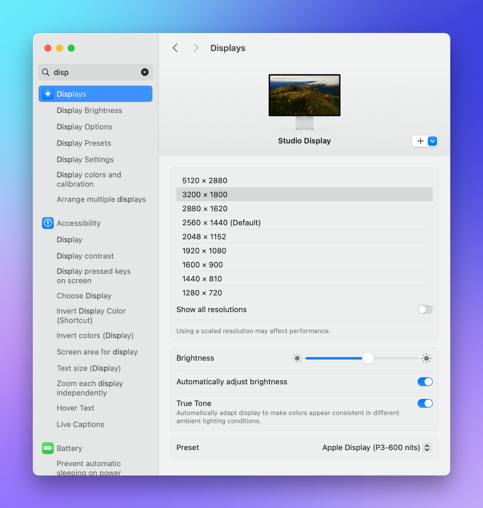

Mac display settings are weird. I have a 5k Apple Studio Display. Until recently, I’ve been using the default resolution , which is 2560 x 1440. Then I started using the Studio Display for my work laptop as well, which is a Lenovo laptop, and I noticed by default it just uses the full resolution of 5120 x 2880.

After seeing how great all that extra space on the PC was for remoting into servers and controlling large semiconductor test equipment UIs and being able to comfortably see everything without any scrolling, I started wondering why I was running the Mac at 2560 x 1440.

System Settings has a Displays section that, among other things, shows you your resolution as 5 buttons labeled “Larger Text” on the low resolution side of things, through “Default” for 2560 x 1440, up to “More Space” for the (apparently) highest resolution.

The thing is, this isn’t actually the highest resolution. If you click the “Advanced” button on this screen and choose to display resolutions as a list, you see that “More Space” sets the monitor to 3200 x 1800, and that there’s another option for 5120 x 2880.

Here’s my gripe with macOS though – remember that “Larger Text” setting? That’s because Apple’s basic way of noticeably changing text size is changing monitor resolution. Which… is stupid. Screen resolution should be used to change how much you can see on screen at once, not to directly correlate that to text size. Yes, there will be some correlation, but Apple’s kind of making it 1:1 instead of allowing it to be a loose, more flexible relationship.

Yes, you can adjust the font size in finder windows to a degree (but not enough for old eyes at 5120 x 2880) and you can adjust font size in some apps with ⌘+, but other apps either have their own way or don’t let you do it at all, and the desktop and menu bar are non-adjustable as far as I can tell.

Accessibility has a few features for this, and you can VERY slightly increase menu bar font size (but not menu bar icon sizes (?) and I couldn’t find a way to change desktop font size. It’s very weird, and I’m sure an accessibility expert could point out all the things I’m missing, but the point is it’s non-discoverable and there’s no unified way to say “Guys, I’m looking at everything shrunk down because I’m on the highest resolution, just show me proportionally larger text EVERYWHERE. You’re the operating system, make it happen.”

I don’t know what Microsoft is doing, but they apparently realize that letting the text disappear into the distance at 5120 x 2880 is a bad idea, because the text is not that much smaller than it was for me on my previous QHD (2560 x 1440) work monitors. I really didn’t notice much of a difference for a lot of things other than suddenly having tons of viewing space. Certain apps like RDCMan and anything happening on remote machines at those higher resolutions are exceptions, of course.

Anyway, I’d love to know why this is the way it is, what I’m doing wrong (you’re the internet, isn’t it your God given mission to make sure people know they’re wrong?), and how everyone else handles it without just saying (well, I guess I’ll just view everything at 1440 x 810 or some ridiculous thing. [Let me know](https://social.lol/@scottwillsey).
