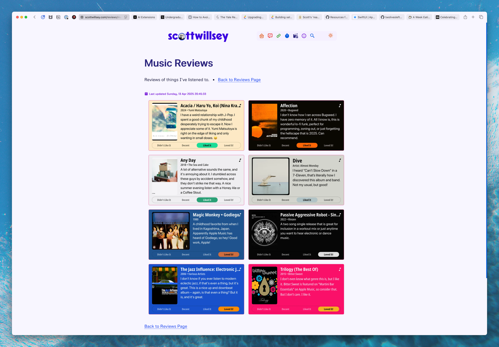

I’ve written about my [review automation workflow in some detail](https://scottwillsey.com/media-reviews-automation/), and while I personally find it fascinating, really the point is [the reviews themselves](https://scottwillsey.com/reviews/). I’m slowly getting some up there and will keep adding more slowly and steadily over time.

Here’s what my current [Music Reviews page](https://scottwillsey.com/reviews/music/1/) looks like. The goal is to start adding them in a way that creates a diverse mix of music while I build up the number of reviews available.

Let me point you again to [Matt Birchler](https://birchtree.me/)’s [Quick Reviews](https://quickreviews.app/). I use his iOS app version of this application to generate the reviews and [then my Mac takes over from there](https://scottwillsey.com/media-reviews-automation/)! It’s a great workflow, and I like the looks of the results.

[IndieWeb](https://scottwillsey.com/links/#indieweb) is where the fun is… if you like the random stuff I throw on my site, think about how to make your own or what you want it to be to try to [make life just a little bit happier](https://www.citationneeded.news/we-can-have-a-different-web/) for a minute or two for anyone who stumbles across you. We could all use some good stuff in life right now.
