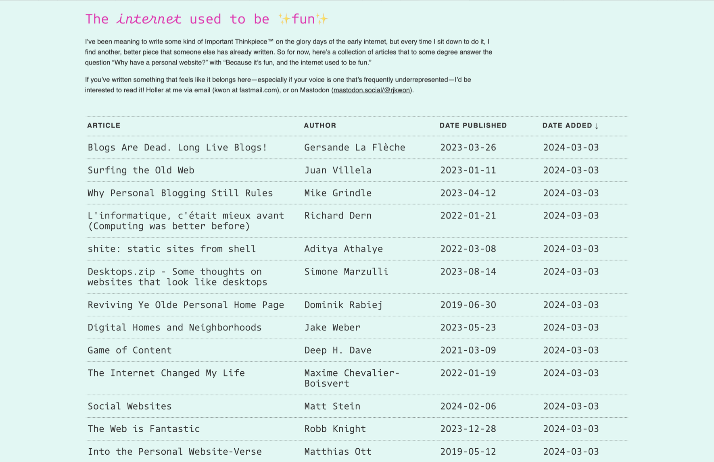

If you’re the kind of person I imagine would find and read this, you’ve read a ton of words already on the concepts of small web, indie web, and personal websites. I’m not going to pretend that my post is the one you have been waiting for on the topic, but I do want to say a couple things about the inspiration I’ve received from some of these people.

I’ve had my own website for years and years in various incarnations. No one ever reads it, to the best of my knowledge, and (like my podcasts) I’m kind of shouting into the void. But I don’t care, and here’s why:

I love the indie web. I love the modern take on personal websites. They are about linking and sharing and going down rabbit holes in a way that the way USED to be about, but now with modern design and personal touches of whimsy. In a way, as terrible as the mainstream web has become, infected with an almost certainly incurable cancer of advertising-driven enshiteification (sic), the indie web, the small web, the personal web is better than ever. And it makes the internet better than ever too, if you just focus your attention.

Nowhere is this better presented than Rachel’s [The internet used to be fun](https://projects.kwon.nyc/internet-is-fun/) project, which I’ve spotlighted in my current [Cool Site Spotlight](/links#CoolSiteSpotlight) on my [Links](/links) page. In case you’re a doubter, or you just haven’t noticed yet that many good people are actively trying to bring back the soul of the internet, Rachel’s got link after link of smart person after smart person talking about this trend and its importance.

And it *is* important, dammit. The web doesn’t have to be total garbage. The people that have ruined everything with advertising technology that makes the web impossible to read and allows bad actors to stuff it full of malware don’t care about you, and it’s time to stop caring about them. To hell with them and the dumb billion dollar horsey they rode in on. It’s time to focus on the good and @#$@ those other guys and their terrible way of making a living.[^1]

Anyway, here’s to Rachel and here’s to all the sites she links to. Let’s all link to them, and let’s all link to each other.

[^1]: I want to make it VERY clear that I wholly support and endorse small sites and podcasts that also make a living with sponsors, but who don’t employ user-hostile ad technology. I’m talking about the [Six Colors](https://sixcolors.com) and [MacStories](https://www.macstories.net) and [Daring Fireballs](https://daringfireball.net) of the world, stuff like that . Things you know with sponsors that don’t piss you off every time you visit them.
