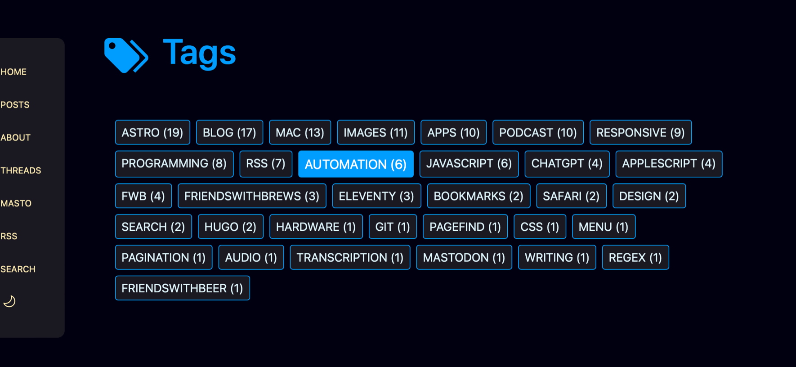
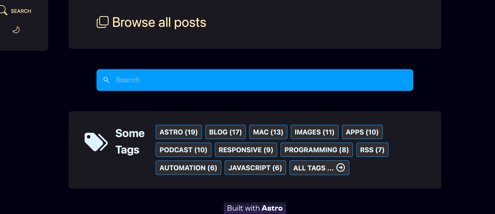
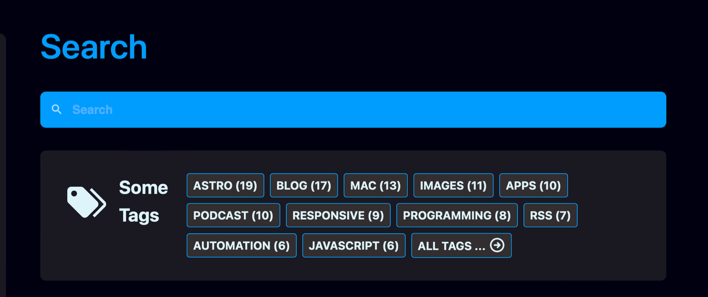
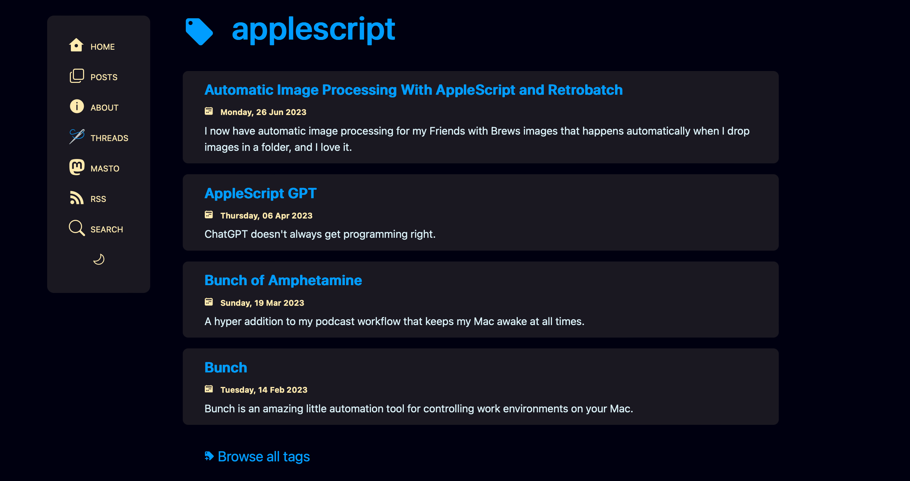

One of my site to-do items for a while now has been doing something with the keywords I add to each post's front matter. Content in Astro can be different variations of Markdown, and front matter is a YAML section with metadata about the content, such as title, description, publish date, or really whatever you want to put in there. One of the things I add there is a YAML array of keywords which are really just tags. I called them keywords, they could have been called categories, tags, topics, whatever.

Here's the YAML front matter for my last post, which was about [podcasting software](https://scottwillsey.com/podcasting-recording-software/):

```yaml
---
title: "My Podcasting Setup - Recording Software"
description: Part 2 of a series on podcasting setups and workflows. This is the software I use for recording podcasts.
date: "2023-08-04T09:00:00-07:00"
keywords: ["mac", "apps", "podcast"]
slug: "podcasting-recording-software"
---
```

I thought it might be nice to add the ability to view posts associated with specific tags, to add a post-filtering option in addition to the site search. That way people could see everything I associated with "mac" or "podcast", for example. I decided to show a subset of tags on my home page and have a tags index page that listed all of them. The tags in those tag lists would link to the specific tag's page, with a list of posts using that tag.

Thanks to others who are a lot smarter than me who've already done this very thing with Astro, finding excellent examples to borrow and steal from didn't take long at all.

I did a search for "astro tags" and found that the [Astro documentation site](https://docs.astro.build/en/getting-started/) has a tutorial that covers building a [tag index page](https://docs.astro.build/en/tutorial/5-astro-api/3/) as well as [individual tag pages](https://docs.astro.build/en/tutorial/5-astro-api/2/), but I wanted some better examples of pulling the tags from the posts and sorting and filtering them rather than the array of tag objects used in the documentation examples.

One of my search results was a post from [Sarah Rainsberger](https://www.rainsberger.ca) called [Creating individual tag pages in Astro via dynamic routes](https://www.rainsberger.ca/posts/dynamic-routing-tag-pages-in-astro/). I know who Sarah is – she's the lead-documentation-guru-in-chief for the Astro documentation, and she's an amazing organizer, explainer, and community builder.

## Tags Index Page and Tag Cloud

Sarah's post does a great job of explaining static vs. dynamic routing, and the astro [`getStaticPaths()`](https://docs.astro.build/en/reference/api-reference/#getstaticpaths) function that's used to generate dynamic routes. First, though, she builds her `src/pages/tags/index.astro` page which serves as her tags list page (which you can see in action [here](https://www.rainsberger.ca/tags/)).

I have a slightly different approach in that I use [Astro Content Collections](https://docs.astro.build/en/guides/content-collections/), which were introduced after Sarah's blog post, rather than [`Astro.fetchContent()`](https://docs.astro.build/en/guides/upgrade-to/v2/#removed-astrofetchcontent), which she uses, which was in turn deprecated in favor of [`Astro.glob()`](https://docs.astro.build/en/guides/imports/#astroglob) in Astro 2.0. For now, just think of Content Collections as another way of grabbing all associated documents, such as posts. You can still use `Astro.glob()`. Content Collections have a few benefits that glob doesn't, but require a little extra setup.

In any event, I wound up with this for a tags index page:

```astro title="src/pages/tags/index.astro"
---
import { Icon } from "astro-icon/components";
import config from "config";
import Base from "../../layouts/Base.astro";
import TagCloud from "../../components/TagCloud.astro";

let title = "Tags - " + config.get("title");
let description = "Tags used in posts on " + config.get("title") + ".";
---

<Base title={title} description={description}>
  <article data-pagefind-ignore>
    <span id="tag-cloud">
      <h1><Icon name="mdi:tag-multiple" /><a href="/tags">Tags</a></h1>
      <div class="cloud">
        <TagCloud showCount="true" displayNumber="999" />
      </div>
    </span>
  </article>
</Base>

<style>
  div.cloud {
    margin: 3em 1em;
  }
  span#tag-cloud [data-icon="mdi:tag-multiple"] {
    width: 1.5em;
    margin: 0 0.3em -0.5em 0;
  }
</style>
```

Well, that's not very exciting. I don't do any of the cool post grabbing stuff that Sarah does here. That's because I put all that work into an Astro component I call TagCloud. You can see that I use my TagCloud component there in my tags index page. I did this because I also wanted to show a subset of my tag cloud on my home page and on my search page. Creating an Astro component to actually display the tag cloud makes all that logic and display markup reusable.

Also note that I pass two params to my TagCloud component – `showCount="true"` and `displayNumber="999"`. I'll explain those pretty soon.

HERE is where the magic happens, in `TagCloud.astro` itself:

```astro title="src/components/TagCloud.astro"
---
import { getCollection } from "astro:content";
import { Icon } from "astro-icon/components";
import { slugify } from "./utilities/StringFormat.js";

const allPosts = await getCollection("posts");
const allTags = allPosts.map((tag) => tag.data.keywords).flat();
const processedTags = allTags.reduce((acc, tag) => {
  const value = acc[tag] || 0;
  const pTags = {
    ...acc,
    [tag]: value + 1,
  };

  const sortedTags = Object.fromEntries(
    Object.entries(pTags).sort((a, b) => b[1] - a[1]),
  );

  return sortedTags;
}, {});

const { showCount, displayNumber } = Astro.props;
---

<span class="categories">
  {
    Object.entries(processedTags)
      .map(([key, val]) => (
        <a class="badge" href={`/tags/${slugify(key)}/`}>
          {key} {showCount && `(${val})`}
        </a>
      ))
      .slice(0, displayNumber)
  }
  {
    displayNumber < 999 ? (
      <a href="/tags/">
        All Tags ... <Icon name="ph:arrow-circle-right-bold" />
      </a>
    ) : null
  }
</span>
<style>
  span.categories {
    display: flex;
    justify-content: center;
    flex-wrap: wrap;
    gap: 0.4rem;
  }
  span.categories a {
    background-color: var(--surface-menu);
    color: var(--color-gray-800);
    padding: 0.25rem 0.5rem;
    border-radius: 0.25rem;
    border: 1px solid var(--brand);
    font-size: 1rem;
    text-transform: uppercase;
    text-decoration: none;
  }
  span.categories a:hover {
    background-color: var(--brand);
    color: #fff;
  }
  [data-icon] {
    width: 1.5rem;
    margin-bottom: -0.3rem;
  }

  @media screen and (max-width: 500px) {
    span.categories a {
      font-size: 0.75rem;
    }
    [data-icon] {
      width: 1rem;
      margin-bottom: -0.2rem;
    }
  }
</style>
```

Ok, that's kind of a big chunk of code, but a lot of it is html and styling. But there are a few important parts, namely all that JavaScript in the front matter regarding `allPosts`, `allTags`, `processedTags`, and `sortedTags`.

Basically what this does is get my posts Content Collection, get the keywords arrays from the front matter, and then create a JavaScript object of key value pairs with each tag I've ever used as a key, and how many times I've used it as its value.

If you `console.log(sortedTags)`, it looks like this:

```javascript title="console.log(sortedTags)"
{ astro: 19, blog: 17, mac: 13, images: 11, podcast: 10, apps: 10, responsive: 9, programming: 8, rss: 7, automation: 6, javascript: 6, applescript: 4, fwb: 4, chatgpt: 4, friendswithbrews: 3, eleventy: 3, hugo: 2, design: 2, search: 2, bookmarks: 2, safari: 2, pagefind: 1, menu: 1, pagination: 1, friendswithbeer: 1, git: 1, css: 1, mastodon: 1, hardware: 1, writing: 1, regex: 1, audio: 1, transcription: 1 }

```

You may be wondering why Sarah's tags index page creates its array of tags very
simply with this:

```javascript
const tags = [
  ...new Set(
    [].concat.apply(
      [],
      allPosts.map((post) => post.tags),
    ),
  ),
];
```

And why I'm making it super complex with this:

```javascript
const allPosts = await getCollection("posts");
const allTags = allPosts.map((tag) => tag.data.keywords).flat();
const processedTags = allTags.reduce((acc, tag) => {
  const value = acc[tag] || 0;
  const pTags = {
    ...acc,
    [tag]: value + 1,
  };

  const sortedTags = Object.fromEntries(
    Object.entries(pTags).sort((a, b) => b[1] - a[1]),
  );

  return sortedTags;
}, {});
```

The reason is that I'm keeping count of how many times each tag is used and I'm displaying that in my tag cloud, as shown below.

[](/images/posts/TagsPage-06E42D5B-5C57-49DA-8888-49922722C7CD.png)

That's the only reason why instead of just sticking with a simple array of tags, I am creating a JavaScript Object of key value pairs, with the tag name being the key and the number of times its used being the value.

I am not clever enough nor good enough with JavaScript to have written that function. All of that JavaScript in that code block above is the work of [Chris Pennington](https://github.com/coding-in-public), who has a really great YouTube channel called [Coding in Public](https://www.youtube.com/@CodinginPublic). One of his videos is titled [Astro Blog Course #12 - Tag cloud](https://www.youtube.com/watch?v=AP2UD0wetAI), and it's about exactly what you think it's about.

My whole TagCloud.astro component aside from styling comes straight from his [CategoryCloud.astro component](https://github.com/coding-in-public/astro-blog-tutorial/blob/lesson-12/src/components/CategoryCloud.astro), with one minor change.

My minor change is the addition of a prop called `displayNumber`. If I give it something real, like 11, it will display 11 tags plus a "All tags... " link to the tags index page. If I give it 999, it shows all tags. On my tags index page, I call TagCloud.astro with `displayNumber="999"`, while on my site home page and my site search page, I call TagCloud.astro with `displayNumber="11"`. The result is that my tags index page looks like the picture immediately above, while my home page and search page tag clouds look like the following two images.

[](/images/posts/IndexPageBottom-06E42D5B-5C57-49DA-8888-49922722C7CD.png)

[](/images/posts/SearchPage-06E42D5B-5C57-49DA-8888-49922722C7CD.png)

## Individual Tag Pages

The tag pages for individual tags are where dynamic routing comes in. While the tags index page is at `src/pages/tags/index.astro`, the fact that the individual tag page are dynamically created is evident by the Astro page name: `src/pages/tags/[tag].astro`. The brackets around the name indicate a [dynamic route page](https://docs.astro.build/en/core-concepts/routing/#dynamic-routes), one that generates an actual page for each item in an array of objects. In our case, our objects are tags.

As the Astro documentation on dynamic routes says,

> Because all routes must be determined at build time, a dynamic route must export a `getStaticPaths()` that returns an array of objects with a `params` property. Each of these objects will generate a corresponding route.

My `tag.astro` page looks just like [Sarah's](https://www.rainsberger.ca/posts/dynamic-routing-tag-pages-in-astro/) as far as my `getStaticPaths()` function, because hers is perfect. Like I said, people much smarter than me have already solved this problem and documented it for others. I'm glad too, because JavaScript isn't really something I spend hours improving my skills at. I tend to learn enough to do what I need to and then move on. Unfortunately this means that correctly expressing things in JavaScript like mapping and filtering is sometimes a struggle for me.

Here's `[tag].astro`. It's another long code block but here's the full code dump anyway.

```astro title="src/pages/tags/[tag].astro"
---
import { Icon } from "astro-icon/components";
import { getCollection } from "astro:content";
import config from "config";
import Base from "../../layouts/Base.astro";
import path from "path";
import { postdate } from "../../components/utilities/DateFormat.js";
import { titleCase } from "../../components/utilities/StringFormat.js";

export async function getStaticPaths({}) {
  const allPosts = await getCollection("posts");
  const sortedPosts = allPosts.sort(
    (a, b) => new Date(b.data.date).valueOf() - new Date(a.data.date).valueOf(),
  );
  const allTags = new Set();
  sortedPosts.map((post) => {
    post.data.keywords && post.data.keywords.map((tag) => allTags.add(tag));
  });

  return Array.from(allTags).map((tag) => {
    const filteredPosts = sortedPosts.filter((post) =>
      post.data.keywords.includes(tag),
    );

    return {
      params: { tag },
      props: {
        posts: filteredPosts,
      },
    };
  });
}

const { posts } = Astro.props;
const { tag } = Astro.params;

let title = tag;
let description = "Posts with tag " + tag + ".";
---

<Base title={title} description={description}>
  <article data-pagefind-ignore>
    <h1>
      <Icon name="mdi:tag" /><a
        href={new URL(path.join("/tags", tag), config.get("url"))}>{title}</a
      >
    </h1>
    <section class="blog-post-list" aria-label="Blog post list">
      {
        posts.map((post) => (
          <header>
            <h4>
              <a
                href={
                  new URL(
                    path.join(config.get("posts.path"), post.slug),
                    config.get("url"),
                  )
                }
              >
                {titleCase(post.data.title)}
              </a>
            </h4>
            <div class="cal">
              <Icon name="bi:calendar2-week-fill" />
              <time datetime={post.data.date}>
                <a
                  href={
                    new URL(
                      path.join(config.get("posts.path"), post.slug),
                      config.get("url"),
                    )
                  }
                >
                  {postdate(post.data.date)}
                </a>
              </time>
            </div>
            <div class="description">{post.data.description}</div>
          </header>
        ))
      }
      <p class="posts-link">
        <a href="/tags"><Icon name="mdi:tag-plus" /> Browse all tags</a>
      </p>
    </section>
  </article>
</Base>
<style>
  header {
    background-color: var(--surface-menu);
    border-radius: 0.5rem;
    padding: 0.5rem 2rem;
    margin: 1rem 0;
  }
  h4 {
    margin: 0.3em 0;
  }
  div.cal,
  div.cal a {
    font-weight: bold;
    font-size: 0.75em;
    color: var(--accent1);
  }
  div.description {
    font-size: 0.75em;
    margin: 0.3em 0;
  }
  p.posts-link {
    margin: 1.5em;
  }
  [data-icon="mdi:tag"] {
    width: 1em;
    margin: 0 0.5em -0.25em 0;
  }
  [data-icon="bi:calendar2-week-fill"] {
    width: 0.75em;
  }
  [data-icon="mdi:tag-plus"] {
    width: 0.75em;
  }
</style>
```

All of that in `[tag].astro` equates to the following individual tag view.

[](/images/posts/SingleTagPage-06E42D5B-5C57-49DA-8888-49922722C7CD.png)

I don't know if you're tired of tags yet, but I'm getting there. I do like how this turned out though. I think it looks pretty good considering my horrific lack of design skills, and I like how I can implement the partial cloud on the home page and the search page, and the full tag cloud on the tags index page, all from the same `TagCloud.astro` component.

## 404, Scott Not Found

Oh, I also added the tag cloud along with a search field on my 404 page too.

[](/images/posts/404-2ABF6127-2AA2-452A-B787-32D051D95FB7.png)

And now I'm going to sleep, because it's after 2 AM and I really need to be 404 myself right now.
