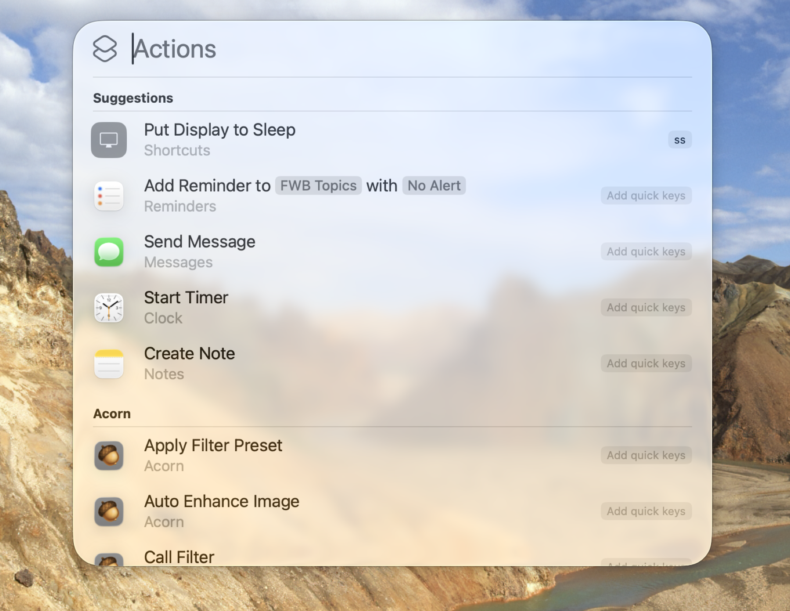
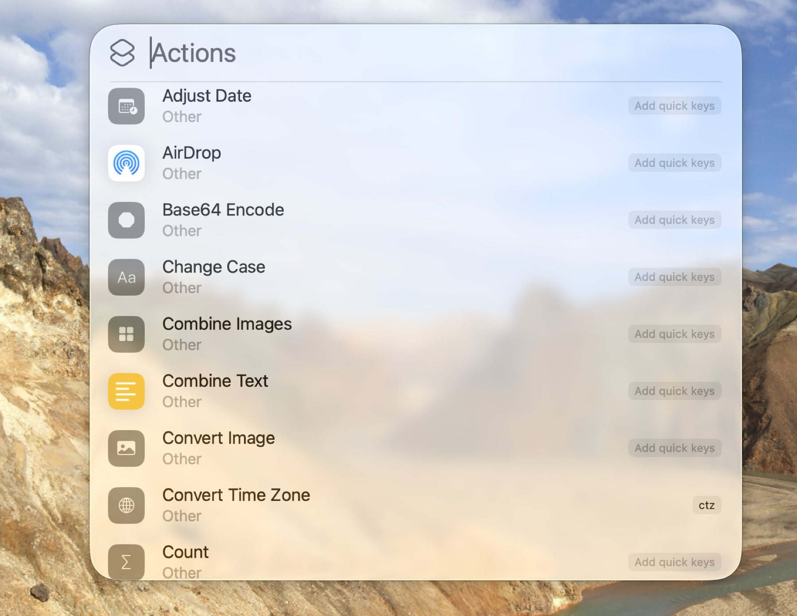

## Spotlight Is Not Dead, It Was Just Resting

For years, Spotlight on the Mac has been a bare-bones app launcher and search utility. Sure, it could find files and apps and do some basic web searches, but there’s a reason third-party launchers like Alfred and LaunchBar have kept loyal fans for years, and why relative newcomers like Raycast has captured many more. Spotlight has never really given the ability to act on files or folders or perform actions on search result items like third-party launchers have.

With macOS 26, or macOS Tahoe, Spotlight surprised everyone by showing up packing an additional 15 lbs of muscle and some fancy new power moves.[^1] Spotlight can now perform tasks like sending messages or email from the Spotlight search bar, but it doesn’t stop there. It can search within an app – for example, searching within Safari will search its history and bookmarks, or searching within Notes allows direct note creation and more. Most importantly for me, it can run shortcuts and Shortcuts actions.[^2]

Spotlight now lets you optionally narrow its area of focus with ⌘ key options – ⌘1 searches applications, ⌘2 searches files, ⌘3 searches shortcuts and even shortcuts actions, and ⌘4 searches the new, admittedly limited, clipboard history.

The part about shortcuts and shortcuts actions might not have leapt off the page at you, but in reality, this was an unexpected and very welcome gift from Apple to power users. This is the feature that made me decide to see if Spotlight could replace Raycast for me. I knew I’d need some additional apps to fill some gaps, but I’m already familiar with Mac power user utilities and was able to make a pretty good assessment of what that would look like.

Here you can see that hitting ⌘ Space to open Spotlight and then hitting ⌘3 to show actions results in Spotlight by default suggesting some actions and then beginning a list of actions that are available inside the Shortcuts app – without even needing to build a shortcut to run them. This is cool.

Here’s another example of some of the Shortcuts system actions now available right within Spotlight. Again, anything Apple or 3rd party developers make available to Shortcuts with app intents are now free to use from within Spotlight.

“Yes, yes, yes”, you say. “Spotlight sounds great. But how can it compare to Raycast, the Power User tool for Power User Power Users?”

## Raycast – The Power User Utility Knife

Don’t worry, I’m not here to argue that [Raycast](https://www.raycast.com/) isn’t powerful. It’s very powerful. It’s got tons of core features, tons of 3rd party extensions, thanks to its easily extensible nature, and it allows for simple integration of personally written scripts into Raycast Script Commands. I made use of this feature many times.

I knew if I tried this experiment that I would have many 3rd party extensions to replace. I also knew, though, that replacing my script commands wouldn’t be a problem – I’d just use the exact same scripts. This is the beauty of Raycast Script Commands. They’re just scripts, with some extra header comments designed for Raycast’s understanding and to allow it to pass in parameters. I can simply call these scripts through Shortcuts or [FastScripts 3](https://redsweater.com/fastscripts/), or run them from the command line.

Another big Raycast feature that needs consideration is Raycast AI. Raycast gives access to a lot of current models, and provides features like AI prompts and presets, as well as quick AI (invoke in the Raycast search bar) and AI chat (a chat window with chats history and the ability to quickly switch models and copy answers, similar to ChatGPT, et al., on the web).

## Next Steps

In my next post, I’m going to list some of the features, extensions, and script commands I used in Raycast and my assessment of how difficult they might be to replace, along with some initial ideas of how to replace them. After that, we can start looking at various specific items in detail, getting deeper into my past (Raycast) and current (Spotlight) workflows.

I think it will be interesting and instructive to show specific actions and use-cases with Spotlight, because explaining the basic premise of its new features doesn’t really help bring the possibilities to life in the same way.

[^1]: I really had to think hard about how much additional muscle made sense there, as if the whole analogy made any sense whatsoever.  
[^2]: I know “shortcuts and Shortcuts actions” looks like inconsistent capitalization, but “shortcuts” are automations made in “Shortcuts” the app.
