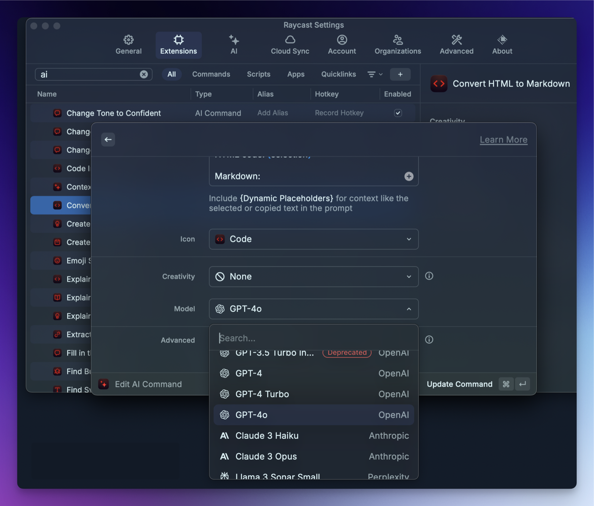

## Contents

## The Goal – Replacing Raycast with Spotlight and Companion Utilities

In Part 1 of this series on replacing Raycast with Spotlight, I explained that macOS Tahoe’s greatly enhanced Spotlight led me to replace Raycast with Spotlight plus a few additional apps and utilities. Raycast purists might be shouting already, thinking I’ve lost both my mind and the challenge, since this approach requires more apps than sticking with Raycast.

Fair enough. But should I care? More important than having everything in one giant app is the user experience and the ultimate results. With that in mind, I will tackle this journey one use case at a time, comparing what I used under Raycast with what I use now for the specific need. First up: AI. Right up front I’ll just say that if AI is your main concern, I’m not going to convince you to get rid of Raycast with anything I say here.

## Raycast AI

### Models

I already know that Raycast AI alone is a factor that will deter many from leaving Raycast in favor of Spotlight. Raycast emphasizes AI integration, whereas Spotlight has zero AI integration whatsoever. If you decide not to use Raycast in favor of Spotlight, you will be looking for AI app and integration options. There are both advantages and disadvantages to this, which I will cover later.

With the free Raycast plan, you get 50 AI messages per month. The $8/mo Raycast Pro unlocks many more models from various providers and increases token quotas (though I can’t tell what the exact limit is). There’s also an Advanced AI add-on to Raycast Pro for another $8/mo (totaling $16/mo), which provides access to the best recent models from multiple providers.

If you want to use a wide variety of models from multiple vendors, you’re unlikely to switch to Spotlight plus a separate AI solution, since you’d have to subscribe to multiple model providers or APIs. There’s also value in spending $192 per year to access that breadth of models and capabilities.

### Integration

Beyond model access, Raycast integrates AI right into its own UI. Quick AI can be invoked inline in Raycast, enabling rapid questions and answers. QuickAI can search the web, and you can also save and execute chat presets.

Furthermore, Raycast has an AI chat app that looks a lot like the ChatGPT or Claude Mac apps. It has chat history, model selection, and you can even switch models in the middle of a chat. It’s very well done.

### Extensions and MCP

One area where third-party LLM integrators have often been ahead of companies like OpenAI and Anthropic is in extensions, MCP, and other methods for enabling integrations with services and local apps and utilities. Raycast is no exception.

Raycast lets you use extensions that are updated to work with AI simply by @ mentioning them. [Their AI page](https://www.raycast.com/core-features/ai) provides an example: stating “@calendar block my day from 4 pm” to have Raycast AI update my calendar using the Raycast calendar extension. That’s very powerful, and presumably the number of Raycast extensions configured to work with Raycast AI will continue to grow.

Even more powerful is [Raycast's integration with MCP servers](https://manual.raycast.com/model-context-protocol). Honestly, just typing this out makes me realize how big of a loss it would be to many people to have to dump Raycast AI. While there are likely hiccups with its MCP integration, MCP in general is fiddly, so it’s no worse than setting up MCP with Claude, and much better than setting it up with a ChatGPT account. The current state of Raycast AI is a big win for Raycast.

### Caveats

There are some aspects of Raycast AI that I’m not a huge fan of. One stems from my aversion to constantly managing models. Some people enjoy choosing a different model for every task and comparing them ad nauseam. I don’t. I just want to get stuff done, and if a model can’t do the things I actually use LLMs for, I won’t use it.

With Raycast AI presets and AI actions, you have to decide in advance which model will be used, and then you have to manually change the model for each preset and action whenever new models come out or you change your mind. It’s mind-bogglingly tedious and painful.

Here's a screenshot of an AI command I was setting up last year. You can see that model choice is a setting, and that setting persists until YOU change it.

I don’t want to live having to manually manage and update AI models for a thousand actions, and I don’t think most other people actually do either.

The end result is that although Raycast AI is easier and more full-featured to get into initially than a roll-your-own solution or using Claude or ChatGPT, it also requires a substantial amount of maintenance and organization unless you just use it for basic AI Quick Chat and AI chat sessions. Raycast definitely needs to fix this, because they’ve created a management nightmare for AI power users.

## Non-Raycast AI Options

If you’re going to ditch Raycast in favor of Spotlight, it’s very simple: you’ll have to find your own alternate AI tools. If you want access to tons of models deeply integrated with your tools and workflows, you’re unlikely to find something you like as well. It’s a simple test: if you want the most models possible combined with as many easy-to-use integrations as possible, keep Raycast.

If you’re like me and you want one or two of the best models with the fewest hallucinations, the ability to get CLI and chat tools in one plan, and as many integrations as possible, you can get by with a Claude.ai account, or possibly a ChatGPT account with occasional OpenAI API use.

As of this writing, the GPT-5 models (including the new GPT-5 Codex model) are much better and less annoying than Anthropic Claude counterparts. This is unfortunate, because Claude is a better product, even if it isn’t as good a LLM anymore. MCP integrations work the way you’d want them to, unlike the macOS ChatGPT app, which requires remote-hosted MCP servers only. Fortunately, OpenAI’s Codex CLI app doesn’t have this limitation on which MCP servers it can use, but that isn’t helpful for most ChatGPT sessions.

Right now I have both Claude and ChatGPT accounts, as well as an OpenAI API account that I make very little use of. The truth is, I haven’t really used Claude recently given the much better results I get from the current GPT-5 models.

If you’re wondering how I live without all the integrations provided by Raycast MCP and AI Extension support, the only reason it’s possible is that I never relied heavily on the extensions available when I installed macOS Tahoe and switched to Spotlight, and I’m pretty sure MCP servers weren’t supported in Raycast at that point. So I’m not really losing a lot in terms of AI use compared to when I was using Raycast. But this may not be the case for many Raycast users.

## The Future

I think the future will bring more options for products and services that provide access to many models and workflow integrations, including improvements directly from companies like OpenAI and Anthropic. We are in the very early days of bringing LLMs fully into our operating environments, and a lot will change in the coming months and years.

One interesting Mac-related option that is still in alpha or early beta, and which I therefore haven’t been able to try yet, is Sky. Federico Viticci of MacStories has an article on its early state titled [From the Creators of Shortcuts, Sky Extends AI Integration and Automation to Your Entire Mac](https://www.macstories.net/stories/sky-for-mac-preview/). It’s worth a read to spark the imagination about the possibilities.

## Conclusion

For most people, the AI support in Raycast is going to beat the “bring your own” approach required by people not using Raycast on the Mac, and it’s not even close. Even considering the caveats above, Raycast AI is simpler to understand and use with your existing workflows.

Next time we’ll start looking at various Raycast extensions and how I’ve worked different tools into replacing them. Most likely I’ll keep it short and cover one or two extensions per post.

### Additional Reading

Read Part 1 of this series [here](/spotomation-part-1).
