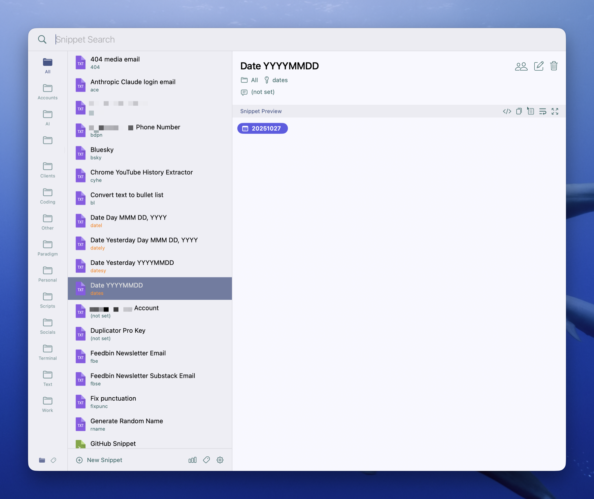
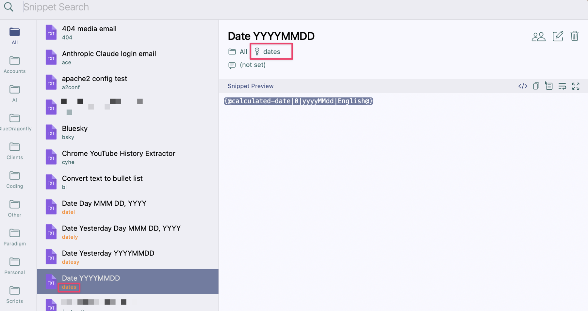
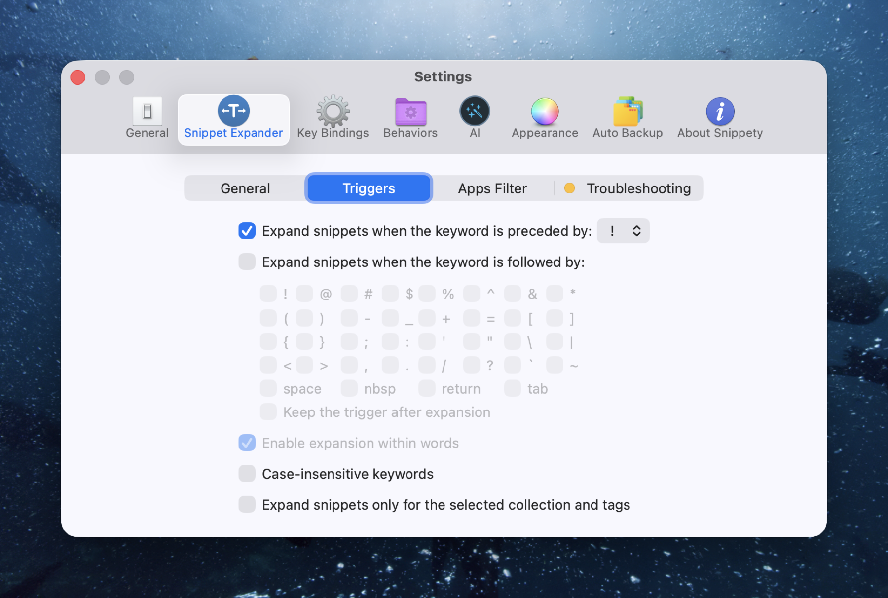
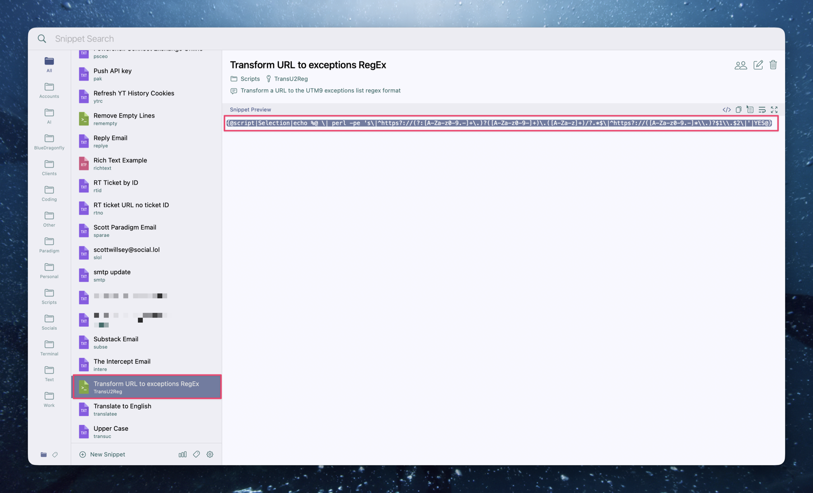

## Contents

## The Goal – Replacing Raycast with Spotlight and Companion Utilities

In Part 1 of this series on replacing Raycast with Spotlight, I explained that macOS Tahoe’s greatly enhanced Spotlight led me to replace Raycast with Spotlight plus a few additional apps and utilities. Raycast purists might be shouting already, thinking I’ve lost both my mind and the challenge, since this approach requires running more apps than sticking with Raycast.

Fair enough. But should I care? More important than having everything in one giant app is the user experience and the ultimate results. With that in mind, I will tackle this journey one use case at a time, comparing what I used under Raycast with what I use now for the specific need. This time, we're tackling Snippets.

## Raycast Snippets

I'm not going to lie, I wish Raycast would decide what they want to call their [Text Expander: Snippet Management for Mac](https://www.raycast.com/core-features/snippets) feature. Usually it's referred to as "Snippets", but on their website, they call it "Text Expander Snippet Management for Mac", "Text Expander Snippet Extension", and just plain "Snippets".

I'm calling it Snippets. Screw those guys and their inability to pick one. 😄

Basically, Snippets are what they sound like: stored snippets of text. You can look up snippets in Raycast itself, or trigger them inline in your document by using keywords you can specify per snippet.

Raycast Snippets is really nice in the sense that it's built into Raycast. They have a couple nice [tutorials on YouTube](https://www.youtube.com/watch?v=gSbZjxgl1Qc) [for using the feature](https://www.youtube.com/watch?v=_P1b00n12PU), focusing on the ability to trigger them inline without having to open Raycast at all (just like a proper, uh, Text Expander tool.)[^1]

Snippets in Raycast has some very nice features. [Dynamic Placeholders](https://manual.raycast.com/dynamic-placeholders) are quite versatile and very powerful once you've thought through some use cases. They're great for inserting the current date, placing the cursor wherever you want in the pasted text in the target document, or grabbing selected text from the foremost app and putting that inline in the snippet output. You can even include a snippet inside another snippet.

Thanks to its feature set, I figured that replacing Raycast Snippets would not be easy. Fortunately, someone else needed advanced snippets too, and they knew how to program.

## Snippety for Mac and iOS

After looking at a few other options I won't list here, I stumbled across an app I'd never heard of (and chances are you haven't either). It's called [Snippety - Productivity App for macOS](https://snippety.app/).

Snippety is powerful. It can do scripts. It can do inline text expansion. It can do automation-based text expansions. And it can do collaboration, with nothing stored anywhere except in iCloud.

### Basic UI

Snippety operates on the "appear by triggering a keyboard shortcut" method in its most basic form. ⇧⌘␣ (Shift-Command-Space) pops Snippety open to show its various folders and snippets.

[](/images/posts/SnippetyUI-267a5da2-7878-4546-b20e-cfac34228d2f.jpg)

The folders on the left are optional categorization folders that you can create, delete, and edit. You can narrow a snippet search by selecting a folder to only return matching results from that folder. You can also use ⌘-1 through ⌘-9 to choose any of the first nine of them.

### Snippet Use

Once you've found the snippet you want, you can highlight it and hit return and it will enter the snippet wherever the cursor is on whatever app you were using when you triggered Snippety to open.

Popping Snippety open and inserting things this way is great, but you can also use it as a text expander. Snippety lets you set a key for any snippet, which is a great way to search for them in the Snippety UI, but also works as a text expansion trigger when combined with whatever character you have set as the text expansion trigger in Snippety Settings.

Below you can see that I have a date snippet called Date YYYYMMDD which generates a datestamp for me with today's date in the year month date format like this: 20251101. That's 2025, month 11, day 1 (it is indeed the 1st of November, 2025, as I write this.) You can also see that I have a key set for it which is the word "dates" (standing for date short).

[](/images/posts/Dates-267a5da2-7878-4546-b20e-cfac34228d2f.jpg)

Because I have my Snippet Expander Trigger character set to be a preceding "!" character, now whenever I type the string "!dates", it expands out into today's date written as YYYYMMDD. I used it above to show the output of today's date written this way, which is 20251101. There, I just used it again!

[](/images/posts/SnippetyExpanderTrigger-267a5da2-7878-4546-b20e-cfac34228d2f.jpg)

### Scripts

Ok, this is all great, but so far none of this does anything Raycast Snippets can't do. That wouldn't bother me, because the goal here is to replace Raycast with Spotlight and any macOS utility apps needed to give me equivalent capabilities. But in fact Snippety does go further.

In Snippety, you can run command line commands that run the command and give you the output as the snippet. For example, I have a snippet called "Transform URL to exceptions RegEx" which I use when I want to take a URL I'm given by someone and convert it into a specific regular expression that I put in a firewall block exceptions list. You can see the big long command in the snippet below:

[](/images/posts/TransU2Reg-267a5da2-7878-4546-b20e-cfac34228d2f.jpg)

```
{@script|Selection|echo %@ \| perl -pe 's\|^https?://(?:[A-Za-z0-9.-]+\.)?([A-Za-z0-9-]+)\.([A-Za-z]+)/?.*$\|^https?://([A-Za-z0-9.-]*\\.)?$1\\.$2\|'|YES@}
```

Basically it takes whatever text you have selected in the foreground app and runs a Perl one-liner on it. The one-liner is a substitute expression. It takes the input url in the form `https://scottwillsey.com` and outputs the string `^https?://([A-Za-z0-9.-]*\.)?scottwillsey\.com`, which is a regular expression I can use to add to a specific firewall's exceptions list. Since I think everyone should have the ability to read scottwillsey.com all the time, I think this is a good thing to do.

Because it relies on having an existing text selection highlighted, I can't use a text expansion, but I can select my URL, hit ⇧⌘␣ (Shift-Command-Space) to open Snippety, start typing the `Transu2Reg` key, and hit return on the snippet to transform my URL into the regular expression I want.

## Conclusion

There are some idiosyncrasies to the Snippety UI that are minor annoyances to me, such as the fact that the UI isn't really meant to remain open but still needs to be used to configure settings and manage snippets and folders, but those are minor. Overall I find Snippety to be an upgrade on Raycast's Snippets feature, even if it does take a slightly different way of thinking to make best use of it.

Check it out at <https://snippety.app> if you're in the market for a good snippet and text expander app, whether you're coming from Raycast or not. I think you'll wonder why no one is really talking about this app.

[^1]: Total sideshow here, but holy cow how far the original has TextExpander fallen. I'm not even going to do it the favor of linking to it. You can take the time if you're really that bored.
