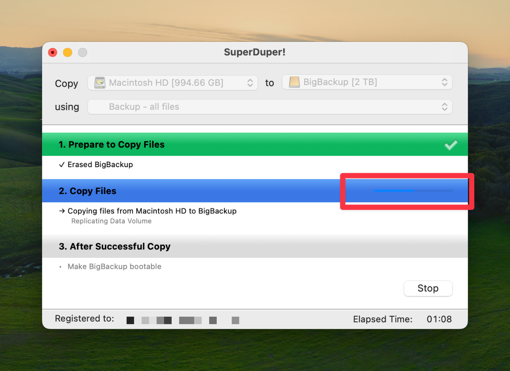

I’ve certainly used drive cloning software in the past, including [SuperDuper!](https://shirt-pocket.com/SuperDuper/SuperDuperDescription.html).[^1] For awhile now, though, I’ve just had [Backblaze](https://www.backblaze.com) as my backup method, which does violate my principle of always having local and remote backups. So when I saw Jason Snell’s article on [SixColors](https://sixcolors.com) about [using a cloned drive to recover from Mac failures](https://sixcolors.com/post/2024/10/use-a-cloned-drive-to-recover-from-mac-failures/), it gave me the impetus to make a clone again.

I love and like and love SuperDuper! and always have, but I do wonder about this UI choice…
  

If you can’t see the blue progress bar inside the outlined section of that Copy Files section header, you are not the only one. It took me a couple minutes to realize it was there.

Look, I may be the pot calling the kettle black, or not picking the mote out of my own eye, or whatever metaphor from 50,000 years ago for hypocrisy you want to use because of the color of the hyperlinks on my site’s dark theme, but that is some kind of invisible ink level trickery on that progress bar.

Anyway… according to the invisible progress bar, as I write this SuperDuper! is about 75% of the way done cloning my internal drive.

[^1]: It looks like I’m ending that sentence with two punctuation marks, but SuperDuper! is the name of the product, and the period is the end of the sentence. Really.
