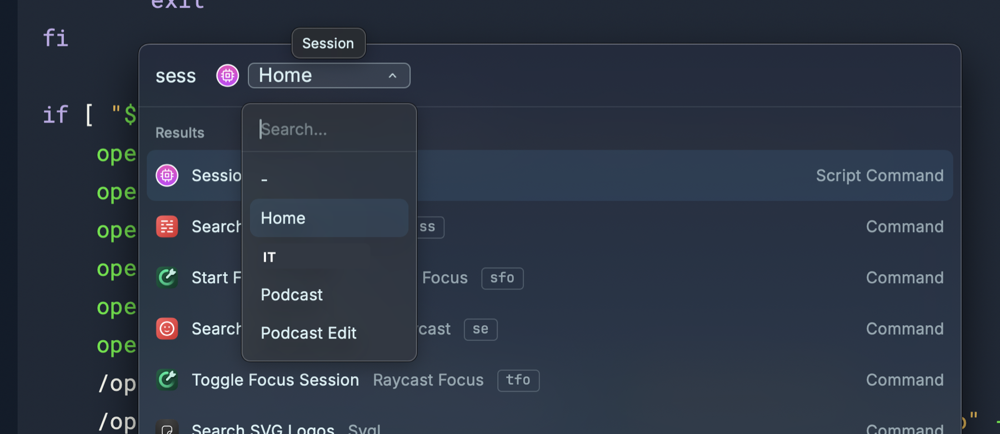

I’ve spoken a couple times about my Sessions Raycast script command, both when [I originally set it up](https://scottwillsey.com/sessions-script-command/), and then again when [I updated it to use Moom as my window manager](https://scottwillsey.com/updated-sessions-script-command/). Well, I’m back to using Raycast as my window manager, and I also use a Raycast focus mode for my podcast session. So here’s your updated Session Raycast script command, 2025 edition.

You may recall that the purpose of this script command is to just set up my environment in a way that’s suitable for a specific task. It always closes all apps, then opens some core apps, and then opens other apps specific to the session type.[^1] It also sets audio output and input based on the session type, arranges app windows in a specific way, and either sets [Coffee for Raycast](https://www.raycast.com/mooxl/coffee) to Caffinate mode (keep the screen on) or Decaffinate mode (let it sleep when it wants).

Here’s is the current Sessions script command.

```bash
#!/bin/bash

# Required parameters:
# @raycast.schemaVersion 1
# @raycast.title Session
# @raycast.mode fullOutput

# Optional parameters:
# @raycast.icon ../icons/app-mode.png
# @raycast.argument1 { "type": "dropdown", "placeholder": "Session", "data": [ { "title": "Home", "value": "home" }, { "title": "IT", "value": "it" }, { "title": "Podcast", "value": "podcast" }, { "title": "Podcast Edit", "value": "podcastedit" } ] }
# @raycast.packageName Utils

# Documentation:
# @raycast.description Set up a workflow session
# @raycast.author scott_willsey
# @raycast.authorURL https://raycast.com/scott_willsey

open 'raycast://focus/complete'
open raycast://extensions/raycast/system/quit-all-applications
sleep 3
CORE=(1Password Messages Mail Safari AnyBox)
open 'raycast://extensions/mooxl/coffee/decaffeinate'

TYPE=$1

for value in "${CORE[@]}"
do
    open -a "$value"
done

if [ "$TYPE" = 'home' ]; then
    open 'raycast://script-commands/set-default-browser-safari'
    open -a Warp
    /opt/homebrew/bin/SwitchAudioSource -s "Studio Display Speakers"
    /opt/homebrew/bin/SwitchAudioSource -s "Studio Display Microphone" -t "input"
    open 'raycast://customWindowManagementCommand?&name=Home'
        exit
fi

if [ "$TYPE" = 'it' ]; then
    open 'raycast://script-commands/set-default-browser-chrome'
    open -a "Google Chrome"
    open -a Warp
    open -a Slack
    /opt/homebrew/bin/SwitchAudioSource -s "Studio Display Speakers"
    /opt/homebrew/bin/SwitchAudioSource -s "Studio Display Microphone" -t "input"
    open 'raycast://customWindowManagementCommand?&name=IT'
        exit
fi

if [ "$TYPE" = 'podcast' ]; then
    open 'raycast://script-commands/set-default-browser-safari'
    open -a "Audio Hijack"
    open -a Farrago
    open -a Bear
    open -a Notes
    open -a "Microsoft Teams"
    /opt/homebrew/bin/SwitchAudioSource -s "Elgato Wave XLR"
    /opt/homebrew/bin/SwitchAudioSource -s "Shure Beta 87a & Farrago" -t "input"
    open 'raycast://customWindowManagementCommand?&name=Podcasting'
    open 'raycast://extensions/mooxl/coffee/caffeinate'
    open 'raycast://focus/start?goal=Podcast&categories=podcast&mode=allow'
        exit
fi

if [ "$TYPE" = 'podcastedit' ]; then
    open 'raycast://script-commands/set-default-browser-safari'
    open -a "Logic Pro"
    open -a Bear
    open -a Finder ~/Documents/Podcasts/FwB
    /opt/homebrew/bin/SwitchAudioSource -s "Elgato Wave XLR"
    open 'raycast://customWindowManagementCommand?&name=Edit%20Podcast'
    open 'raycast://focus/start?goal=Podcast%20Edit&categories=podcastedit&mode=allow'
        exit
fi
```

When I run the Sessions script command in Raycast, I just choose the session type. The nice thing about Raycast dropdowns is they pre-select the option you chose last time. In the case of the Session script command, that’s not as convenient as it is for some other script commands, but that’s life.

[](/images/posts/SessionsDropdown-d6401ea3-9aa3-4572-ac8c-6189a3af2d39.jpg)

Anyway, if you have any questions about this script command or Raycast script commands in general, you know how to find me (hint: [Mastodon](https://social.lol/@scottwillsey) or [Bluesky](https://bsky.app/profile/scottwillsey.com)).

[^1]: I should see if there’s a way to close all apps that aren’t in a list, instead of closing all apps and then re-opening all apps that are in a list.
