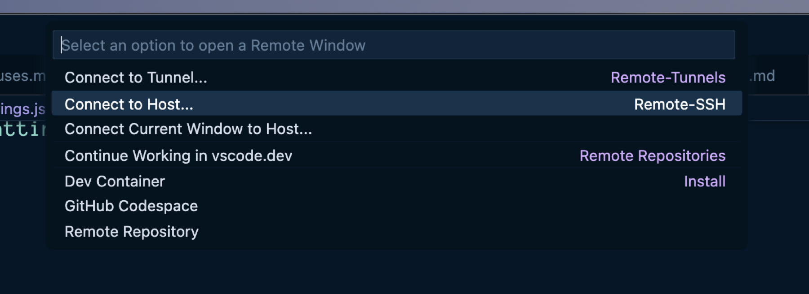

Recently I needed to work on some script files on a server and wanted to edit them in Visual Studio Code. Visual Studio Code supports remote connections, including ssh connections. Unfortunately, some of these files require root privileges, and I can’t and don’t want to be able to ssh into this server as root.

What about `sudo su` once you’re logged in, you say?

The good news about configuring ssh connections is that you can set up RemoteCommand entries in your ssh config that will be executed upon connection. `sudo su` is a command. And the good news about Visual Studio Code is that it lets you specify an ssh config file to use for its ssh connections, so you can customize your Visual Studio Code ssh connections to perform a `sudo su` upon connection, if needed, while keeping your normal ssh config file free of such silliness so that this doesn’t happen in your normal terminal ssh sessions.[^1]

First create a copy of your ~/.ssh/config file and name it something obvious. Mine is named config_vscode.

```bash
ll
total 168
drwx------@ 20 scott  staff   640B Jan 21 08:47 .
drwxr-xr-x@ 76 scott  staff   2.4K Jan 21 09:02 ..
-rw-r--r--@  1 scott  staff   6.0K Dec 18  2023 .DS_Store
drwx------   3 scott  staff    96B Jan 21 08:47 1Password
-rw-------@  1 scott  staff   1.7K Jan 10 14:32 config
-rw-------@  1 scott  staff   1.7K Dec 20 20:26 config_por
-rw-------@  1 scott  staff   948B Jan 10 14:58 config_vscode

```

Now edit your newly created created config_vscode (or whatever) file and add the following to the end of connections that need root access to files in Visual Studio Code:

```bash
RemoteCommand sudo su
```

This means a given connection that looks like this in ~/.ssh/config:

```bash title="~/.ssh/config"
Host server1
 HostName server1.domain.com
 Port 22
 User serverperson
 IdentityFile ~/.ssh/server1
 IdentitiesOnly yes
```

Should look like this in ~/.ssh/config_vscode:

```bash title="~/.ssh/config_vscode"
Host server1
 HostName server1.domain.com
 Port 22
 User serverperson
 IdentityFile ~/.ssh/server1
 IdentitiesOnly yes
 RemoteCommand sudo su
```

Then in your Visual Studio Code user settings.json file, make sure to point to your custom ssh config and set enableRemoteCommand to true.

```json title="settings.json"
"remote.SSH.configFile": "/Users/scott/.ssh/config_vscode",
"remote.SSH.enableRemoteCommand": true,
```

Also, in your Visual Studio Code defaultSettings.json, make sure the following is set to true:

```json title="defaultSettings.json"
"remote.SSH.useLocalServer": true,
```

Then make your ssh connection in Visual Studio Code and be amazed as you now have root powers on files that previously refused to submit to your will.

[](/images/posts/VscodeSSH-A61A9FC9-989F-4593-84D1-4AB07BD0D702.jpg)

[^1]: This assumes that your login user is in your server’s sudoers list and that sudoers don’t need to enter passwords to perform a `sudo su`.
