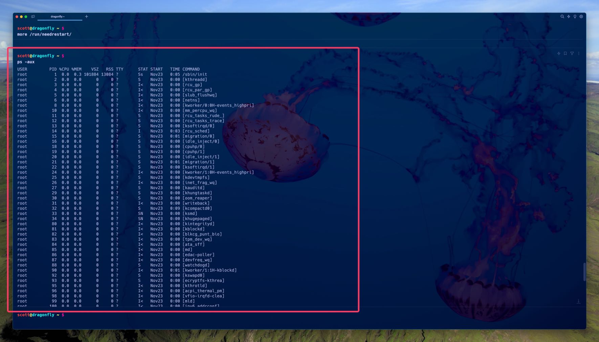
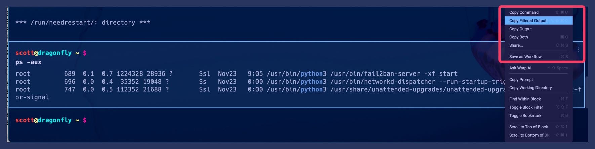
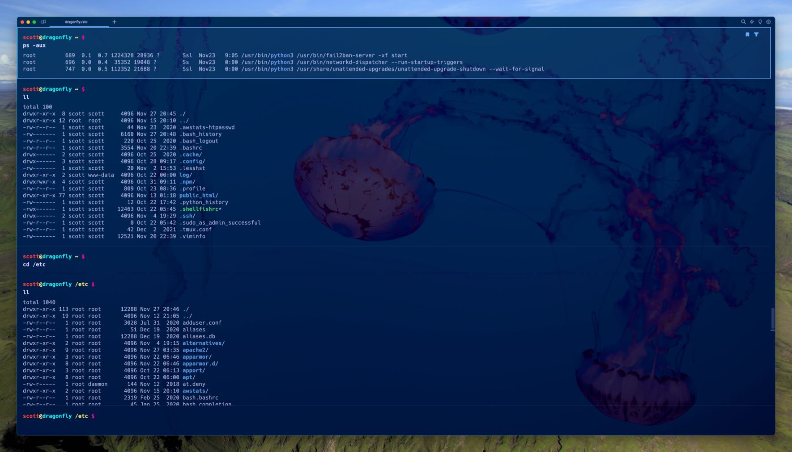
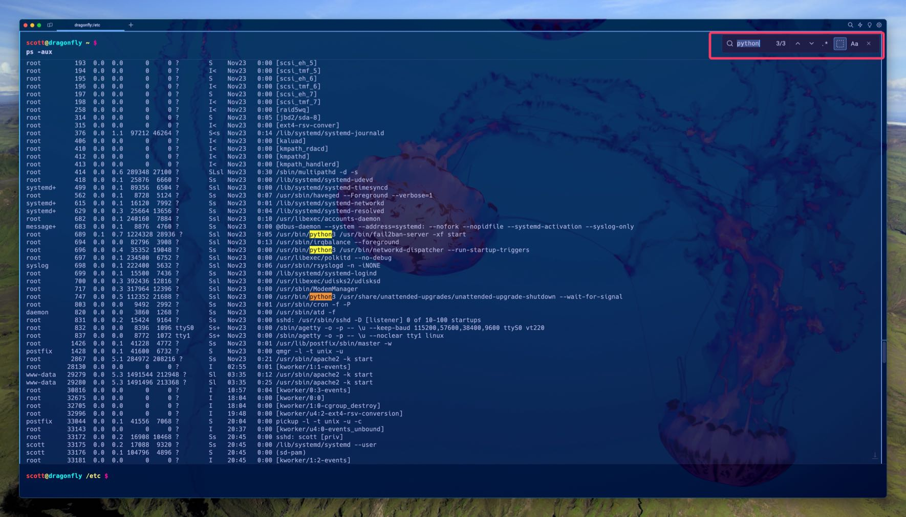

I like [Warp](https://www.warp.dev). I did not intend to like Warp. I didn't even **want** to like Warp. But after giving it a fair shot for a few days, I couldn't help but liking it and sticking with it. It just feels to me like everything a next generation terminal should be.

According to its developers,

> Warp is a modern, Rust-based terminal with AI built in so you and your team can build great software faster.

That sounds nice, if not a bit vague. What is so *great* about Warp, and what makes it more desirable to use than macOS Terminal app or [iTerm2](https://iterm2.com/) or Secure Shellfish, for example? The obvious answer is its features and the workflows they enable. One of my favorite of those features is Blocks.

## Blocks

Blocks are one of the biggest Warp features, in my opinion, and one that I love and take advantage of all the time. Blocks are simply a grouping of a command and its output into one selectable and actionable section in Warp. For example, here's the result of a `ps -aux` command that is now a block.

My new waiting command prompt is below the block and is now in a separate block from it, but I can scroll up and down to see the whole `ps -aux` block and perform actions on it. Blocks are nice because not only do they negate having to use something like `ps -aux | more` to see the full output of a command, but they also remain selectable, filterable, and modifiable.

Speaking of filterable... here's that same block filtered by the word "python". Look how small it is... down from 124 lines of output to 3!

Filtering can accept regular expressions or case-sensitive text simply by choosing those options in the filter search, just like most modern text editors. The keyboard shortcut for filtering is Shift-Option-F (⇧ ⌥ F).

You may be thinking, hang on... I can just pipe the command to grep like this: `ps -aux | grep 'python'`,  and you're right. You can. But filtering is fast and you can further act on it by saving the filtered output or the filtered output and the command, and more.

**Update** *2023-12-17*

*Warp has a great blog post about Block filtering vs. grep that help answer the obvious question of why use block filtering instead of just using grep: [New utilities for your terminal, inspired by text editors | Warp](https://www.warp.dev/blog/new-utilities-for-your-terminal-inspired-by-text-editors)*

Bookmarking blocks is nice too. For example, here I left the previous `ps -aux` block filtered for "python" and bookmarked it. I then executed a bunch of other commands which all created their own blocks and the bookmarked `ps -aux` block scrolled off the screen. But by hitting Option-up (⌥-↑), I immediately jumped back up to the bookmarked (and still filtered) block.

Filtering isn't the only way to find things in a block, you can also use standard old Command-F (⌘-F) to search within a block. The difference between this and filtering is exactly what the words imply: filtering reduces the output of the command to just lines with matches, while search finds search text or regular expression matches in the command output, but doesn't filter to only show matching lines.

One nice feature is using search in a "live" block, like one that's running an `htop` or a `tail -f` command. As the output of the running process updates, so do your search results.

There's more to [Warp Blocks](https://docs.warp.dev/features/blocks) than what I've mentioned here. Check out [Warp's documentation on Blocks](https://docs.warp.dev/features/blocks) to see for yourself.
