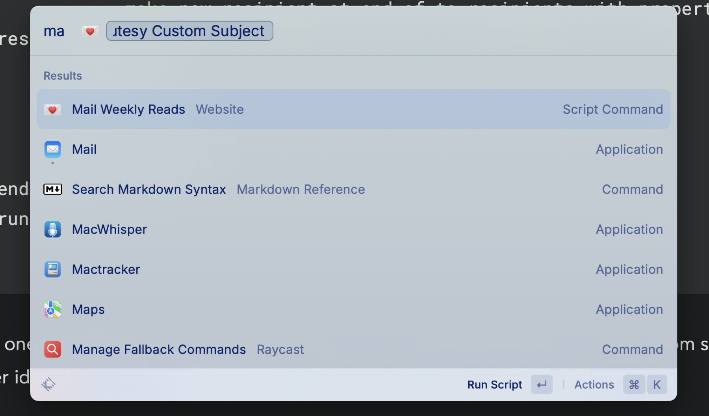
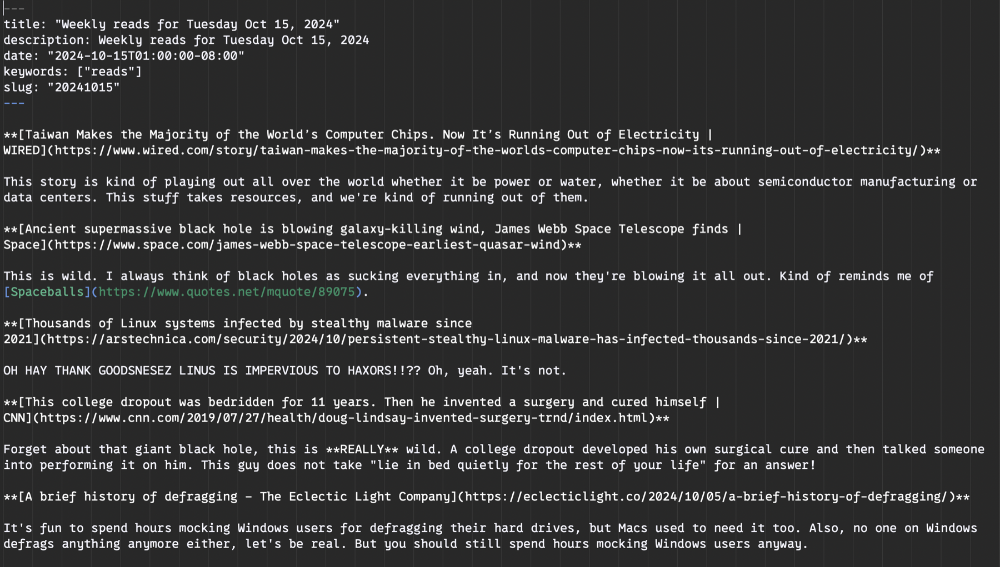
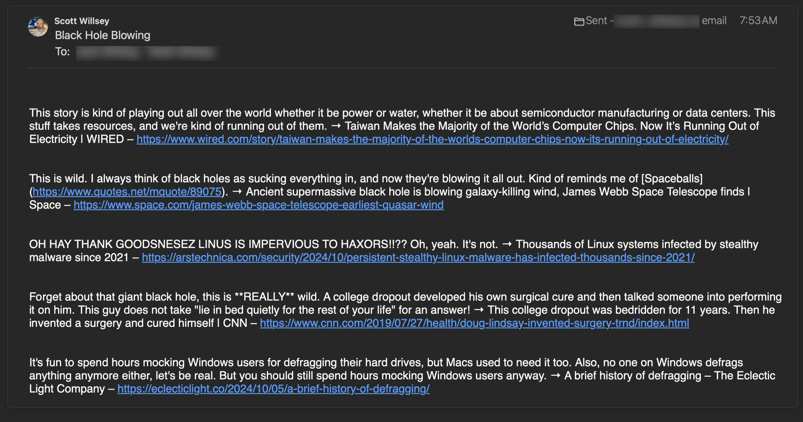

[As I mentioned previously](https://scottwillsey.com/weekly-reads), I have a [Weekly Reads page](https://scottwillsey.com/reads/1/) that I set up to make it easier for me to share articles with my dad and brother (and anyone else who cares), complete with RSS feed. But let’s be real, neither of them wants to be bothered with my feed because they have stuff to do and we already have a tradition of emailing links to each other.[^1]

Last night I created a Raycast Script Command that looks at the markdown file for my latest Reads update, parses and reformats it for email, and mails it out to them. It looks like this:

```bash
#!/bin/bash

# Required parameters:
# @raycast.schemaVersion 1
# @raycast.title Mail Weekly Reads
# @raycast.mode fullOutput

# Optional parameters:
# @raycast.icon 
# @raycast.argument1 { "type": "text", "placeholder": "Subject" }
# @raycast.packageName Website

# Documentation:
# @raycast.author scott_willsey
# @raycast.authorURL https://raycast.com/scott_willsey

subject=$1

# Find the latest file in the specified directory
latest_file=$(ls -t ~/Sites/scottwillsey/src/content/reads | head -n1)
echo "Processing file: $latest_file"

# Read the contents of the file, remove YAML front matter, and modify markdown links
content=$(awk '
    BEGIN { in_frontmatter=0; }
    /^---$/ { in_frontmatter = !in_frontmatter; next; }
    !in_frontmatter { print; }
' "/Users/scott/Sites/scottwillsey/src/content/reads/$latest_file")

content=$(echo "$content" | perl -0pe 's/\*\*\[(.+)\]\((.+)\)\*\*\n\n(.+)/$3 → $1 – $2\n/gm')

echo "Content after regex replacement:"
echo "$content"

# Escape the content for AppleScript
escaped_content=$(echo "$content" | sed -e 's/\\/\\\\/g' -e 's/"/\\"/g' -e 's/`/\\`/g' -e "s/'/\\'/g" -e 's/$/\\n/' | tr -d '\n')

# Pass the escaped content to the AppleScript
osascript <<EOD
on run
    set theContent to "$escaped_content"
    tell application "Mail"
        set theFrom to "me@mine.com"
        set theTos to {"dad@dads.com", "brother@brothers.com"}
        set theCcs to {}
        set theBccs to {}
        
        set theSubject to "$subject"
        set theSignature to ""
        set theAttachments to {}
        set theDelay to 1
        
        set theMessage to make new outgoing message with properties {sender:theFrom, subject:theSubject, content:theContent, visible:false}
        tell theMessage
            repeat with theTo in theTos
                make new recipient at end of to recipients with properties {address:theTo}
            end repeat
        end tell
        
        send theMessage
    end tell
end run
EOD
```

It takes one parameter when I run the script so that I can give the email a cutesy custom subject (another idea I stole from my brother).

[](/images/posts/RaycastMailWeeklyReadsScriptCommand-CFB75642-BC5F-48B9-BDF3-E7823DE6F714.jpg)

Then it parses the latest file in my web project’s /src/content/reads directory, replaces markdown links with “commentary → link title – link” for each link and following commentary paragraph in the page, and gives that to an AppleScript to send the mail.

From this markdown page that generates [the individual HTML reads page](https://scottwillsey.com/reads/20241015/):

[](/images/posts/ReadsMarkdown-A113C477-D22C-432C-BBF1-1A0E6585DC17.jpg)

To this email that gets sent to my long-suffering family members:

[](/images/posts/ReadsEmail-D6CDFB20-D9A0-4023-BCE9-82A322A999E6.jpg)

It’s simple and effective. You can do this and make your family hate you too.

[^1]: Fine, it’s my brother’s tradition and I’m stealing it, much to his annoyance I’m sure.
