### [Books](/reviews/books/1)

[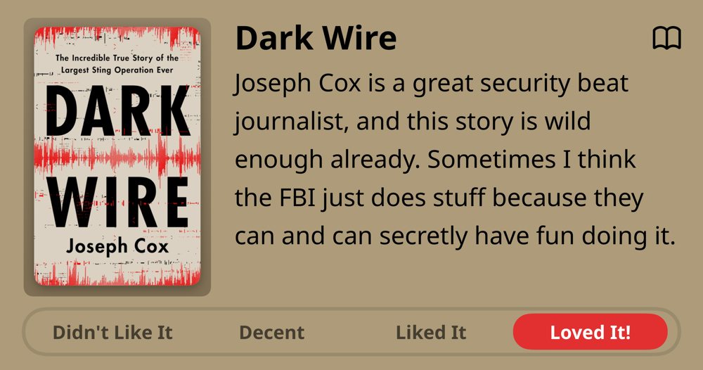](/images/posts/PngImage43919Ad5A30-review-a6d1efbe-5de8-4a8b-8875-796aff0ada0f.jpg)

[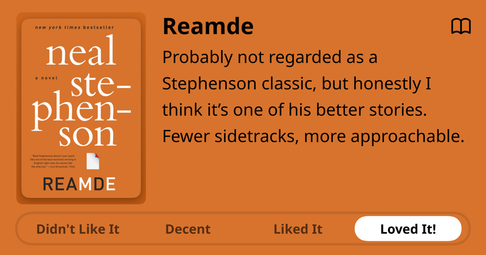](/images/posts/PngImage4A79B0E5E30-review-f9e93501-df54-4be4-a46e-908f7c5af5e5.jpg)

[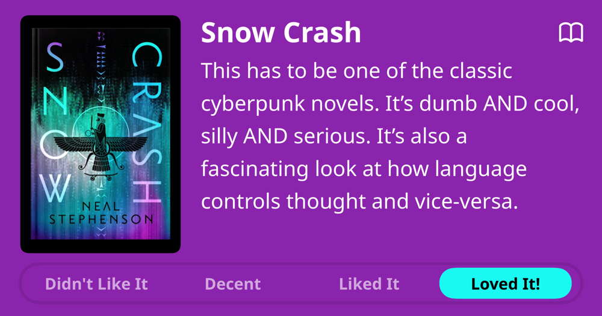](/images/posts/PngImage4D3F935C6C0-review-591b3665-f084-4cf9-9881-f5c78d33aea5.jpg)
[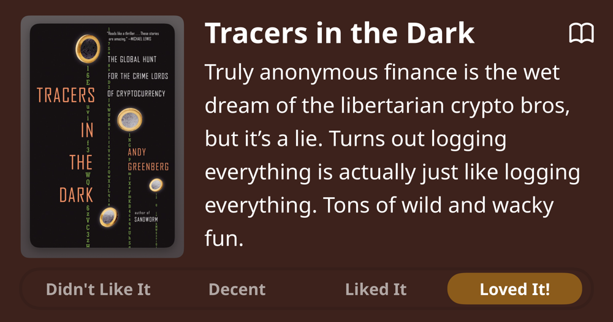](/images/posts/PngImage4Bb4B153Ff0-review-3a9aa495-7f1a-4e22-958c-8d35ad1090d5.jpg)

### [Movies](/reviews/movies/1)

[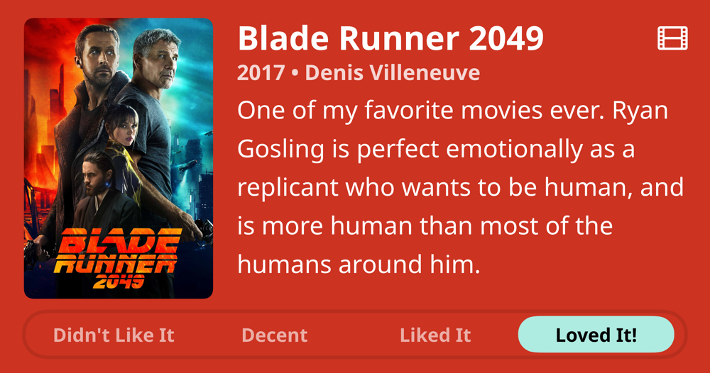](/images/posts/PngImage4851A68CDc0-review-c037fd42-3ceb-435c-b80d-6135451e9eca.jpg)

[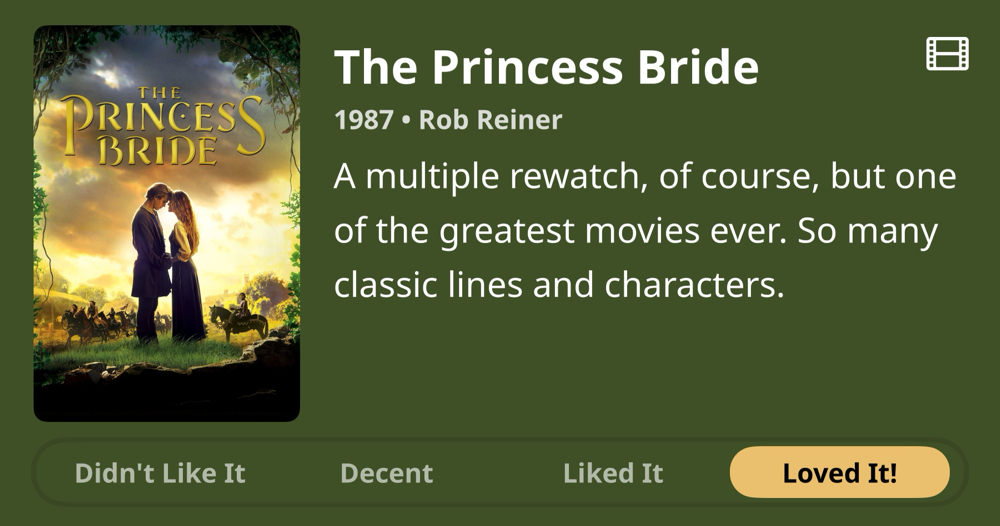](/images/posts/ThePrincessBrideReview-be189bc8-20cc-44eb-b5c6-3a39d917defb.jpg)

### [TV Shows](/reviews/tv/1)

[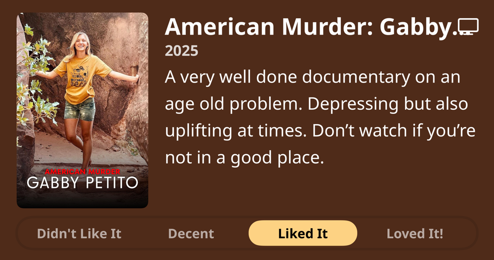](/images/posts/PngImage40C6A17DB10-review-cc7cc661-18f8-4d71-ac1f-d67b5a7af69b.jpg)
[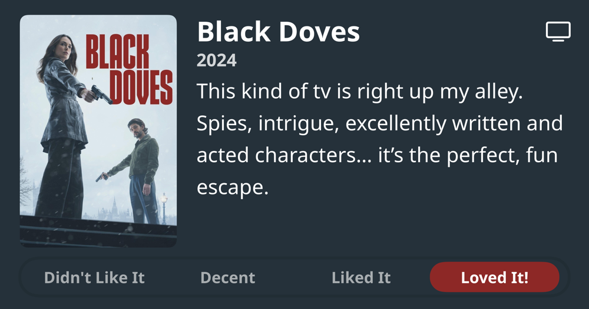](/images/posts/PngImage4253Bb2A550-review-3b5b7e91-9ad6-4173-83fd-fe3c7f3bcc07.jpg)

[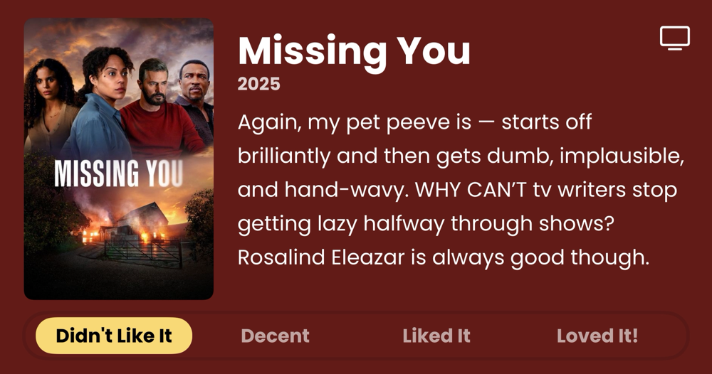](/images/posts/Missing-You-review-E3468A66-9C4D-482C-9570-41B5E4390803.jpg)

[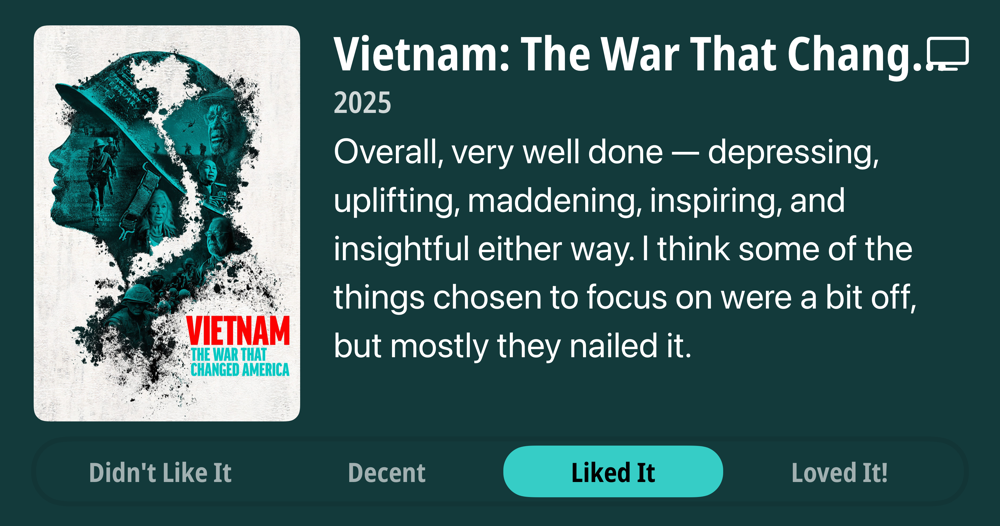](/images/posts/PngImage4E32Ad42D80-review-af9dd394-2bff-4e5b-8f59-771f03a2bf41.jpg)

### [Music](/reviews/music/1)

[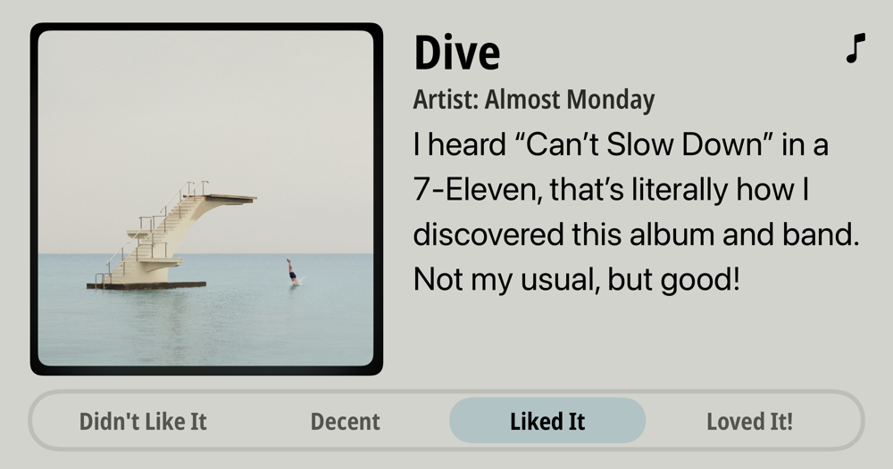](/images/posts/PngImage446EB7Aa4F0-review-573431f0-ca97-4e5e-a380-c905768f7ac2.jpg)
