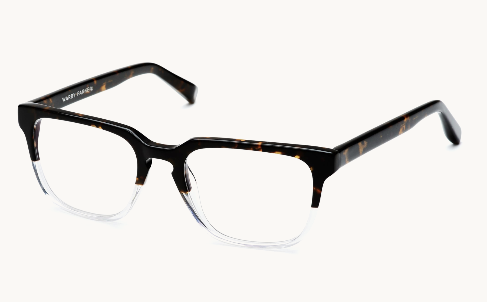
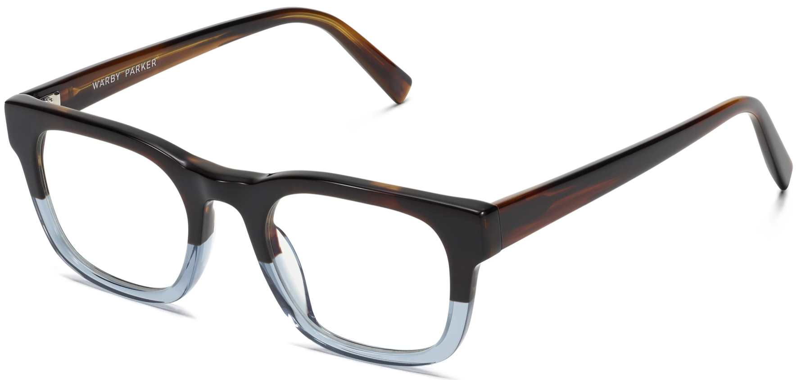
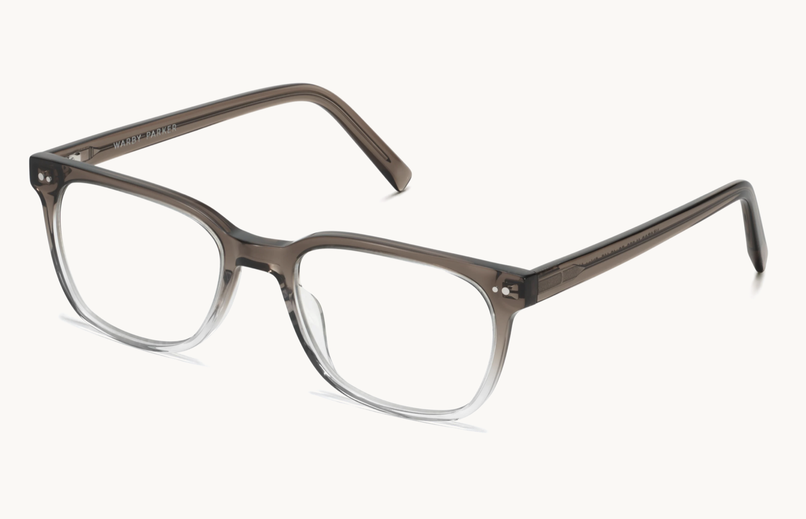
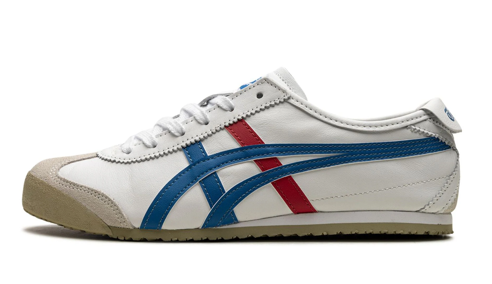
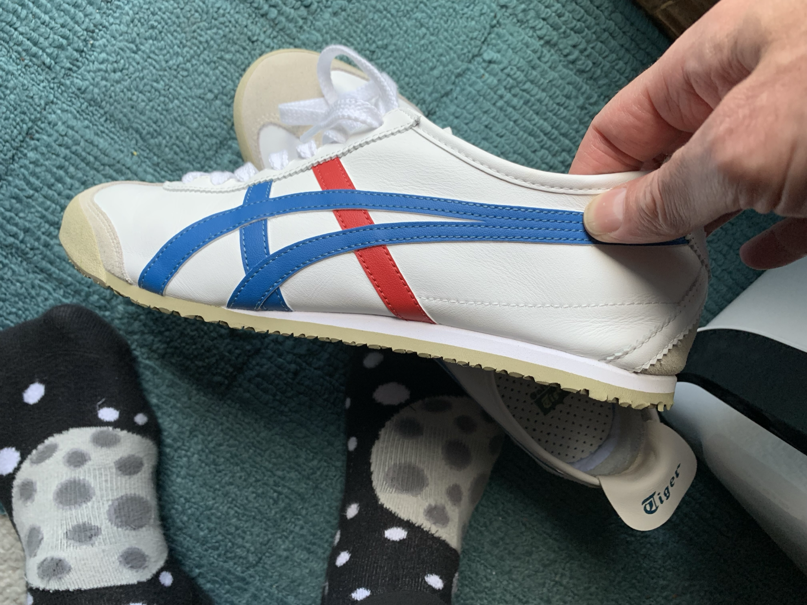

## MacBook Pro

### 2024 M4 Pro 14"

- 14-core CPU, 20-core GPU, 24GB RAM, 2TB SSD, Space Black
- [Apple Studio Display](https://www.apple.com/studio-display/)
- [Keychron Q1](https://www.keychron.com/products/keychron-q1) QMK, 84 key (75%), Gateron Pro Brown switches
- [OWC 11-port Thunderbolt 4 Dock](https://eshop.macsales.com/shop/owc-thunderbolt-dock)
- [Razer Basilisk V3](https://www.razer.com/gaming-mice/razer-basilisk-v3)
- [Shure Beta 87A](https://www.shure.com/en-US/products/microphones/beta_87a?variant=BETA87A)
- [Elgato Wave XLR](https://www.elgato.com/us/en/p/wave-xlr)  

## Software

### Automation and Utilities

- [CleanShot X for Mac](https://cleanshot.com/)
- [EasyFind | DEVONtechnologies | Needful Things](https://www.devontechnologies.com/apps/freeware)
- [EchoFeed](https://echofeed.app/)
- [Hazel – Noodlesoft](https://www.noodlesoft.com/manual/hazel/hazel-overview/)
- [Raycast](https://raycast.com/)
- [Swift Shift | Manage your mac's windows like a pro](https://www.swiftshift.app/)
- [Supercharge — Sindre Sorhus](https://sindresorhus.com/supercharge)
- [TripMode - Save data, browse faster](https://tripmode.ch/)
- [Warp: Your terminal, reimagined](https://www.warp.dev/)

### Browsers and Bookmarks

- [Anybox – Bookmarking App for Mac & iPhone](https://anybox.app/)
- [Google Chrome - The Fast & Secure Web Browser Built to be Yours](https://www.google.com/chrome/) *I use this for certain types of work related use cases.*
- [Safari - Apple](https://www.apple.com/safari/) *I use this for most of my browsing and all personal use.*

### Documentation and Notes

- Apple Notes
- [Notion](https://www.notion.so/)

### Image Processing

- [Acorn 7 | Full Featured Photo Editor for the Mac](https://flyingmeat.com/acorn/)
- [Affinity Photo – Professional Image Editing Software](https://affinity.serif.com/en-us/photo/)
- [Affinity Designer – Professional Graphic Design Software](https://affinity.serif.com/en-us/designer/)
- [Pixelmator Pro](https://www.pixelmator.com/pro/)
- [Retrobatch 2, from Flying Meat](https://flyingmeat.com/retrobatch/)

### Organization

- Apple Reminders
- [BusyCal - Professional Calendar App for Mac and iOS | Busy Apps by Beehive](https://www.busymac.com/)
- [Notion](https://www.notion.so/)
- [Timery for Toggl: Toggl API Token](https://www.timeryapp.com/token.html)

### Podcasting/Recording

- [Audio Hijack: Record Any Audio on MacOS | Rogue Amoeba](https://rogueamoeba.com/audiohijack/)
- [Farrago: Robust, rapid-fire soundboards | Rogue Amoeba](https://rogueamoeba.com/farrago/)
- [Fission: Fast & Lossless Audio Editing | Rogue Amoeba](https://rogueamoeba.com/fission/)
- [Hush | AI-powered tools for dialogue repair](https://hushaudioapp.com/)
- [Logic Pro for Mac - Apple](https://www.apple.com/logic-pro/)
- [Loopback: Cable-Free Audio Routing | Rogue Amoeba](https://rogueamoeba.com/loopback/)
- [🎙️ MacWhisper](https://goodsnooze.gumroad.com/l/macwhisper)
- [Rogue Amoeba | Quality Audio Software for MacOS](https://rogueamoeba.com/)

### Programming, Log Analysis, Text Filtering

- [Bare Bones Software | BBEdit](https://www.barebones.com/products/bbedit/index.html)
- [TextBuddy – retina studio](https://retina.studio/textbuddy/)
- [Visual Studio Code - Code Editing. Redefined](https://code.visualstudio.com/)
- [Xcode 15 - Apple Developer](https://developer.apple.com/xcode/)

### Reading

- [Apple Books](https://apps.apple.com/us/app/apple-books/id364709193)
- [Bookshop: Buy books online. Support local bookstores.](https://bookshop.org/)
- [Sequel](https://www.getsequel.app)
- [Libby App: Free ebooks & audiobooks from your library | by OverDrive](https://www.overdrive.com/apps/libby)

### RSS

- [EchoFeed](https://echofeed.app/)
- [ReadKit - Have all your reading in one place](https://readkit.app/)

### Writing

- [Bear - Notes for iPhone, iPad and Mac](https://bear.app/)

## Attire

### Glasses

- [Burke Eyeglasses in Tennessee Whiskey | Warby Parker](https://www.warbyparker.com/eyeglasses/burke/tennessee-whiskey?w=medium)  (My current favorites!)

  

- [Connor Eyeglasses in Eastern Bluebird Fade | Warby Parker](https://www.warbyparker.com/eyeglasses/connor/eastern-bluebird-fade?w=medium)

  

- [Hector Eyeglasses in Driftwood Fade](https://www.warbyparker.com/eyeglasses/hector/driftwood-fade?w=medium) (My current computer glasses)

  
  
### Shoes

- [Onitsuka Tiger Mexico 66™ "White/Blue" Sneakers - Farfetch](https://www.farfetch.com/jp/shopping/men/onitsuka-tiger-mexico-66-whiteblue-sneakers-item-21345026.aspx?storeid=11218) I wore Asics Tigers in Japan as a kid, so finding these was super nostalgic. Instant buy.

