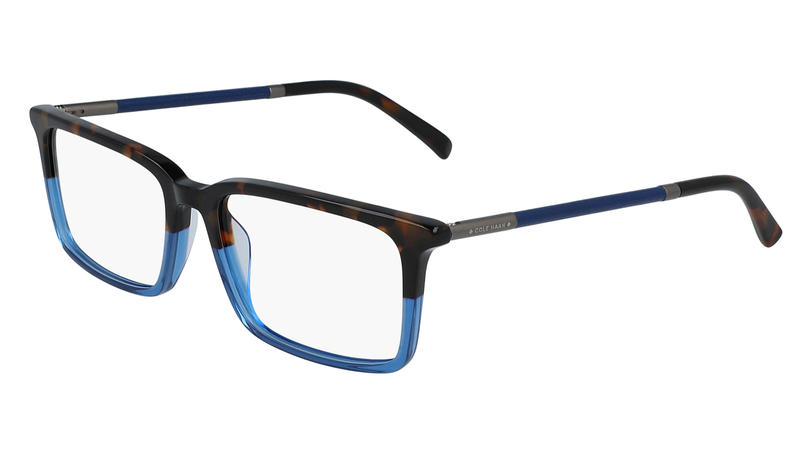

## MacBook Pro

### 2021 M1 Pro 14"

- 10-core CPU, 16-core GPU, 16GB RAM, 1TB SSD
- [Apple Studio Display](https://www.apple.com/studio-display/)
- [Keychron Q1](https://www.keychron.com/products/keychron-q1) QMK, 84 key (75%), Gateron Pro Brown switches
- [OWC 11-port Thunderbolt 4 Dock](https://eshop.macsales.com/shop/owc-thunderbolt-dock)
- [Logitech M720 Triathlon Multi-Computer Wireless Mouse](https://www.logitech.com/en-us/products/mice/m720-triathlon.910-004790.html)
- [Shure Beta 87A](https://www.shure.com/en-US/products/microphones/beta_87a?variant=BETA87A)
- [Elgato Wave XLR](https://www.elgato.com/us/en/p/wave-xlr)  

## Software

### Automation and Utilities

- [BetterTouchTool | folivora.ai - Great Tools for your Mac!](https://folivora.ai/)
- [EasyFind | DEVONtechnologies | Needful Things](https://www.devontechnologies.com/apps/freeware)
- [EchoFeed](https://echofeed.app/)
- [Raycast](https://raycast.com/)
- [Welcome to Bunch - Bunch.app](https://bunchapp.co/)

### Browsers and Bookmarks

- [Anybox – Bookmarking App for Mac & iPhone](https://anybox.app/)
- [Google Chrome - The Fast & Secure Web Browser Built to be Yours](https://www.google.com/chrome/) *I use this for certain types of work related use cases.*
- [Safari - Apple](https://www.apple.com/safari/) *I use this for most of my browsing and all personal use.*

### Documentation and Notes

- Apple Notes
- [Notion](https://www.notion.so/)

### Image Processing

- [Acorn 7 | Full Featured Photo Editor for the Mac](https://flyingmeat.com/acorn/)
- [Affinity Photo – Professional Image Editing Software](https://affinity.serif.com/en-us/photo/)
- [Affinity Designer – Professional Graphic Design Software](https://affinity.serif.com/en-us/designer/)
- [Retrobatch 2, from Flying Meat](https://flyingmeat.com/retrobatch/)

### Podcasting/Recording

- [Audio Hijack: Record Any Audio on MacOS | Rogue Amoeba](https://rogueamoeba.com/audiohijack/)
- [Farrago: Robust, rapid-fire soundboards | Rogue Amoeba](https://rogueamoeba.com/farrago/)
- [Fission: Fast & Lossless Audio Editing | Rogue Amoeba](https://rogueamoeba.com/fission/)
- [Loopback: Cable-Free Audio Routing | Rogue Amoeba](https://rogueamoeba.com/loopback/)
- [Rogue Amoeba | Quality Audio Software for MacOS](https://rogueamoeba.com/)
- [Logic Pro for Mac - Apple](https://www.apple.com/logic-pro/)
- [Hush | AI-powered tools for dialogue repair](https://hushaudioapp.com/)
- [🎙️ MacWhisper](https://goodsnooze.gumroad.com/l/macwhisper)

### Programming, Log Analysis, Text Filtering

- [Bare Bones Software | BBEdit](https://www.barebones.com/products/bbedit/index.html)
- [TextBuddy – retina studio](https://retina.studio/textbuddy/)
- [Visual Studio Code - Code Editing. Redefined](https://code.visualstudio.com/)

### Reading

- [Apple Books](https://apps.apple.com/us/app/apple-books/id364709193)
- [Book Tracker: Bookshelf Log for iPhone, iPad and Mac](https://booktrack.app/)
- [Libby App: Free ebooks & audiobooks from your library | by OverDrive](https://www.overdrive.com/apps/libby)

### RSS

- [EchoFeed](https://echofeed.app/)
- [NetNewsWire](https://netnewswire.com)

### Writing

- [Bear - Notes for iPhone, iPad and Mac](https://bear.app/)

## Attire

### Glasses

- [Connor Eyeglasses in Eastern Bluebird Fade | Warby Parker](https://www.warbyparker.com/eyeglasses/connor/eastern-bluebird-fade?w=medium) (My current favorites!)

  

- [Cole Haan CH4034 Eyeglasses](https://www.coolframes.com/glasses/cole-haan-eyewear/ch4034-eyeglasses.html) in Tortoise and Blue Fade (no one has these anymore, and I love them)

  
### Shoes

- [Onitsuka Tiger Mexico 66™ "White/Blue" Sneakers - Farfetch](https://www.farfetch.com/jp/shopping/men/onitsuka-tiger-mexico-66-whiteblue-sneakers-item-21345026.aspx?storeid=11218) I wore Asics Tigers in Japan as a kid, so finding these was super nostalgic. Instant buy.

