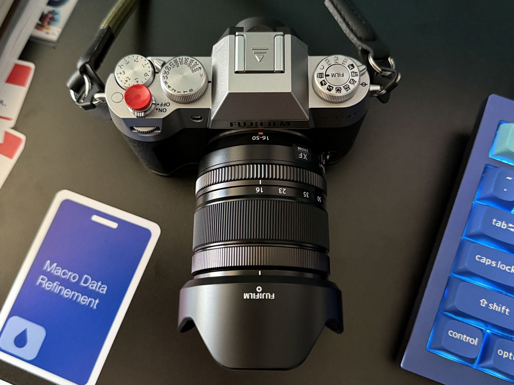
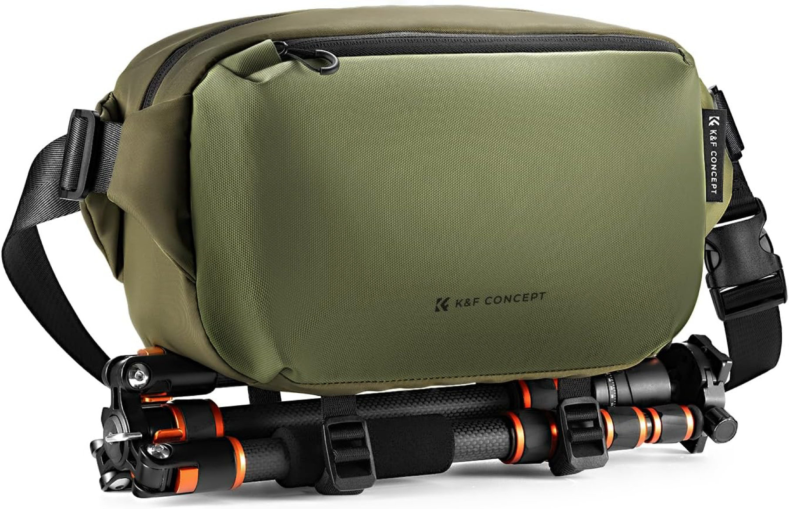

## MacBook Pro

### 2024 M4 Pro 14"

- 14-core CPU, 20-core GPU, 24GB RAM, 2TB SSD, Space Black
- [Apple Studio Display](https://www.apple.com/studio-display/) (27" 5K Retina)
- [Keychron Q1](https://www.keychron.com/products/keychron-q1) QMK, 84 key (75%), Gateron Pro Brown switches
- [OWC 11-port Thunderbolt 4 Dock](https://eshop.macsales.com/shop/owc-thunderbolt-dock)
- [Razer Basilisk V3](https://www.razer.com/gaming-mice/razer-basilisk-v3)
- [Shure Beta 87A](https://www.shure.com/en-US/products/microphones/beta_87a?variant=BETA87A)
- [Elgato Wave XLR](https://www.elgato.com/us/en/p/wave-xlr)  
- [Insta360 Link 2 - AI 4K webcam, pro audio.](https://www.insta360.com/product/insta360-link2)  

## Software

### AI - Programming, research, dictation, transcribing

- [ChatGPT](https://chatgpt.com/)
- [Claude](https://claude.ai/new)
- [Claude Code: Deep coding at terminal velocity \ Anthropic](https://www.anthropic.com/claude-code)
- [HyperContext](https://hypercontext.eu/)
- [🎙️ MacWhisper](https://goodsnooze.gumroad.com/l/macwhisper)
- [OpenAI Codex](https://openai.com/codex/)

### Automation and Utilities

- [Actions — Sindre Sorhus](https://sindresorhus.com/actions)
- [AltTab - Windows alt-tab on macOS](https://alt-tab-macos.netlify.app/)
- [Batteries for Mac | Track all your devices' batteries from your Mac. Get notified when they need recharging.](https://www.fadel.io/batteries)
- [CleanShot X for Mac](https://cleanshot.com/)
- [EasyFind | DEVONtechnologies | Needful Things](https://www.devontechnologies.com/apps/freeware)
- [EchoFeed](https://echofeed.app/)
- [FastScripts 3](https://redsweater.com/fastscripts/)
- [Front and Center](https://apps.apple.com/us/app/front-and-center/id1493996622?mt=12)
- [Hazel – Noodlesoft](https://www.noodlesoft.com/manual/hazel/hazel-overview/)
- [Hyperspace: Reclaim Disk Space](https://apps.apple.com/us/app/hyperspace-reclaim-disk-space/id6739505345?mt=12)
- [One Thing — Sindre Sorhus](https://sindresorhus.com/one-thing)
- [Paste – Clipboard Manager for Mac, iPhone, and iPad](https://pasteapp.io/)
- [Rectangle Pro](https://rectangleapp.com/pro)
- [Shortcutie — Sindre Sorhus](https://sindresorhus.com/shortcutie)
- [Snippety - Productivity App for macOS](https://snippety.app/)
- [Supercharge — Sindre Sorhus](https://sindresorhus.com/supercharge)
- [TripMode - Save data, browse faster](https://tripmode.ch/)
- [Warp: Your terminal, reimagined](https://www.warp.dev/)

### Browsers and Bookmarks

- [Anybox – Bookmarking App for Mac & iPhone](https://anybox.app/)
- [Google Chrome - The Fast & Secure Web Browser Built to be Yours](https://www.google.com/chrome/) *I use this for certain types of work related use cases.*
- [Safari - Apple](https://www.apple.com/safari/) *I use this for most of my browsing and all personal use.*

### Documentation and Notes

- Apple Notes
- [Notion](https://www.notion.so/)
- [Obsidian - Sharpen your thinking](https://obsidian.md/)
- [Plain Text Editor — Sindre Sorhus](https://sindresorhus.com/plain-text-editor)
- [Scratchpad — Sindre Sorhus](https://sindresorhus.com/scratchpad)
- [Snippety - Productivity App for macOS](https://snippety.app/)

### Image Processing

- [Acorn 7 | Full Featured Photo Editor for the Mac](https://flyingmeat.com/acorn/)
- [Affinity Photo – Professional Image Editing Software](https://affinity.serif.com/en-us/photo/)
- [Affinity Designer – Professional Graphic Design Software](https://affinity.serif.com/en-us/designer/)
- [DxO PhotoLab 8: RAW photo editing at its finest - DxO](https://www.dxo.com/dxo-photolab/)
- [DxO ViewPoint 5: Control geometry, shape, and perspective - DxO](https://www.dxo.com/dxo-viewpoint/)
- [Nik Collection 8: The world's favorite photography plugins - Nik Collection by DxO](https://nikcollection.dxo.com/)
- [Pixelmator Pro](https://www.pixelmator.com/pro/)
- [Retrobatch 2, from Flying Meat](https://flyingmeat.com/retrobatch/)
- [System Color Picker — Sindre Sorhus](https://sindresorhus.com/system-color-picker)

### Organization

- Apple Reminders
- [BBEdit | Bare Bones Software](https://www.barebones.com/products/bbedit/index.html)
- [BusyCal - Professional Calendar App for Mac and iOS | Busy Apps by Beehive](https://www.busymac.com/)
- [Notion](https://www.notion.so/)
- [Obsidian - Sharpen your thinking](https://obsidian.md/)
- [Scratchpad — Sindre Sorhus](https://sindresorhus.com/scratchpad)
- [Timery for Toggl: Toggl API Token](https://www.timeryapp.com/token.html)
- [Zones: Time Zone Conversion](https://squircleapps.com/zones/)

### Podcasting/Recording

- [Audio Hijack: Record Any Audio on MacOS | Rogue Amoeba](https://rogueamoeba.com/audiohijack/)
- [Farrago: Robust, rapid-fire soundboards | Rogue Amoeba](https://rogueamoeba.com/farrago/)
- [Fission: Fast & Lossless Audio Editing | Rogue Amoeba](https://rogueamoeba.com/fission/)
- [Forecast: Podcast MP3 Chapter Encoder — Overcast](https://overcast.fm/forecast)
- [Logic Pro for Mac - Apple](https://www.apple.com/logic-pro/)
- [Loopback: Cable-Free Audio Routing | Rogue Amoeba](https://rogueamoeba.com/loopback/)
- [🎙️ MacWhisper](https://goodsnooze.gumroad.com/l/macwhisper)
- [Riverside: HD Podcast & Video Software | Free Recording & Editing](https://riverside.com/)
- [Rogue Amoeba | Quality Audio Software for MacOS](https://rogueamoeba.com/)
- [Voice Cleaner](https://alexdenk.eu/mywork/voicecleaner.html)

### Programming, Log Analysis, Text Filtering

- [BackLog - Eternal Storms Software](https://eternalstorms.at/backlog/)
- [BBEdit | Bare Bones Software](https://www.barebones.com/products/bbedit/index.html)
- [Kaleidoscope | Git Diff and Merge Tool and Text Comparison](https://kaleidoscope.app/)
- [TextBuddy – retina studio](https://retina.studio/textbuddy/)
- [Visual Studio Code - Code Editing. Redefined](https://code.visualstudio.com/)
- [Xcode 15 - Apple Developer](https://developer.apple.com/xcode/)

### Reading

- [Apple Books](https://apps.apple.com/us/app/apple-books/id364709193)
- [Bookshop: Buy books online. Support local bookstores.](https://bookshop.org/)
- [Sequel](https://www.getsequel.app)
- [Libby App: Free ebooks & audiobooks from your library | by OverDrive](https://www.overdrive.com/apps/libby)

### RSS

- [EchoFeed](https://echofeed.app/)
- [ReadKit - Have all your reading in one place](https://readkit.app/)
- [Tapestry • Your favorite blogs, social media, and more in a unified and chronological timeline](https://usetapestry.com/)

### Writing

- [Obsidian - Sharpen your thinking](https://obsidian.md/)

## Photography

### Camera

- [Fujifilm X-T50](https://www.fujifilm-x.com/en-us/products/cameras/x-t50/)
- [Fujifilm XF16-50mmF2.8-4.8 R LM WR lens](https://www.fujifilm-x.com/global/products/lenses/xf16-50mmf28-48-r-lm-wr/)

  

  

### Camera Bag

- [K&F CONCEPT Camera Sling Bag10L Urban Wander 01(Green)](https://www.kfconcept.com/KF13.157V2-camera-sling-bag10l-urban-wander-01-green-)

  

  

### Software

- [Affinity Photo – Professional Image Editing Software](https://affinity.serif.com/en-us/photo/)
- [DxO PhotoLab 8: RAW photo editing at its finest - DxO](https://www.dxo.com/dxo-photolab/)
- [DxO ViewPoint 5: Control geometry, shape, and perspective - DxO](https://www.dxo.com/dxo-viewpoint/)
- [Nik Collection 8: The world's favorite photography plugins - Nik Collection by DxO](https://nikcollection.dxo.com/)

## Attire

### Glasses

- [Burke Eyeglasses in Tennessee Whiskey | Warby Parker](https://www.warbyparker.com/eyeglasses/burke/tennessee-whiskey?w=medium)  (My current favorites!)

  

- [Connor Eyeglasses in Eastern Bluebird Fade | Warby Parker](https://www.warbyparker.com/eyeglasses/connor/eastern-bluebird-fade?w=medium)

  

- [Hector Eyeglasses in Driftwood Fade](https://www.warbyparker.com/eyeglasses/hector/driftwood-fade?w=medium) (My current computer glasses)

  
  
### Shoes

- [Onitsuka Tiger MEXICO 66 "Black/Classic Red"](https://www.onitsukatiger.com/jp/en-gl/product/mexico-66/1183c102_004.html) This is what I'm wearing now after wearing down the white/blue pair dramatically over the past couple of years. Still love the classic look and the wonderful minimalist comfort.

- [Onitsuka Tiger Mexico 66™ "White/Blue" Sneakers - Farfetch](https://www.farfetch.com/jp/shopping/men/onitsuka-tiger-mexico-66-whiteblue-sneakers-item-21345026.aspx?storeid=11218) I wore Asics Tigers in Japan as a kid, so finding these was super nostalgic. Instant buy. I still have these but am wearing the black and red now.

